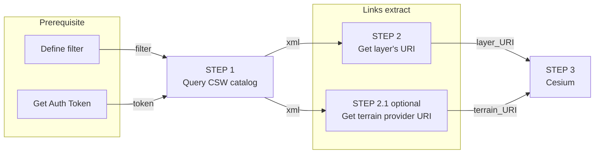

import Tabs from '@theme/Tabs';
import TabItem from '@theme/TabItem';
import PlaygroundFrame from '@site/src/components/PlaygroundFrame'

## Step by step guide
The following guide will help you understand, ***Step-by-step*** the best practices of how to work with the Map Colonies **3D** Catalog and how to consume mapping products in a ***dynamic way*** (materials might be changed or added)

## Flow diagram


## Query CSW catalog (Step 1)

Query **3D CSW catalog** service to find item(s) according to desired filter [example are here](/docs/ogc/protocols/ogc-csw/ogc-csw-examples)

Filter should be based on [3D profile](/docs/MapColonies/3D/services/catalog/catalog-profile-v2)

:::warning
Pay attention to set the following parameter 'outputSchema="http://schema.mapcolonies.com/3d"' in order to get full catalog data
:::

There are a few ways to acquire the desired record layer, for example:

<Tabs>
<TabItem value="SpecificLayer" label="Specific Layer">

To fetch a specific layer you need to aquire the following property value:
1. `productType`
The "type" of the desired record layer ("3DPhotoRealistic","TERRAIN_QMESH", etc.)
2. `productId`
The unique identifier of the desired record layer

To get unique product when you already have the ***productType*** and ***productId*** you can use the following query (both can be coppied from our catalog app, for example for a specific ***3D Photo Realistic*** use the following)

```xml title="GetRecords Request"
POST Request

url:
'<3D_CATALOG_SERVICE_URL>/csw'

body (XML):
<?xml version="1.0" encoding="UTF-8"?>
<csw:GetRecords outputFormat="application/xml"  outputSchema="http://schema.mapcolonies.com/3d" resultType="results" service="CSW" version="2.0.2" startPosition="1" maxRecords="10" xmlns:mc="http://schema.mapcolonies.com/3d" xmlns:csw="http://www.opengis.net/cat/csw/2.0.2" xmlns:ogc="http://www.opengis.net/ogc">
    <csw:Query typeNames="csw:Record">
        <csw:ElementSetName>full</csw:ElementSetName>
        <csw:Constraint version="1.1.0">
            <Filter xmlns="http://www.opengis.net/ogc">
            <And>
              <PropertyIsEqualTo>
                <!-- ****** PROFILE FIELD NAME START ********************** -->
                <PropertyName>mc:productType</PropertyName>
                <!-- ****** PROFILE FIELD NAME END ********************** -->

                <!-- ****** PROFILE FIELD VALUE START ********************** -->
                <Literal>3DPhotoRealistic</Literal>
                <!-- ****** PROFILE FIELD VALUE END ********************** -->
              </PropertyIsEqualTo>
              <PropertyIsEqualTo>
                <PropertyName>mc:productId</PropertyName>
                <Literal>0fa277cb-b8ba-4c31-b787-7700f916dcd4</Literal>
              </PropertyIsEqualTo>
            </And>
            </Filter>
        </csw:Constraint>
    </csw:Query>
</csw:GetRecords>
```
</TabItem>
<TabItem value="fetchAll" label="Fetch All Layers (Pagination)">

You can enquire all 3d products by `productType`, use maxRecords and startPosition for pagination:

```xml title="GetRecords Request"
POST Request

url:
'<3D_CATALOG_SERVICE_URL>/csw'

body (XML):
<?xml version="1.0" encoding="UTF-8"?>
<csw:GetRecords outputFormat="application/xml"  outputSchema="http://schema.mapcolonies.com/3d" resultType="results" service="CSW" version="2.0.2" startPosition="1" maxRecords="200" xmlns:mc="http://schema.mapcolonies.com/3d" xmlns:csw="http://www.opengis.net/cat/csw/2.0.2" xmlns:ogc="http://www.opengis.net/ogc">
    <csw:Query typeNames="csw:Record">
        <csw:ElementSetName>full</csw:ElementSetName>
        <csw:Constraint version="1.1.0">
            <Filter xmlns="http://www.opengis.net/ogc">
              <PropertyIsEqualTo>
                <!-- ****** PROFILE FIELD NAME START ********************** -->
                <PropertyName>mc:productType</PropertyName>
                <!-- ****** PROFILE FIELD NAME END ********************** -->

                <!-- ****** PROFILE FIELD VALUE START ********************** -->
                <Literal>3DPhotoRealistic</Literal>
                <!-- ****** PROFILE FIELD VALUE END ********************** -->
              </PropertyIsEqualTo>
            </Filter>
        </csw:Constraint>
    </csw:Query>
</csw:GetRecords>
```

</TabItem>
</Tabs>

You will get GetRecords XML Response with product **metadata**.

<details>
  <summary>Response example</summary>

```xml title="Search Results Example"
    <?xml version="1.0" encoding="UTF-8"?>
    <csw:GetRecordsResponse xmlns:csw="http://www.opengis.net/cat/csw/2.0.2" xmlns:dc="http://purl.org/dc/elements/1.1/" xmlns:dct="http://purl.org/dc/terms/" xmlns:gmd="http://www.isotc211.org/2005/gmd" xmlns:gml="http://www.opengis.net/gml" xmlns:mc="http://schema.mapcolonies.com/3d" xmlns:ows="http://www.opengis.net/ows" xmlns:xs="http://www.w3.org/2001/XMLSchema" xmlns:xsi="http://www.w3.org/2001/XMLSchema-instance" version="2.0.2" xsi:schemaLocation="http://www.opengis.net/cat/csw/2.0.2 http://schemas.opengis.net/csw/2.0.2/CSW-discovery.xsd">
    <csw:SearchStatus timestamp="2022-03-27T06:45:54Z" />
    <csw:SearchResults numberOfRecordsMatched="1" numberOfRecordsReturned="1" nextRecord="0" recordSchema="http://schema.mapcolonies.com/3d" elementSet="full">
        <mc:MC3DRecord>
            <mc:accuracyLE90>4.0</mc:accuracyLE90>
            <mc:classification>5</mc:classification>
            <mc:creationDateUTC>2025-01-09T08:00:00Z</mc:creationDateUTC>
            <mc:footprint>{"type":"Polygon","coordinates":[[[46.9831483,36.4864826],[46.9831483,37.0135162],[48.0168517,37.0135162],[48.0168517,36.4864826],[46.9831483,36.4864826]]]}</mc:footprint>
            <mc:maxHorizontalAccuracyCE90>5.0</mc:maxHorizontalAccuracyCE90>
            <mc:id>0fa277cb-b8ba-4c31-b787-7700f916dcd4</mc:id>
            <mc:insertDate>2025-01-09T16:33:51Z</mc:insertDate>
            <mc:links scheme="3DTiles" name="" description="">https://tiles.mapcolonies.net/api/3d/v1/b3dm/0fa277cb-b8ba-4c31-b787-7700f916dcd4/vricon_3d_surface_model_3dtiles_1.0_gltf_2/data/vricon_3dtiles/tileset.json</mc:links>
            <mc:producerName>DAVID</mc:producerName>
            <mc:productBBox>46.9831483,36.4864826,48.0168517,37.0135162</mc:productBBox>
            <mc:productId>0fa277cb-b8ba-4c31-b787-7700f916dcd4</mc:productId>
            <mc:productName>name</mc:productName>
            <mc:productSource>\\Path\To\3D\Models\e047n36_N\vricon_3d_surface_model_3dtiles_1.0_gltf_2\data\vricon_3dtiles</mc:productSource>
            <mc:productStatus>PUBLISHED</mc:productStatus>
            <mc:productType>3DPhotoRealistic</mc:productType>
            <mc:productVersion>1</mc:productVersion>
            <mc:productionSystem>system</mc:productionSystem>
            <mc:productionSystemVersion>9</mc:productionSystemVersion>
            <mc:region>region</mc:region>
            <mc:sensors>sensor</mc:sensors>
            <mc:imagingTimeEndUTC>2022-01-09T08:11:00Z</mc:imagingTimeEndUTC>
            <mc:imagingTimeBeginUTC>2022-01-09T08:11:00Z</mc:imagingTimeBeginUTC>
            <mc:SRS>4326</mc:SRS>
            <mc:SRSName>WGS84GEO</mc:SRSName>
            <mc:type>RECORD_3D</mc:type>
            <mc:updateDateUTC>2025-01-09T16:34:46Z</mc:updateDateUTC>
            <ows:BoundingBox crs="urn:x-ogc:def:crs:EPSG:6.11:4326" dimensions="2">
                <ows:LowerCorner>36.4864826 46.9831483</ows:LowerCorner>
                <ows:UpperCorner>37.0135162 48.0168517</ows:UpperCorner>
            </ows:BoundingBox>
        </mc:MC3DRecord>
    </csw:SearchResults>
    </csw:GetRecordsResponse>
```
</details>

:::info
**Authentication must be integrated in order to communicate with 3D Tile and Catalog services.**<br/>
**See the principles [here](/docs/MapColonies/authentication)**
:::

## Get layer URI (Step 2)
In the Response, look for

```xml title="Extract link for desired 3D model"
<mc:links scheme="3DTiles" name="">
  http://3d-model-server.com/path-to-tileset.json
</mc:links>
```

:::info
**You need to save `<mc:links>` <u>element</u> value as MODEL_URL, which is a layer consumption URL.**
:::

## Get terrain provider URI (Step 2.1, optional)
This section explains how to query "Best" terrain for complementing the `3D models` and giving a true 3D visualization. If you wish to get a specifc terrain please use [DEM Getting Started Guide](/docs/MapColonies/DEM/Guides/DEM_getting_started.md)

To query the "Best" terrain, use the following:
```xml title="GetRecords Request For Terrain"
POST Request

url:
'<3D_CATALOG_SERVICE_URL>/csw'

body (XML):
<?xml version="1.0" encoding="UTF-8"?>
<csw:GetRecords outputFormat="application/xml"  outputSchema="http://schema.mapcolonies.com/3d" resultType="results" service="CSW" version="2.0.2" startPosition="1" maxRecords="200" xmlns:mc="http://schema.mapcolonies.com/3d" xmlns:csw="http://www.opengis.net/cat/csw/2.0.2" xmlns:ogc="http://www.opengis.net/ogc">
    <csw:Query typeNames="csw:Record">
        <csw:ElementSetName>full</csw:ElementSetName>
        <csw:Constraint version="1.1.0">
            <Filter xmlns="http://www.opengis.net/ogc">
              <PropertyIsEqualTo>

                <!-- ****** PROFILE FIELD NAME START ********************** -->
                <PropertyName>mc:productType</PropertyName>
                <!-- ****** PROFILE FIELD NAME END ********************** -->

                <!-- ****** PROFILE FIELD VALUE START ********************** -->
                <Literal>QuantizedMeshDTMBest</Literal>
                <!-- ****** PROFILE FIELD VALUE END ********************** -->

              </PropertyIsEqualTo>
            </Filter>
        </csw:Constraint>
    </csw:Query>
</csw:GetRecords>
```

You will get GetRecords XML Response with product **metadata**.

<details>
  <summary>Response example</summary>

```xml title="Search Results Example"
    <?xml version="1.0" encoding="UTF-8"?>
    <csw:GetRecordsResponse xmlns:csw="http://www.opengis.net/cat/csw/2.0.2" xmlns:dc="http://purl.org/dc/elements/1.1/" xmlns:dct="http://purl.org/dc/terms/" xmlns:gmd="http://www.isotc211.org/2005/gmd" xmlns:gml="http://www.opengis.net/gml" xmlns:mc="http://schema.mapcolonies.com/3d" xmlns:ows="http://www.opengis.net/ows" xmlns:xs="http://www.w3.org/2001/XMLSchema" xmlns:xsi="http://www.w3.org/2001/XMLSchema-instance" version="2.0.2" xsi:schemaLocation="http://www.opengis.net/cat/csw/2.0.2 http://schemas.opengis.net/csw/2.0.2/CSW-discovery.xsd">
    <csw:SearchStatus timestamp="2022-03-27T06:45:54Z" />
    <csw:SearchResults numberOfRecordsMatched="1" numberOfRecordsReturned="1" nextRecord="0" recordSchema="http://schema.mapcolonies.com/3d" elementSet="full">
        <mc:MC3DRecord>
            <mc:accuracyLE90>4.0</mc:accuracyLE90>
            <mc:classification>5</mc:classification>
            <mc:creationDateUTC>2022-10-24</mc:creationDateUTC>
            <mc:footprint>{"type":"Polygon","coordinates":[[[34.98,32.8],[35.1,32.8],[35.1,32.7],[34.98,32.7],[34.98,32.8]]]}</mc:footprint>
            <mc:geographicArea>North</mc:geographicArea>
            <mc:maxHorizontalAccuracyCE90>999.0</mc:maxHorizontalAccuracyCE90>
            <mc:id>33333333-3333-3333-3333-333333333333</mc:id>
            <mc:insertDate>2022-10-24</mc:insertDate>
            <mc:links scheme="TERRAIN_QMESH" name="" description="">https://tiles.mapcolonies.net/api/dem/v1/terrains/srtm100</mc:links>
            <mc:producerName>producer</mc:producerName>
            <mc:productBBox>35.2670012825,32.5856881598,35.3105702702,32.6300363309</mc:productBBox>
            <mc:productId>33333333-3333-3333-3333-333333333333</mc:productId>
            <mc:productName>srtm100</mc:productName>
            <mc:productSource></mc:productSource>
            <mc:productStatus>PUBLISHED</mc:productStatus>
            <mc:productType>QuantizedMeshDTMBest</mc:productType>
            <mc:productVersion>1</mc:productVersion>
            <mc:productionSystem></mc:productionSystem>
            <mc:productionSystemVersion>1</mc:productionSystemVersion>
            <mc:region>region</mc:region>
            <mc:sensors>UNDEFINED</mc:sensors>
            <mc:imagingTimeEndUTC>2022-10-24</mc:imagingTimeEndUTC>
            <mc:imagingTimeBeginUTC>2022-10-24</mc:imagingTimeBeginUTC>
            <mc:SRS>4326</mc:SRS>
            <mc:SRSName>WGS84GEO</mc:SRSName>
            <mc:type>RECORD_3D</mc:type>
            <mc:updateDateUTC>2022-10-25T16:48:17Z</mc:updateDateUTC>
            <ows:BoundingBox crs="urn:x-ogc:def:crs:EPSG:6.11:4326" dimensions="2">
                <ows:LowerCorner>32.7 34.98</ows:LowerCorner>
                <ows:UpperCorner>32.8 35.1</ows:UpperCorner>
            </ows:BoundingBox>
        </mc:MC3DRecord>
    </csw:SearchResults>
    </csw:GetRecordsResponse>
```
</details>


```xml title="Extract link for terrain provider"
<mc:links scheme="TERRAIN_QMESH" name="srtm100">
  http://tiles.com/terrains/srtm100/layer.json
</mc:links>
```


:::info
**You need to save `<mc:links>` <u>element</u> value as TERRAIN_URL, which is a terrain provider consumption URL.**
:::

## Step 3
### Construct Client side Layer
Now, after you got all product metadata that you need by querying our Catalog and MapProxy capabilities, lets actually use it in order to display it in real map viewer / application (clients).

:::warning
**Below examples are based on `Pseudo code`, you will have to adapt it in your own application to make it work.**
:::

### Cesium

:::info
**The minimum required version for cesium is v84.**
:::

```javascript
// **Optional** add to Cesium terrain provider in order to clamp 3d models to the ground
viewer.terrainProvider = new Cesium.TerrainProvider({
  url: new Cesium.Resource({
    url: "<TERRAIN_URL>",
    queryParameters: {
      "token": "<token>",
    },
  }),
});
...
...
// Add 3d model to the scene
const tileset = viewer.scene.primitives.add(
  new Cesium.Cesium3DTileset({
    url: new Cesium.Resource({
      url: "<MODEL_URL>",
      queryParameters: {
        "token": "<token>",
      },
    }),
  })
);
...
```
Replace `<MODEL_URL>` with the URL link that you got from **Step 2**.

Replace `<TERRAIN_URL>` with the URL link that you got from **Step 2.1 (optional)**.

Replace `<token>` with the token you have.
