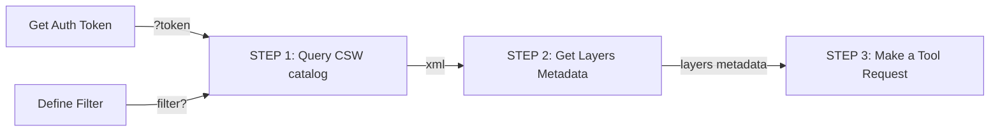

## 3D Model Viewer 🌍
 3D Model Viewer is a tool that loads 3D tiles using cesium. It allows the client to send a request to this tool with model ID's and see the 3D model on the map.

 The following guide will help you understand, **step by step** the best practices of how to work with the Map Colonies **3D Catalog Viewer!**

 ## Flow Diagram ⏭


## Quering 3D CSW catalog service (STEP ☝🏼)
Query **3D CSW catalog** service to find an item(s) according to the desired filter.

A good example of a filter request:
```html
POST Request

url:
'<3D-CATALOG-SERVICE_URL>/csw?token=<TOKEN>'

body (XML):
<?xml version="1.0" encoding="UTF-8"?>
<csw:GetRecords outputFormat="application/xml"  outputSchema="http://schema.mapcolonies.com/3d" resultType="results" service="CSW" version="2.0.2" startPosition="1" maxRecords="200" xmlns:mc="http://schema.mapcolonies.com/3d" xmlns:csw="http://www.opengis.net/cat/csw/2.0.2" xmlns:ogc="http://www.opengis.net/ogc">
    <csw:Query typeNames="csw:Record">
        <csw:ElementSetName>full</csw:ElementSetName>
        <csw:Constraint version="1.1.0">
            <ogc:Filter>
                <ogc:Or>
                    <ogc:PropertyIsEqualTo>
                        <ogc:PropertyName>mc:classification</ogc:PropertyName>
                        <ogc:Literal>5</ogc:Literal>
                    </ogc:PropertyIsEqualTo>
                    <ogc:PropertyIsEqualTo>
                        <ogc:PropertyName>mc:productType</ogc:PropertyName>
                        <ogc:Literal>3DPhotoRealistic</ogc:Literal>
                    </ogc:PropertyIsEqualTo>
                </ogc:Or>
            </ogc:Filter>
        </csw:Constraint>
    </csw:Query>
</csw:GetRecords>
``` 
 - Replace `<3D-CATALOG-SERVICE_URL>` with 3D CSW catalog URL.
``` bash 
 <3D-CATALOG-SERVICE_URL>
 ```
 - Replace `<token>` with with the token you have.
``` bash 
 <token>
 ```

Of course, you can also send a regular request with no filter. 

A good example is:
``` html
POST Request

url:
'<3D-CATALOG-SERVICE_URL>/csw?token=<TOKEN>'

body (XML):
<csw:GetRecords 
maxRecords="10" 
outputFormat="application/xml"
outputSchema="http://schema.mapcolonies.com/3d" 
resultType="results" 
service="CSW"
version="2.0.2" 
startPosition="1" 
xmlns:mc="http://schema.mapcolonies.com/3d"
xmlns:csw="http://www.opengis.net/cat/csw/2.0.2"
xmlns:ogc="http://www.opengis.net/ogc">
    <csw:Query typeNames="csw:Record">
        <csw:ElementSetName>full</csw:ElementSetName>
    </csw:Query>
</csw:GetRecords>
``` 
You will get GetRecords XML Response with the products **metadata**.

<details>
<summary>XML Response</summary>

`````` html
<?xml version="1.0" encoding="UTF-8" standalone="no"?>
<!-- pycsw 2.7.dev0 -->
<csw:GetRecordsResponse xmlns:csw="http://www.opengis.net/cat/csw/2.0.2" xmlns:dc="http://purl.org/dc/elements/1.1/" xmlns:dct="http://purl.org/dc/terms/" xmlns:gmd="http://www.isotc211.org/2005/gmd" xmlns:gml="http://www.opengis.net/gml" xmlns:ows="http://www.opengis.net/ows" xmlns:xs="http://www.w3.org/2001/XMLSchema" xmlns:xsi="http://www.w3.org/2001/XMLSchema-instance" xmlns:mc="http://schema.mapcolonies.com/3d" version="2.0.2" xsi:schemaLocation="http://www.opengis.net/cat/csw/2.0.2 http://schemas.opengis.net/csw/2.0.2/CSW-discovery.xsd">
    <csw:SearchStatus timestamp="2023-10-15T10:49:46Z"/>
    <csw:SearchResults numberOfRecordsMatched="2" numberOfRecordsReturned="2" nextRecord="0" recordSchema="http://schema.mapcolonies.com/3d" elementSet="full">
        <mc:MC3DRecord>
            <mc:accuracyLE90>8.0</mc:accuracyLE90>
            <mc:classification>6</mc:classification>
            <mc:creationDateUTC>1970-01-01</mc:creationDateUTC>
            <mc:footprint>{"type":"Polygon","coordinates":[[[35.2670012825,32.5856881598],[35.2670012825,32.6300363309],[35.3105702702,32.6300363309],[35.3105702702,32.5856881598],[35.2670012825,32.5856881598]]]}</mc:footprint>
            <mc:maxHorizontalAccuracyCE90>8.0</mc:maxHorizontalAccuracyCE90>
            <mc:id>53c9e5f6-31d6-47a1-bc11-64e150bcc13b</mc:id>
            <mc:insertDate>2023-10-11T18:33:18Z</mc:insertDate>
            <mc:links scheme="3D_LAYER" name="" description="">https://URL-TO-3D-TILE/api/3d/v1/b3dm/model/tileset.json</mc:links>
            <mc:producerName>IDFMU</mc:producerName>
            <mc:productBBox>35.2670012825,32.5856881598,35.3105702702,32.6300363309</mc:productBBox>
            <mc:productId>53c9e5f6-31d6-47a1-bc11-64e150bcc13b</mc:productId>
            <mc:productName>natik-q2</mc:productName>
            <mc:productSource>\\domtest\mimi\archi\maz\silver\libot\afula-whole</mc:productSource>
            <mc:productStatus>PUBLISHED</mc:productStatus>
            <mc:productType>3DPhotoRealistic</mc:productType>
            <mc:productVersion>1</mc:productVersion>
            <mc:productionSystem>i</mc:productionSystem>
            <mc:productionSystemVersion>uy</mc:productionSystemVersion>
            <mc:region>kl</mc:region>
            <mc:sensors>k</mc:sensors>
            <mc:imagingTimeEndUTC>2023-08-20T12:16:00Z</mc:imagingTimeEndUTC>
            <mc:imagingTimeBeginUTC>2023-08-11T18:48:00Z</mc:imagingTimeBeginUTC>
            <mc:SRS>4326</mc:SRS>
            <mc:SRSName>WGS84GEO</mc:SRSName>
            <mc:type>RECORD_3D</mc:type>
            <mc:updateDateUTC>2023-10-11T18:33:18Z</mc:updateDateUTC>
            <ows:BoundingBox crs="urn:x-ogc:def:crs:EPSG:6.11:4326" dimensions="2">
                <ows:LowerCorner>32.5856881598 35.2670012825</ows:LowerCorner>
                <ows:UpperCorner>32.6300363309 35.3105702702</ows:UpperCorner>
            </ows:BoundingBox>
        </mc:MC3DRecord>
        <mc:MC3DRecord>
            <mc:accuracyLE90>999.0</mc:accuracyLE90>
            <mc:classification>6</mc:classification>
            <mc:creationDateUTC>1970-01-01</mc:creationDateUTC>
            <mc:footprint>{"type":"Polygon","coordinates":[[[34.8,31.9],[34.8,31.9],[34.82,31.90],[34.81968953570555,31.91211446418133],[34.8809,31.913]]]}</mc:footprint>
            <mc:maxHorizontalAccuracyCE90>999.0</mc:maxHorizontalAccuracyCE90>
            <mc:id>e8a7ee77-1f95-4ac7-ad6e-24aae7859be5</mc:id>
            <mc:insertDate>2023-10-14T15:05:15Z</mc:insertDate>
            <mc:links scheme="3D_LAYER" name="" description="">https://URL-TO-3D-TILE/api/3d/v1/b3dm/model/tileset.json</mc:links>
            <mc:producerName>IDFMU</mc:producerName>
            <mc:productId>e8a7ee77-1f95-4ac7-ad6e-24aa5</mc:productId>
            <mc:productName>רחובות</mc:productName>
            <mc:productSource>\\domtest\mimi\archi\maz\silver\libot\City</mc:productSource>
            <mc:productStatus>PUBLISHED</mc:productStatus>
            <mc:productType>3DPhotoRealistic</mc:productType>
            <mc:productVersion>1</mc:productVersion>
            <mc:productionSystem>123</mc:productionSystem>
            <mc:productionSystemVersion>123</mc:productionSystemVersion>
            <mc:region>ישראל</mc:region>
            <mc:sensors>סנסור</mc:sensors>
            <mc:imagingTimeEndUTC>2023-10-08T12:14:00Z</mc:imagingTimeEndUTC>
            <mc:imagingTimeBeginUTC>2023-10-03T11:09:00Z</mc:imagingTimeBeginUTC>
            <mc:SRS>4326</mc:SRS>
            <mc:SRSName>WGS84GEO</mc:SRSName>
            <mc:type>RECORD_3D</mc:type>
            <mc:updateDateUTC>2023-10-14T15:05:15Z</mc:updateDateUTC>
            <ows:BoundingBox crs="urn:x-ogc:def:crs:EPSG:6.11:4326" dimensions="2">
                <ows:LowerCorner>31.908523874681066 34.81539563385809</ows:LowerCorner>
                <ows:UpperCorner>31.91211446418133 34.81968953570555</ows:UpperCorner>
            </ows:BoundingBox>
        </mc:MC3DRecord>
    </csw:SearchResults>
</csw:GetRecordsResponse>

``````
</details>

## Extract the desired attributes of the models (Step ✌🏼)

Within the response, locate the ID  attribute of the desired mode, represented as :
``` bash
<mc:id>MODEL_ID</mc:id>
```
Additionally, the response contains other valuable attributes for your application.

In the response, you can find other useful attributes that you can use for your application.

You can see here how to build a 3D profile (version 2):
- [3D Profile v2](http://localhost:3000/docs/MapColonies/3D/services/catalog/catalog-profile-v2) 

### <ins>Useful and recommended attributes to use and display in your UI for the best user experience:</ins>
- <ins>product name</ins> attributes to display the records property.
- <ins>footprint/product_bbox</ins> attribute in order to display the footprint of the model.
- <ins>imagingTimeBeginUTC</ins> attribute to order the 3D models by their footage creation time.
- <ins>region</ins> attribute to group 3D models from the same region.

Save the ID's of the models you wish to view as you will need them for the next step.

## Creating a proper URL request for the tool (Step 3️⃣ )
With the model ID's in hand, you can now create a request to the tool. 

Use the following request template:
```bash
GET Request

url:
<CATALOG-VIEWER-URL>?<QUERY-PARAMS>
```
 - Replace `<3D-CATALOG-SERVICE_URL>` with 3D CSW catalog URL.
``` bash 
 <3D-CATALOG-SERVICE_URL>
 ```

 In `<QUERY-PARAMS>`, you need to add there params:
 ### 1. model_ids -<font color="red"> mandatory</font>

 ID's of the desired models obtained from the CSW response.
 
 The convention is to list them as a comma-separated string:
 ```
 model_ids=ID1,ID2
 ``` 
 If you only need one model, omit the comma.

 ### 2. token - <font color="red"> mandatory</font>
 Simply the token you have.
 
 This is the convention:
 ```
 token=TOKEN
 ```

 ### 3. position (optional)
 A position if you want the viewer to fly to a specific position instead of the model itself. 

**This is an optional parameter.**
the potion has 3 attributes:

1. longitude - double number between -180 and 180.
2. latitude - double number between -90 and 90.
3. height - positive double number between 0 and 22 (represents zoom level).

This is the convention:
```
position=LON,LAT,HEIGHT
```

### 4. show_extent (optional)
A boolean parameter that determines whether a 3D model will display its footprint or not in the viewer. **This is an optional parameter!** 

The show_extent parameter can be “true” or “false”.

This is the convention:
```
show_extent=trueshow_extent=true
```

**The default value is false!**

```
ℹ️ Query params are separated by '&' char. 

An example:
[http://url?model_ids=id1,id2?token=TOKEN&position=0,0,0&show_extent=true](http://url?model_ids=id1,id2?token=TOKEN&position=0,0,0&show_extent=true) 
```

**Here's an example of a well-structured GET request:**
```
http://url-to-viewer/simple-catalog-viewer?model_ids=MODEL_ID1,MODEL_ID2&token=TOKEN&position=1.5,3,13
```


## Congratulations! 
You're now ready to view the model within a Cesium-based viewer.

<figure>
    
</figure>


### Important Notes:
- When the "model_ids" query parameter includes multiple models, the viewer will automatically center on the first model listed. If a "position" query parameter is provided, the viewer will prioritize navigating to the specified position.

- The viewer seamlessly incorporates a terrain layer, offering a comprehensive portrayal of diverse surface elevations.

- To customize your experience, you can easily switch between various base maps (Raster layers) using the gear icon located in the upper-right corner of the viewer.

- Inside the viewer, you have the freedom to navigate the 3D space as you desire, providing a dynamic and immersive experience.
 


