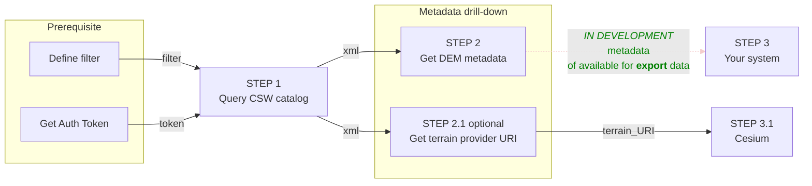

## Step by step guide
The following guide will help you understand, ***Step-by-step*** the best practices of how to work with the Map Colonies **DEM** Catalog and how to consume mapping products in a ***dynamic way*** (materials might be changed or added)

## Flow diagram


## Query CSW catalog (Step 1)
Query **DEM CSW catalog** service to find item(s) according to desired filter [examples are here](/docs/ogc/protocols/ogc-csw/ogc-csw-examples)

Filter should be based on [DEM profile](/docs/MapColonies/DEM/Services/catalog/catalog-profile-v1)

Example query based on `mc:classification` profile field
```xml title="GetRecords Request"
POST Request

url:
'<DEM-CATALOG-SERVICE_URL>/csw'

body (XML):
<?xml version="1.0" encoding="UTF-8"?>
<csw:GetRecords outputFormat="application/xml"  outputSchema="http://schema.mapcolonies.com/dem" resultType="results" service="CSW" version="2.0.2" startPosition="1" maxRecords="200" xmlns:mc="http://schema.mapcolonies.com/dem" xmlns:csw="http://www.opengis.net/cat/csw/2.0.2" xmlns:ogc="http://www.opengis.net/ogc">
    <csw:Query typeNames="csw:Record">
        <csw:ElementSetName>full</csw:ElementSetName>
        <csw:Constraint version="1.1.0">
            <ogc:Filter>
                <ogc:And>
                    <ogc:PropertyIsEqualTo>
                        <ogc:PropertyName>mc:classification</ogc:PropertyName>
                        <ogc:Literal>5</ogc:Literal>
                    </ogc:PropertyIsEqualTo>
                    <ogc:PropertyIsEqualTo>
                        <ogc:PropertyName>mc:productType</ogc:PropertyName>
                        <ogc:Literal>DTM</ogc:Literal>
                    </ogc:PropertyIsEqualTo>
                </ogc:And>
            </ogc:Filter>
        </csw:Constraint>
    </csw:Query>
</csw:GetRecords>
```

You will get GetRecords XML Response with product **metadata**.

<details>
  <summary>Response example</summary>

```xml title="Search Results Example"
    <?xml version="1.0" encoding="UTF-8"?>
    <csw:GetRecordsResponse xmlns:csw="http://www.opengis.net/cat/csw/2.0.2" xmlns:dc="http://purl.org/dc/elements/1.1/" xmlns:dct="http://purl.org/dc/terms/" xmlns:gmd="http://www.isotc211.org/2005/gmd" xmlns:gml="http://www.opengis.net/gml" xmlns:mc="http://schema.mapcolonies.com/dem" xmlns:ows="http://www.opengis.net/ows" xmlns:xs="http://www.w3.org/2001/XMLSchema" xmlns:xsi="http://www.w3.org/2001/XMLSchema-instance" version="2.0.2" xsi:schemaLocation="http://www.opengis.net/cat/csw/2.0.2 http://schemas.opengis.net/csw/2.0.2/CSW-discovery.xsd">
    <csw:SearchStatus timestamp="2022-03-27T06:45:54Z" />
    <csw:SearchResults numberOfRecordsMatched="2" numberOfRecordsReturned="2" nextRecord="0" recordSchema="http://schema.mapcolonies.com/dem" elementSet="full">
        <mc:MCDEMRecord>
            <mc:accuracyLEP90>999.0</mc:accuracyLEP90>
            <mc:classification>5</mc:classification>
            <mc:footprint>{"type":"Polygon","coordinates":[[[31.2603,33.4345],[31.2603,34.4888],[32.3353,34.4888],[32.3353,33.4345],[31.2603,33.4345]]]}</mc:footprint>
            <mc:geographicArea>ישראל</mc:geographicArea>
            <mc:maxHorizontalAccuracyCE90>999.0</mc:maxHorizontalAccuracyCE90>
            <mc:id>c2bbeeee-6081-4e69-918c-287f48ea244d</mc:id>
            <mc:links scheme="WMTS_LAYER" name="" description="">http://dem-server/15211-65da-4523-9d6f-08016ad51b0d....</mc:links>
            <mc:producerName>DAVID</mc:producerName>
            <mc:productBBox>31.2603,33.4345,32.3353,34.4888</mc:productBBox>
            <mc:productId>c2bbeeee-6081-4e69-918c-287f48ea244d</mc:productId>
            <mc:productName>מודל פריז</mc:productName>
            <mc:productType>DTM</mc:productType>
            <mc:productVersion>1</mc:productVersion>
            <mc:productionMethod>photogrammetric</mc:productionMethod>
            <mc:productionSystem>P-30</mc:productionSystem>
            <mc:productionSystemVersion>1</mc:productionSystemVersion>
            <mc:region>צפון</mc:region>
            <mc:sensors>sensor1</mc:sensors>
            <mc:imagingTimeEndUTC>2022-06-15T10:39:00Z</mc:imagingTimeEndUTC>
            <mc:imagingTimeBeginUTC>2022-06-15T10:39:00Z</mc:imagingTimeBeginUTC>
            <mc:SRS>4567</mc:SRS>
            <mc:SRSName>WGS24GEO</mc:SRSName>
            <mc:type>RECORD_DEM</mc:type>
            <ows:BoundingBox crs="urn:x-ogc:def:crs:EPSG:6.11:4326" dimensions="2">
                <ows:LowerCorner>33.4345 31.2603</ows:LowerCorner>
                <ows:UpperCorner>34.4888 32.3353</ows:UpperCorner>
            </ows:BoundingBox>
        </mc:MCDEMRecord>
        <mc:MCDEMRecord>
            <mc:accuracyLEP90>999.0</mc:accuracyLEP90>
            <mc:classification>5</mc:classification>
            <mc:creationDateUTC>2022-06-15</mc:creationDateUTC>
            <mc:description>srtm100</mc:description>
            <mc:footprint>{"type":"Polygon","coordinates":[[[35.2670012825,32.5856881598],[35.2670012825,32.6300363309],[35.3105702702,32.6300363309],[35.3105702702,32.5856881598],[35.2670012825,32.5856881598]]]}</mc:footprint>
            <mc:geographicArea>North</mc:geographicArea>
            <mc:maxHorizontalAccuracyCE90>999.0</mc:maxHorizontalAccuracyCE90>
            <mc:id>11111111-1111-1111-1111-111111111111</mc:id>
            <mc:links scheme="TERRAIN_QMESH" name="" description="">http://terrain-server.com/terrains/srtm100</mc:links>
            <mc:producerName>MIKI</mc:producerName>
            <mc:productBBox>35.2670012825,32.5856881598,35.3105702702,32.6300363309</mc:productBBox>
            <mc:productId>11111111-1111-1111-1111-111111111111</mc:productId>
            <mc:productName>srtm100</mc:productName>
            <mc:productType>DTM</mc:productType>
            <mc:productVersion>1</mc:productVersion>
            <mc:productionMethod></mc:productionMethod>
            <mc:productionSystem></mc:productionSystem>
            <mc:productionSystemVersion>1</mc:productionSystemVersion>
            <mc:region>Israel</mc:region>
            <mc:sensors>UNDEFINED</mc:sensors>
            <mc:imagingTimeEndUTC>2022-06-15</mc:imagingTimeEndUTC>
            <mc:imagingTimeBeginUTC>2022-06-15</mc:imagingTimeBeginUTC>
            <mc:SRS>4326</mc:SRS>
            <mc:SRSName>WGS84GEO</mc:SRSName>
            <mc:type>RECORD_DEM</mc:type>
            <ows:BoundingBox crs="urn:x-ogc:def:crs:EPSG:6.11:4326" dimensions="2">
                <ows:LowerCorner>32.5856881598 35.2670012825</ows:LowerCorner>
                <ows:UpperCorner>32.6300363309 35.3105702702</ows:UpperCorner>
            </ows:BoundingBox>
        </mc:MCDEMRecord>
    </csw:SearchResults>
    </csw:GetRecordsResponse>
```
</details>

:::info
**Authentication must be integrated in order to communicate with Catalog services.**<br/>
**See the principles [here](/docs/MapColonies/authentication)**
:::

## Get DEM metadata (Step 2)
In the Response, look for desired data according to profile definition.

## Get terrain provider URI (Step 2.1, optional)
In the Response, look for

```xml title="Extract link for terrain provider"
<mc:links scheme="TERRAIN_QMESH" name="srtm100">
  http://terrain-server.com/terrains/srtm100
</mc:links>
```

:::info
**You should extract the `<mc:links>` <u>element</u> value as TERRAIN_URL variable, which is a terrain provider consumption URL for the following steps.**
:::

## Using catalog data (Step 3)
In the future, you'll be able to export catalog data( elevation raw data in TIFF format ) after filtering.

## Construct Client (Step 3.1)
Now, after you got all product metadata that you need by querying our Catalog, lets actually use it in your client application.

:::warning
**Below examples are based on `Pseudo code`, you will have to adapt it in your own application to make it work.**
:::

### Cesium

:::info
**The minimum required version for cesium is v84.**
:::

```javascript
// **Optional** add to Cesium terrain provider in order to clamp 3d models to the ground or investigate terrain 
viewer.terrainProvider = new Cesium.TerrainProvider({
  url: new Cesium.Resource({
    url: "<TERRAIN_URL>",
    queryParameters: {
      "token": "<token>",
    },
  }),
});
...
```
Replace `<TERRAIN_URL>` with the URL link that you got from **Step 2.1 (optional)**.

Replace `<token>` with the token you have.
