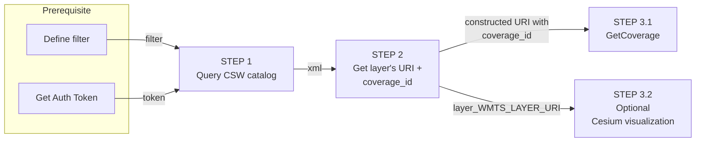

## Developer Guide step-by-step <!-- {docsify-ignore} -->
The following guide will help you understand how to work with the DEM sub-system of Map Colonies  and how to consume DEM data.

There are two options:
- CSW catalog service with conjunction WCS service.
- Superior-DEM service

## CSW catalog service with conjunction WCS service
**Step-by-step** recipe:

:::info
**Authentication must be integrated in order to communicate with CSW server.** 
**See the principles [here](/ogc-protocols/ogc-csw-auth.md)**
:::

1. Query **DEM CSW catalog** service to find item(s)  according to desired filter [example are here](catalog-information/query-examples.md)
2. From relevant catalog item extract **coverage_id**
3. Use catalog item
    1. Query **DEM WCS** service for data according to [GetCoverage protocol operation](ogc-protocols/ogc-wcs.md)
    2. _Optional_ - Visualize layer on map(**Cesium**)
