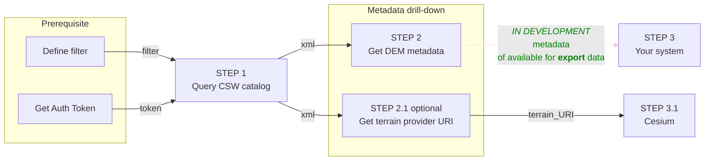

## Step by step guide
The following guide will help you understand ***Step-by-step*** how to work with the Map Colonies Height Extraction service, from the [Catalog](/docs/MapColonies/DEM/Services/catalog/dem-catalog) to the WCS protocol.

:::warning
This guide is for using height extraction for algorithm usage and **not for viewing purposes**.
:::

:::note
Please note the [obligations](/docs/MapColonies/obligations) you need to follow while using our services.
:::

:::warning
**Any** request to our services should include a `token` as a form of [authentication](/docs/MapColonies/authentication).
:::

## Flow diagram


## Query the DEM catalog (Step 1)

Query the **DEM catalog** service to find item(s) according to a desired filter [examples are here](/docs/ogc/protocols/ogc-csw/ogc-csw-examples).

Filter should be based on fields in the [DEM profile](/docs/MapColonies/DEM/Services/catalog/dem-catalog-profile-v2).

### Get all records (pagination)

When we want to get all of the records in the catalog we can make the following query:

```bash
curl --location --request POST '<DEM_CATALOG_SERVICE_URL>/csw?token=<token>' \
--header 'Content-Type: application/xml' \
--data-raw '<?xml version="1.0" encoding="UTF-8"?>
<csw:GetRecords outputFormat="application/xml" outputSchema="http://schema.mapcolonies.com/dem" resultType="results" service="CSW" version="2.0.2" startPosition="1" maxRecords="1" xmlns:mc="http://schema.mapcolonies.com/dem" xmlns:csw="http://www.opengis.net/cat/csw/2.0.2" xmlns:ogc="http://www.opengis.net/ogc">
    <csw:Query typeNames="mc:MCDEMRecord">
        <csw:ElementSetName>full</csw:ElementSetName>
    </csw:Query>
</csw:GetRecords>'
```

<details>
    <summary>Response</summary>
    ```xml
    <?xml version="1.0" encoding="UTF-8" standalone="no"?>
    <csw:GetRecordsResponse xmlns:csw="http://www.opengis.net/cat/csw/2.0.2" xmlns:dc="http://purl.org/dc/elements/1.1/" xmlns:dct="http://purl.org/dc/terms/" xmlns:gmd="http://www.isotc211.org/2005/gmd" xmlns:gml="http://www.opengis.net/gml" xmlns:ows="http://www.opengis.net/ows" xmlns:xs="http://www.w3.org/2001/XMLSchema" xmlns:xsi="http://www.w3.org/2001/XMLSchema-instance" xmlns:mc="http://schema.mapcolonies.com/dem" version="2.0.2" xsi:schemaLocation="http://www.opengis.net/cat/csw/2.0.2 http://schemas.opengis.net/csw/2.0.2/CSW-discovery.xsd">
        <csw:SearchStatus timestamp="2026-02-11T14:05:23Z"/>
        <csw:SearchResults numberOfRecordsMatched="2" numberOfRecordsReturned="1" nextRecord="2" recordSchema="http://schema.mapcolonies.com/dem" elementSet="full">
            <mc:MCDEMRecord>
                <mc:acquisitionTimeBeginUTC>2019-12-31T11:00:00Z</mc:acquisitionTimeBeginUTC>
                <mc:acquisitionTimeEndUTC>2019-12-31T11:00:00Z</mc:acquisitionTimeEndUTC>
                <mc:areaOrPoint>Area</mc:areaOrPoint>
                <mc:classification>0</mc:classification>
                <mc:dataType>FLOAT32</mc:dataType>
                <mc:description></mc:description>
                <mc:footprint>{"type":"Polygon","coordinates":[[[0,0],[10,0],[10,10],[0,0]]]}</mc:footprint>
                <mc:geoidModel>egm96</mc:geoidModel>
                <mc:id>e2d812ba-40b7-4dfe-b3e7-869356467d3a</mc:id>
                <mc:ingestionDateUTC>2025-12-31T10:17:16Z</mc:ingestionDateUTC>
                <mc:insertDateUTC>2020-12-31T11:00:00Z</mc:insertDateUTC>
                <mc:links scheme="WCS" name="product_name_2-DSM" description=""><WCS_SERVICE_URL>/wcs?request=GetCapabilities</mc:links>
                <mc:links scheme="Download" name="product_name_2-DSM" description=""><DOWNLOAD_SERVICE_URL>/path/to/file.ext</mc:links>
                <mc:maxAbsoluteAccuracyLEP90>2</mc:maxAbsoluteAccuracyLEP90>
                <mc:maxHorizontalAccuracyCEP90>6</mc:maxHorizontalAccuracyCEP90>
                <mc:maxRelativeAccuracyLEP90>4</mc:maxRelativeAccuracyLEP90>
                <mc:maxResolutionDegree>0.0004</mc:maxResolutionDegree>
                <mc:maxResolutionMeter>40</mc:maxResolutionMeter>
                <mc:minAbsoluteAccuracyLEP90>1</mc:minAbsoluteAccuracyLEP90>
                <mc:minHorizontalAccuracyCEP90>5</mc:minHorizontalAccuracyCEP90>
                <mc:minRelativeAccuracyLEP90>3</mc:minRelativeAccuracyLEP90>
                <mc:minResolutionDegree>0.0004</mc:minResolutionDegree>
                <mc:minResolutionMeter>40</mc:minResolutionMeter>
                <mc:noDataValue>-32768</mc:noDataValue>
                <mc:producerName>IDFMU</mc:producerName>
                <mc:productId>81d2b9b0-a99f-45da-8dce-b83323d22d1c</mc:productId>
                <mc:productName>product_name_2</mc:productName>
                <mc:productType>DSM</mc:productType>
                <mc:productVersion>1</mc:productVersion>
                <mc:region>region</mc:region>
                <mc:sensors>sensors</mc:sensors>
                <mc:srsId>4326</mc:srsId>
                <mc:srsName>WGS84GEO</mc:srsName>
                <mc:type>RECORD_DEM</mc:type>
                <mc:updateDateUTC>2020-12-31T11:00:00Z</mc:updateDateUTC>
                <ows:BoundingBox crs="urn:x-ogc:def:crs:EPSG:6.11:4326" dimensions="2">
                    <ows:LowerCorner>0.0 0.0</ows:LowerCorner>
                    <ows:UpperCorner>10.0 10.0</ows:UpperCorner>
                </ows:BoundingBox>
            </mc:MCDEMRecord>
        </csw:SearchResults>
    </csw:GetRecordsResponse>
    ```
</details>

Notice the attriutes `startPosition` and `maxRecords`, both of them help us to implement the `pagination` concept. In result, we get the following attributes in the response:

- `numberOfRecordsMatched` indicating the total amount of records in the catalog matching our filters
- `numberOfRecordsReturned` indicating the amount of records returned for this request (may be less than `maxRecords` given in the request)
- `nextRecord` the value that should be passed for `startPosition` in the following request

Our next request should look like this:

```bash
curl --location --request POST '<DEM_CATALOG_SERVICE_URL>/csw?token=<token>' \
--header 'Content-Type: application/xml' \
--data-raw '<?xml version="1.0" encoding="UTF-8"?>
<csw:GetRecords outputFormat="application/xml" outputSchema="http://schema.mapcolonies.com/dem" resultType="results" service="CSW" version="2.0.2" startPosition="2" maxRecords="1" xmlns:mc="http://schema.mapcolonies.com/dem" xmlns:csw="http://www.opengis.net/cat/csw/2.0.2" xmlns:ogc="http://www.opengis.net/ogc">
    <csw:Query typeNames="mc:MCDEMRecord">
        <csw:ElementSetName>full</csw:ElementSetName>
    </csw:Query>
</csw:GetRecords>'
```

### Get all records with productType DTM

```bash
curl --location --request POST '<DEM_CATALOG_SERVICE_URL>/csw?token=<token>' \
--header 'Content-Type: application/xml' \
--data-raw '<?xml version="1.0" encoding="UTF-8"?>
<csw:GetRecords outputFormat="application/xml" outputSchema="http://schema.mapcolonies.com/dem" resultType="results" service="CSW" version="2.0.2" startPosition="1" maxRecords="5" xmlns:mc="http://schema.mapcolonies.com/dem" xmlns:csw="http://www.opengis.net/cat/csw/2.0.2" xmlns:ogc="http://www.opengis.net/ogc">
    <csw:Query typeNames="mc:MCDEMRecord">
        <csw:ElementSetName>full</csw:ElementSetName>
        <csw:Constraint version="1.1.0">
            <Filter xmlns="http://www.opengis.net/ogc">
                <PropertyIsEqualTo>
                    <PropertyName>mc:productType</PropertyName>
                    <Literal>DTM</Literal>
                </PropertyIsEqualTo>
            </Filter>
        </csw:Constraint >
    </csw:Query>
</csw:GetRecords>'
```

<details>
    <summary>Response</summary>
    ```xml
    <?xml version="1.0" encoding="UTF-8" standalone="no"?>
    <csw:GetRecordsResponse xmlns:csw="http://www.opengis.net/cat/csw/2.0.2" xmlns:dc="http://purl.org/dc/elements/1.1/" xmlns:dct="http://purl.org/dc/terms/" xmlns:gmd="http://www.isotc211.org/2005/gmd" xmlns:gml="http://www.opengis.net/gml" xmlns:ows="http://www.opengis.net/ows" xmlns:xs="http://www.w3.org/2001/XMLSchema" xmlns:xsi="http://www.w3.org/2001/XMLSchema-instance" xmlns:mc="http://schema.mapcolonies.com/dem" version="2.0.2" xsi:schemaLocation="http://www.opengis.net/cat/csw/2.0.2 http://schemas.opengis.net/csw/2.0.2/CSW-discovery.xsd">
        <csw:SearchStatus timestamp="2026-02-11T14:03:18Z"/>
        <csw:SearchResults numberOfRecordsMatched="1" numberOfRecordsReturned="1" nextRecord="0" recordSchema="http://schema.mapcolonies.com/dem" elementSet="full">
            <mc:MCDEMRecord>
                <mc:acquisitionTimeBeginUTC>2024-12-31T11:00:00Z</mc:acquisitionTimeBeginUTC>
                <mc:acquisitionTimeEndUTC>2024-12-31T11:00:00Z</mc:acquisitionTimeEndUTC>
                <mc:areaOrPoint>Area</mc:areaOrPoint>
                <mc:classification>0</mc:classification>
                <mc:dataType>FLOAT32</mc:dataType>
                <mc:footprint>{"type":"Polygon","coordinates":[[[0,0],[10,0],[10,10],[0,0]]]}</mc:footprint>
                <mc:geoidModel>egm96</mc:geoidModel>
                <mc:id>d2d812ba-40b7-4dfe-b3e7-869356467d3a</mc:id>
                <mc:ingestionDateUTC>2025-12-31T09:55:51Z</mc:ingestionDateUTC>
                <mc:insertDateUTC>2025-12-31T11:00:00Z</mc:insertDateUTC>
                <mc:links scheme="WCS" name="product_name_1-DTM" description=""><WCS_SERVICE_URL>/wcs?request=GetCapabilities</mc:links>
                <mc:links scheme="Download" name="product_name_1-DTM" description=""><DOWNLOAD_SERVICE_URL>/path/to/file.ext</mc:links>
                <mc:maxAbsoluteAccuracyLEP90>2</mc:maxAbsoluteAccuracyLEP90>
                <mc:maxHorizontalAccuracyCEP90>6</mc:maxHorizontalAccuracyCEP90>
                <mc:maxRelativeAccuracyLEP90>4</mc:maxRelativeAccuracyLEP90>
                <mc:maxResolutionDegree>0.0004</mc:maxResolutionDegree>
                <mc:maxResolutionMeter>40</mc:maxResolutionMeter>
                <mc:minAbsoluteAccuracyLEP90>1</mc:minAbsoluteAccuracyLEP90>
                <mc:minHorizontalAccuracyCEP90>5</mc:minHorizontalAccuracyCEP90>
                <mc:minRelativeAccuracyLEP90>3</mc:minRelativeAccuracyLEP90>
                <mc:minResolutionDegree>0.0004</mc:minResolutionDegree>
                <mc:minResolutionMeter>40</mc:minResolutionMeter>
                <mc:noDataValue>-32768</mc:noDataValue>
                <mc:producerName>IDFMU</mc:producerName>
                <mc:productId>71d2b9b0-a99f-45da-8dce-b83323d22d1c</mc:productId>
                <mc:productName>product_name_1</mc:productName>
                <mc:productType>DTM</mc:productType>
                <mc:productVersion>1</mc:productVersion>
                <mc:region>region</mc:region>
                <mc:sensors>sensors</mc:sensors>
                <mc:srsId>4326</mc:srsId>
                <mc:srsName>WGS84GEO</mc:srsName>
                <mc:type>RECORD_DEM</mc:type>
                <mc:updateDateUTC>2025-12-31T11:00:00Z</mc:updateDateUTC>
                <ows:BoundingBox crs="urn:x-ogc:def:crs:EPSG:6.11:4326" dimensions="2">
                    <ows:LowerCorner>0.0 0.0</ows:LowerCorner>
                    <ows:UpperCorner>10.0 10.0</ows:UpperCorner>
                </ows:BoundingBox>
            </mc:MCDEMRecord>
        </csw:SearchResults>
    </csw:GetRecordsResponse>
    ```
</details>

### Get all records with productType DTM and contained in a given BBOX

```bash
curl --location --request POST '<DEM_CATALOG_SERVICE_URL>/csw?token=<token>' \
--data-raw '<?xml version="1.0" encoding="UTF-8"?>
<csw:GetRecords outputFormat="application/xml" outputSchema="http://schema.mapcolonies.com/dem" resultType="results" service="CSW" version="2.0.2" startPosition="1" maxRecords="5" xmlns:mc="http://schema.mapcolonies.com/dem" xmlns:csw="http://www.opengis.net/cat/csw/2.0.2" xmlns:ogc="http://www.opengis.net/ogc" xmlns:gml="http://www.opengis.net/gml">
    <csw:Query typeNames="mc:MCDEMRecord">
        <csw:ElementSetName>full</csw:ElementSetName>
        <csw:Constraint version="1.1.0">
            <Filter xmlns="http://www.opengis.net/ogc">
                <And>
                    <PropertyIsEqualTo>
                        <PropertyName>mc:productType</PropertyName>
                        <Literal>DTM</Literal>
                    </PropertyIsEqualTo>
                    <ogc:BBOX>
                        <ogc:PropertyName>ows:BoundingBox</ogc:PropertyName>
                        <gml:Envelope>
                            <gml:lowerCorner>-10 -10</gml:lowerCorner>
                            <gml:upperCorner>20 20</gml:upperCorner>
                        </gml:Envelope>
                    </ogc:BBOX>
                </And>
            </Filter>
        </csw:Constraint >
    </csw:Query>
</csw:GetRecords>'
```

### Get all records with productType DTM and contained in a given Polygon

```bash
curl --location --request POST '<DEM_CATALOG_SERVICE_URL>/csw?token=<token>' \
--data-raw '<?xml version="1.0" encoding="UTF-8"?>
<csw:GetRecords outputFormat="application/xml" outputSchema="http://schema.mapcolonies.com/dem" resultType="results" service="CSW" version="2.0.2" startPosition="1" maxRecords="5" xmlns:mc="http://schema.mapcolonies.com/dem" xmlns:csw="http://www.opengis.net/cat/csw/2.0.2" xmlns:ogc="http://www.opengis.net/ogc" xmlns:gml="http://www.opengis.net/gml">
    <csw:Query typeNames="mc:MCDEMRecord">
        <csw:ElementSetName>full</csw:ElementSetName>
        <csw:Constraint version="1.1.0">
            <Filter xmlns="http://www.opengis.net/ogc">
                <And>
                    <PropertyIsEqualTo>
                        <PropertyName>mc:productType</PropertyName>
                        <Literal>DTM</Literal>
                    </PropertyIsEqualTo>
                    <ogc:Intersects>
                        <ogc:PropertyName>ows:BoundingBox</ogc:PropertyName>
                        <gml:Polygon srsName="[SRS_IDENTIFIER]">
                            <gml:outerBoundaryIs>
                                <gml:LinearRing>
                                    <gml:coordinates decimal="." cs="," ts=" ">
                                        [COORD1_X],[COORD1_Y] [COORD2_X],[COORD2_Y] [COORD3_X],[COORD3_Y] [COORD4_X],[COORD4_Y] ... [COORDN_X],[COORDN_Y] [COORD1_X],[COORD1_Y]
                                    </gml:coordinates>
                                </gml:LinearRing>
                            </gml:outerBoundaryIs>
                        </gml:Polygon>
                    </ogc:Intersects>
                </And>
            </Filter>
        </csw:Constraint >
    </csw:Query>
</csw:GetRecords>'
```

## Get metadata (Step 2)

In the Response, look for desired data according to profile definition.

For the next steps you may want to examine the information returned from the `catalog` and extraction service additional requests in order to make calculated decisions about which `product` to use.

### Catalog service

:::info
For details about each filed read more [here](/docs/MapColonies/DEM/Services/catalog/dem-catalog-profile-v2).
:::

Fields you may want to filter by:
| **Field name / Partial name** | **Filter purpose** |
| ----------- | ----------- |
| footprint | Specific geographical area |
| ...Accuracy... | |
| ...Resolution... | |
| productType | Specific product type (for example: only DTM) |
| srsId / srsName | Wanted SRS |
| ingestionDateUTC | Layers that were ingested before / after a given time  |
| updateDateUTC | Layers that were updated before / after a given time |

### Extraction service capabilities

:::info
Read more about this request [here](/docs/ogc/protocols/ogc-wcs#getcapabilities).
:::

```bash
<WCS_SERVICE_URL>/wcs?request=GetCapabilities&token=<token>
```

<details>
    <summary>Response</summary>
    ```xml
    <?xml version="1.0" encoding="UTF-8"?>
    <wcs:Capabilities xmlns:wcs="http://www.opengis.net/wcs/2.0" xmlns:ows="http://www.opengis.net/ows/2.0" xmlns:gml="http://www.opengis.net/gml/3.2" xmlns:gmlcov="http://www.opengis.net/gmlcov/1.0" xmlns:xlink="http://www.w3.org/1999/xlink" xmlns:xsi="http://www.w3.org/2001/XMLSchema-instance" version="2.0.1" updateSequence="16" xmlns:int="https://www.opengis.net/wcs/interpolation/1.0" xmlns:crs="http://www.opengis.net/wcs/crs/1.0" xmlns:inspire_common="http://inspire.ec.europa.eu/schemas/common/1.0" xmlns:inspire_dls="http://inspire.ec.europa.eu/schemas/inspire_dls/1.0" xsi:schemaLocation=" http://www.opengis.net/wcs/2.0 http://schemas.opengis.net/wcs/2.0/wcsGetCapabilities.xsd http://inspire.ec.europa.eu/schemas/inspire_dls/1.0 https://inspire.ec.europa.eu/schemas/inspire_dls/1.0/inspire_dls.xsd">
        <ows:ServiceIdentification>
            <ows:Title/>
            <ows:Abstract/>
            <ows:ServiceType>urn:ogc:service:wcs</ows:ServiceType>
            <ows:ServiceTypeVersion>2.0.1</ows:ServiceTypeVersion>
            <ows:ServiceTypeVersion>1.1.1</ows:ServiceTypeVersion>
            <ows:ServiceTypeVersion>1.1.0</ows:ServiceTypeVersion>
            <ows:Profile>http://www.opengis.net/spec/WCS/2.0/conf/core</ows:Profile>
            <ows:Profile>http://www.opengis.net/spec/WCS_protocol-binding_get-kvp/1.0.1</ows:Profile>
            <ows:Profile>http://www.opengis.net/spec/WCS_protocol-binding_post-xml/1.0</ows:Profile>
            <ows:Profile>http://www.opengis.net/spec/WCS_service-extension_crs/1.0/conf/crs-gridded-coverage</ows:Profile>
            <ows:Profile>
                <![CDATA[ http://www.opengis.net/spec/WCS_geotiff-coverages/1.0/conf/geotiff-coverage]]>
            </ows:Profile>
            <ows:Profile>http://www.opengis.net/spec/GMLCOV/1.0/conf/gml-coverage</ows:Profile>
            <ows:Profile>http://www.opengis.net/spec/GMLCOV/1.0/conf/special-format</ows:Profile>
            <ows:Profile>http://www.opengis.net/spec/GMLCOV/1.0/conf/multipart</ows:Profile>
            <ows:Profile>http://www.opengis.net/spec/WCS_service-extension_scaling/1.0/conf/scaling</ows:Profile>
            <ows:Profile>http://www.opengis.net/spec/WCS_service-extension_crs/1.0/conf/crs</ows:Profile>
            <ows:Profile>http://www.opengis.net/spec/WCS_service-extension_interpolation/1.0/conf/interpolation</ows:Profile>
            <ows:Profile>http://www.opengis.net/spec/WCS_service-extension_interpolation/1.0/conf/interpolation-per-axis</ows:Profile>
            <ows:Profile>http://www.opengis.net/spec/WCS_service-extension_interpolation/1.0/conf/nearest-neighbor</ows:Profile>
            <ows:Profile>http://www.opengis.net/spec/WCS_service-extension_interpolation/1.0/conf/linear</ows:Profile>
            <ows:Profile>http://www.opengis.net/spec/WCS_service-extension_interpolation/1.0/conf/cubic</ows:Profile>
            <ows:Profile>http://www.opengis.net/spec/WCS_service-extension_range-subsetting/1.0/conf/record-subsetting</ows:Profile>
            <ows:Fees>NONE</ows:Fees>
            <ows:AccessConstraints>NONE</ows:AccessConstraints>
        </ows:ServiceIdentification>
        <ows:ServiceProvider>
            <ows:ProviderName/>
            <ows:ProviderSite xlink:href=""/>
            <ows:ServiceContact>
                <ows:ContactInfo>
                    <ows:Phone/>
                    <ows:Address/>
                </ows:ContactInfo>
            </ows:ServiceContact>
        </ows:ServiceProvider>
        <ows:OperationsMetadata>
            <ows:Operation name="GetCapabilities">
                <ows:DCP>
                    <ows:HTTP>
                        <ows:Get xlink:href="<WCS_SERVICE_URL>/wcs?"/>
                    </ows:HTTP>
                </ows:DCP>
                <ows:DCP>
                    <ows:HTTP>
                        <ows:Post xlink:href="<WCS_SERVICE_URL>/wcs?"/>
                    </ows:HTTP>
                </ows:DCP>
            </ows:Operation>
            <ows:Operation name="DescribeCoverage">
                <ows:DCP>
                    <ows:HTTP>
                        <ows:Get xlink:href="<WCS_SERVICE_URL>/wcs?"/>
                    </ows:HTTP>
                </ows:DCP>
                <ows:DCP>
                    <ows:HTTP>
                        <ows:Post xlink:href="<WCS_SERVICE_URL>/wcs?"/>
                    </ows:HTTP>
                </ows:DCP>
            </ows:Operation>
            <ows:Operation name="GetCoverage">
                <ows:DCP>
                    <ows:HTTP>
                        <ows:Get xlink:href="<WCS_SERVICE_URL>/wcs?"/>
                    </ows:HTTP>
                </ows:DCP>
                <ows:DCP>
                    <ows:HTTP>
                        <ows:Post xlink:href="<WCS_SERVICE_URL>/wcs?"/>
                    </ows:HTTP>
                </ows:DCP>
            </ows:Operation>
            <ows:Constraint name="PostEncoding">
                <ows:AllowedValues>
                    <ows:Value>XML</ows:Value>
                </ows:AllowedValues>
            </ows:Constraint>
        </ows:OperationsMetadata>
        <wcs:ServiceMetadata>
            <wcs:formatSupported>application/gml+xml</wcs:formatSupported>
            <wcs:formatSupported>image/jpeg</wcs:formatSupported>
            <wcs:formatSupported>image/png</wcs:formatSupported>
            <wcs:formatSupported>image/tiff</wcs:formatSupported>
            <wcs:formatSupported>image/tiff;application=geotiff</wcs:formatSupported>
            <wcs:formatSupported>text/plain</wcs:formatSupported>
            <wcs:Extension>
                <crs:CrsMetadata xmlns:crs="http://www.opengis.net/wcs/crs/1.0">
                    ...
                    <crs:crsSupported>http://www.opengis.net/def/crs/EPSG/0/3857</crs:crsSupported>
                    ...
                    <crs:crsSupported>http://www.opengis.net/def/crs/EPSG/0/4326</crs:crsSupported>
                    ...
                    <crs:crsSupported>http://www.opengis.net/def/crs/EPSG/0/32600</crs:crsSupported>
                    <crs:crsSupported>http://www.opengis.net/def/crs/EPSG/0/32601</crs:crsSupported>
                    <crs:crsSupported>http://www.opengis.net/def/crs/EPSG/0/32602</crs:crsSupported>
                    <crs:crsSupported>http://www.opengis.net/def/crs/EPSG/0/32603</crs:crsSupported>
                    <crs:crsSupported>http://www.opengis.net/def/crs/EPSG/0/32604</crs:crsSupported>
                    <crs:crsSupported>http://www.opengis.net/def/crs/EPSG/0/32605</crs:crsSupported>
                    <crs:crsSupported>http://www.opengis.net/def/crs/EPSG/0/32606</crs:crsSupported>
                    <crs:crsSupported>http://www.opengis.net/def/crs/EPSG/0/32607</crs:crsSupported>
                    <crs:crsSupported>http://www.opengis.net/def/crs/EPSG/0/32608</crs:crsSupported>
                    <crs:crsSupported>http://www.opengis.net/def/crs/EPSG/0/32609</crs:crsSupported>
                    <crs:crsSupported>http://www.opengis.net/def/crs/EPSG/0/32610</crs:crsSupported>
                    <crs:crsSupported>http://www.opengis.net/def/crs/EPSG/0/32611</crs:crsSupported>
                    <crs:crsSupported>http://www.opengis.net/def/crs/EPSG/0/32612</crs:crsSupported>
                    <crs:crsSupported>http://www.opengis.net/def/crs/EPSG/0/32613</crs:crsSupported>
                    <crs:crsSupported>http://www.opengis.net/def/crs/EPSG/0/32614</crs:crsSupported>
                    <crs:crsSupported>http://www.opengis.net/def/crs/EPSG/0/32615</crs:crsSupported>
                    <crs:crsSupported>http://www.opengis.net/def/crs/EPSG/0/32616</crs:crsSupported>
                    <crs:crsSupported>http://www.opengis.net/def/crs/EPSG/0/32617</crs:crsSupported>
                    <crs:crsSupported>http://www.opengis.net/def/crs/EPSG/0/32618</crs:crsSupported>
                    <crs:crsSupported>http://www.opengis.net/def/crs/EPSG/0/32619</crs:crsSupported>
                    <crs:crsSupported>http://www.opengis.net/def/crs/EPSG/0/32620</crs:crsSupported>
                    <crs:crsSupported>http://www.opengis.net/def/crs/EPSG/0/32621</crs:crsSupported>
                    <crs:crsSupported>http://www.opengis.net/def/crs/EPSG/0/32622</crs:crsSupported>
                    <crs:crsSupported>http://www.opengis.net/def/crs/EPSG/0/32623</crs:crsSupported>
                    <crs:crsSupported>http://www.opengis.net/def/crs/EPSG/0/32624</crs:crsSupported>
                    <crs:crsSupported>http://www.opengis.net/def/crs/EPSG/0/32625</crs:crsSupported>
                    <crs:crsSupported>http://www.opengis.net/def/crs/EPSG/0/32626</crs:crsSupported>
                    <crs:crsSupported>http://www.opengis.net/def/crs/EPSG/0/32627</crs:crsSupported>
                    <crs:crsSupported>http://www.opengis.net/def/crs/EPSG/0/32628</crs:crsSupported>
                    <crs:crsSupported>http://www.opengis.net/def/crs/EPSG/0/32629</crs:crsSupported>
                    <crs:crsSupported>http://www.opengis.net/def/crs/EPSG/0/32630</crs:crsSupported>
                    <crs:crsSupported>http://www.opengis.net/def/crs/EPSG/0/32631</crs:crsSupported>
                    <crs:crsSupported>http://www.opengis.net/def/crs/EPSG/0/32632</crs:crsSupported>
                    <crs:crsSupported>http://www.opengis.net/def/crs/EPSG/0/32633</crs:crsSupported>
                    <crs:crsSupported>http://www.opengis.net/def/crs/EPSG/0/32634</crs:crsSupported>
                    <crs:crsSupported>http://www.opengis.net/def/crs/EPSG/0/32635</crs:crsSupported>
                    <crs:crsSupported>http://www.opengis.net/def/crs/EPSG/0/32636</crs:crsSupported>
                    <crs:crsSupported>http://www.opengis.net/def/crs/EPSG/0/32637</crs:crsSupported>
                    <crs:crsSupported>http://www.opengis.net/def/crs/EPSG/0/32638</crs:crsSupported>
                    <crs:crsSupported>http://www.opengis.net/def/crs/EPSG/0/32639</crs:crsSupported>
                    <crs:crsSupported>http://www.opengis.net/def/crs/EPSG/0/32640</crs:crsSupported>
                    <crs:crsSupported>http://www.opengis.net/def/crs/EPSG/0/32641</crs:crsSupported>
                    <crs:crsSupported>http://www.opengis.net/def/crs/EPSG/0/32642</crs:crsSupported>
                    <crs:crsSupported>http://www.opengis.net/def/crs/EPSG/0/32643</crs:crsSupported>
                    <crs:crsSupported>http://www.opengis.net/def/crs/EPSG/0/32644</crs:crsSupported>
                    <crs:crsSupported>http://www.opengis.net/def/crs/EPSG/0/32645</crs:crsSupported>
                    <crs:crsSupported>http://www.opengis.net/def/crs/EPSG/0/32646</crs:crsSupported>
                    <crs:crsSupported>http://www.opengis.net/def/crs/EPSG/0/32647</crs:crsSupported>
                    <crs:crsSupported>http://www.opengis.net/def/crs/EPSG/0/32648</crs:crsSupported>
                    <crs:crsSupported>http://www.opengis.net/def/crs/EPSG/0/32649</crs:crsSupported>
                    <crs:crsSupported>http://www.opengis.net/def/crs/EPSG/0/32650</crs:crsSupported>
                    <crs:crsSupported>http://www.opengis.net/def/crs/EPSG/0/32651</crs:crsSupported>
                    <crs:crsSupported>http://www.opengis.net/def/crs/EPSG/0/32652</crs:crsSupported>
                    <crs:crsSupported>http://www.opengis.net/def/crs/EPSG/0/32653</crs:crsSupported>
                    <crs:crsSupported>http://www.opengis.net/def/crs/EPSG/0/32654</crs:crsSupported>
                    <crs:crsSupported>http://www.opengis.net/def/crs/EPSG/0/32655</crs:crsSupported>
                    <crs:crsSupported>http://www.opengis.net/def/crs/EPSG/0/32656</crs:crsSupported>
                    <crs:crsSupported>http://www.opengis.net/def/crs/EPSG/0/32657</crs:crsSupported>
                    <crs:crsSupported>http://www.opengis.net/def/crs/EPSG/0/32658</crs:crsSupported>
                    <crs:crsSupported>http://www.opengis.net/def/crs/EPSG/0/32659</crs:crsSupported>
                    <crs:crsSupported>http://www.opengis.net/def/crs/EPSG/0/32660</crs:crsSupported>
                    <crs:crsSupported>http://www.opengis.net/def/crs/EPSG/0/32661</crs:crsSupported>
                    <crs:crsSupported>http://www.opengis.net/def/crs/EPSG/0/32662</crs:crsSupported>
                    <crs:crsSupported>http://www.opengis.net/def/crs/EPSG/0/32663</crs:crsSupported>
                    <crs:crsSupported>http://www.opengis.net/def/crs/EPSG/0/32664</crs:crsSupported>
                    <crs:crsSupported>http://www.opengis.net/def/crs/EPSG/0/32665</crs:crsSupported>
                    <crs:crsSupported>http://www.opengis.net/def/crs/EPSG/0/32666</crs:crsSupported>
                    <crs:crsSupported>http://www.opengis.net/def/crs/EPSG/0/32667</crs:crsSupported>
                    <crs:crsSupported>http://www.opengis.net/def/crs/EPSG/0/32700</crs:crsSupported>
                    <crs:crsSupported>http://www.opengis.net/def/crs/EPSG/0/32701</crs:crsSupported>
                    <crs:crsSupported>http://www.opengis.net/def/crs/EPSG/0/32702</crs:crsSupported>
                    <crs:crsSupported>http://www.opengis.net/def/crs/EPSG/0/32703</crs:crsSupported>
                    <crs:crsSupported>http://www.opengis.net/def/crs/EPSG/0/32704</crs:crsSupported>
                    <crs:crsSupported>http://www.opengis.net/def/crs/EPSG/0/32705</crs:crsSupported>
                    <crs:crsSupported>http://www.opengis.net/def/crs/EPSG/0/32706</crs:crsSupported>
                    <crs:crsSupported>http://www.opengis.net/def/crs/EPSG/0/32707</crs:crsSupported>
                    <crs:crsSupported>http://www.opengis.net/def/crs/EPSG/0/32708</crs:crsSupported>
                    <crs:crsSupported>http://www.opengis.net/def/crs/EPSG/0/32709</crs:crsSupported>
                    <crs:crsSupported>http://www.opengis.net/def/crs/EPSG/0/32710</crs:crsSupported>
                    <crs:crsSupported>http://www.opengis.net/def/crs/EPSG/0/32711</crs:crsSupported>
                    <crs:crsSupported>http://www.opengis.net/def/crs/EPSG/0/32712</crs:crsSupported>
                    <crs:crsSupported>http://www.opengis.net/def/crs/EPSG/0/32713</crs:crsSupported>
                    <crs:crsSupported>http://www.opengis.net/def/crs/EPSG/0/32714</crs:crsSupported>
                    <crs:crsSupported>http://www.opengis.net/def/crs/EPSG/0/32715</crs:crsSupported>
                    <crs:crsSupported>http://www.opengis.net/def/crs/EPSG/0/32716</crs:crsSupported>
                    <crs:crsSupported>http://www.opengis.net/def/crs/EPSG/0/32717</crs:crsSupported>
                    <crs:crsSupported>http://www.opengis.net/def/crs/EPSG/0/32718</crs:crsSupported>
                    <crs:crsSupported>http://www.opengis.net/def/crs/EPSG/0/32719</crs:crsSupported>
                    <crs:crsSupported>http://www.opengis.net/def/crs/EPSG/0/32720</crs:crsSupported>
                    <crs:crsSupported>http://www.opengis.net/def/crs/EPSG/0/32721</crs:crsSupported>
                    <crs:crsSupported>http://www.opengis.net/def/crs/EPSG/0/32722</crs:crsSupported>
                    <crs:crsSupported>http://www.opengis.net/def/crs/EPSG/0/32723</crs:crsSupported>
                    <crs:crsSupported>http://www.opengis.net/def/crs/EPSG/0/32724</crs:crsSupported>
                    <crs:crsSupported>http://www.opengis.net/def/crs/EPSG/0/32725</crs:crsSupported>
                    <crs:crsSupported>http://www.opengis.net/def/crs/EPSG/0/32726</crs:crsSupported>
                    <crs:crsSupported>http://www.opengis.net/def/crs/EPSG/0/32727</crs:crsSupported>
                    <crs:crsSupported>http://www.opengis.net/def/crs/EPSG/0/32728</crs:crsSupported>
                    <crs:crsSupported>http://www.opengis.net/def/crs/EPSG/0/32729</crs:crsSupported>
                    <crs:crsSupported>http://www.opengis.net/def/crs/EPSG/0/32730</crs:crsSupported>
                    <crs:crsSupported>http://www.opengis.net/def/crs/EPSG/0/32731</crs:crsSupported>
                    <crs:crsSupported>http://www.opengis.net/def/crs/EPSG/0/32732</crs:crsSupported>
                    <crs:crsSupported>http://www.opengis.net/def/crs/EPSG/0/32733</crs:crsSupported>
                    <crs:crsSupported>http://www.opengis.net/def/crs/EPSG/0/32734</crs:crsSupported>
                    <crs:crsSupported>http://www.opengis.net/def/crs/EPSG/0/32735</crs:crsSupported>
                    <crs:crsSupported>http://www.opengis.net/def/crs/EPSG/0/32736</crs:crsSupported>
                    <crs:crsSupported>http://www.opengis.net/def/crs/EPSG/0/32737</crs:crsSupported>
                    <crs:crsSupported>http://www.opengis.net/def/crs/EPSG/0/32738</crs:crsSupported>
                    <crs:crsSupported>http://www.opengis.net/def/crs/EPSG/0/32739</crs:crsSupported>
                    <crs:crsSupported>http://www.opengis.net/def/crs/EPSG/0/32740</crs:crsSupported>
                    <crs:crsSupported>http://www.opengis.net/def/crs/EPSG/0/32741</crs:crsSupported>
                    <crs:crsSupported>http://www.opengis.net/def/crs/EPSG/0/32742</crs:crsSupported>
                    <crs:crsSupported>http://www.opengis.net/def/crs/EPSG/0/32743</crs:crsSupported>
                    <crs:crsSupported>http://www.opengis.net/def/crs/EPSG/0/32744</crs:crsSupported>
                    <crs:crsSupported>http://www.opengis.net/def/crs/EPSG/0/32745</crs:crsSupported>
                    <crs:crsSupported>http://www.opengis.net/def/crs/EPSG/0/32746</crs:crsSupported>
                    <crs:crsSupported>http://www.opengis.net/def/crs/EPSG/0/32747</crs:crsSupported>
                    <crs:crsSupported>http://www.opengis.net/def/crs/EPSG/0/32748</crs:crsSupported>
                    <crs:crsSupported>http://www.opengis.net/def/crs/EPSG/0/32749</crs:crsSupported>
                    <crs:crsSupported>http://www.opengis.net/def/crs/EPSG/0/32750</crs:crsSupported>
                    <crs:crsSupported>http://www.opengis.net/def/crs/EPSG/0/32751</crs:crsSupported>
                    <crs:crsSupported>http://www.opengis.net/def/crs/EPSG/0/32752</crs:crsSupported>
                    <crs:crsSupported>http://www.opengis.net/def/crs/EPSG/0/32753</crs:crsSupported>
                    <crs:crsSupported>http://www.opengis.net/def/crs/EPSG/0/32754</crs:crsSupported>
                    <crs:crsSupported>http://www.opengis.net/def/crs/EPSG/0/32755</crs:crsSupported>
                    <crs:crsSupported>http://www.opengis.net/def/crs/EPSG/0/32756</crs:crsSupported>
                    <crs:crsSupported>http://www.opengis.net/def/crs/EPSG/0/32757</crs:crsSupported>
                    <crs:crsSupported>http://www.opengis.net/def/crs/EPSG/0/32758</crs:crsSupported>
                    <crs:crsSupported>http://www.opengis.net/def/crs/EPSG/0/32759</crs:crsSupported>
                    <crs:crsSupported>http://www.opengis.net/def/crs/EPSG/0/32760</crs:crsSupported>
                    <crs:crsSupported>http://www.opengis.net/def/crs/EPSG/0/32761</crs:crsSupported>
                    <crs:crsSupported>http://www.opengis.net/def/crs/EPSG/0/32762</crs:crsSupported>
                    <crs:crsSupported>http://www.opengis.net/def/crs/EPSG/0/32763</crs:crsSupported>
                    <crs:crsSupported>http://www.opengis.net/def/crs/EPSG/0/32764</crs:crsSupported>
                    <crs:crsSupported>http://www.opengis.net/def/crs/EPSG/0/32765</crs:crsSupported>
                    <crs:crsSupported>http://www.opengis.net/def/crs/EPSG/0/32766</crs:crsSupported>
                    ...
                </crs:CrsMetadata>
                <int:InterpolationMetadata xmlns:int="https://www.opengis.net/wcs/interpolation/1.0">
                    <int:InterpolationSupported>http://www.opengis.net/def/interpolation/OGC/1/nearest-neighbor</int:InterpolationSupported>
                    <int:InterpolationSupported>http://www.opengis.net/def/interpolation/OGC/1/linear</int:InterpolationSupported>
                    <int:InterpolationSupported>http://www.opengis.net/def/interpolation/OGC/1/cubic</int:InterpolationSupported>
                </int:InterpolationMetadata>
            </wcs:Extension>
        </wcs:ServiceMetadata>
        <wcs:Contents>
            <wcs:CoverageSummary>
                <ows:Title>mimad</ows:Title>
                <ows:Keywords>
                    <ows:Keyword>mimad</ows:Keyword>
                    <ows:Keyword>WCS</ows:Keyword>
                    <ows:Keyword>GeoTIFF</ows:Keyword>
                </ows:Keywords>
                <wcs:CoverageId>dem__mimad</wcs:CoverageId>
                <wcs:CoverageSubtype>RectifiedGridCoverage</wcs:CoverageSubtype>
                <ows:BoundingBox crs="http://www.opengis.net/def/crs/EPSG/0/32636">
                    <ows:LowerCorner>473139.25219177455 3230615.3954787063</ows:LowerCorner>
                    <ows:UpperCorner>873608.5831505858 3831319.391916923</ows:UpperCorner>
                </ows:BoundingBox>
                <ows:WGS84BoundingBox>
                    <ows:LowerCorner>32.70697763422942 29.149161895068794</ows:LowerCorner>
                    <ows:UpperCorner>37.071150249328454 34.62339561526329</ows:UpperCorner>
                </ows:WGS84BoundingBox>
            </wcs:CoverageSummary>
            <wcs:CoverageSummary>
                <ows:Title>mimad</ows:Title>
                <ows:Keywords>
                    <ows:Keyword>mimad</ows:Keyword>
                    <ows:Keyword>WCS</ows:Keyword>
                    <ows:Keyword>GeoTIFF</ows:Keyword>
                </ows:Keywords>
                <wcs:CoverageId>dem__mimad</wcs:CoverageId>
                <wcs:CoverageSubtype>RectifiedGridCoverage</wcs:CoverageSubtype>
                <ows:BoundingBox crs="http://www.opengis.net/def/crs/EPSG/0/32636">
                    <ows:LowerCorner>473139.25219177455 3230615.3954787063</ows:LowerCorner>
                    <ows:UpperCorner>873608.5831505858 3831319.391916923</ows:UpperCorner>
                </ows:BoundingBox>
                <ows:WGS84BoundingBox>
                    <ows:LowerCorner>32.70697763422942 29.149161895068794</ows:LowerCorner>
                    <ows:UpperCorner>37.071150249328454 34.62339561526329</ows:UpperCorner>
                </ows:WGS84BoundingBox>
            </wcs:CoverageSummary>
            <wcs:CoverageSummary>
                <ows:Title>srtm30</ows:Title>
                <ows:Keywords>
                    <ows:Keyword>srtm30</ows:Keyword>
                    <ows:Keyword>WCS</ows:Keyword>
                    <ows:Keyword>GeoTIFF</ows:Keyword>
                </ows:Keywords>
                <wcs:CoverageId>dem__srtm30</wcs:CoverageId>
                <wcs:CoverageSubtype>RectifiedGridCoverage</wcs:CoverageSubtype>
                <ows:BoundingBox crs="http://www.opengis.net/def/crs/EPSG/0/4326">
                    <ows:LowerCorner>34.716796875 32.16796875</ows:LowerCorner>
                    <ows:UpperCorner>35.68359375 32.958984375</ows:UpperCorner>
                </ows:BoundingBox>
                <ows:WGS84BoundingBox>
                    <ows:LowerCorner>34.716796875 32.16796875</ows:LowerCorner>
                    <ows:UpperCorner>35.68359375 32.958984375</ows:UpperCorner>
                </ows:WGS84BoundingBox>
            </wcs:CoverageSummary>
            <wcs:Extension/>
        </wcs:Contents>
    </wcs:Capabilities>
    ```
</details>

#### Understanding the capabilities response

Read more [here](/docs/ogc/protocols/ogc-wcs#understanding-capabilities).

### Extraction service coverage metadata

:::info
Read more about this request [here](/docs/ogc/protocols/ogc-wcs#describecoverage).
:::

```bash
curl --location --request GET '<WCS_SERVICE_URL>/wcs?request=DescribeCoverage&version=2.0.1&coverageId=srtm30&token=<token>'
```

<details>
    <summary>Response</summary>
    ```xml
    <?xml version="1.0" encoding="UTF-8"?>
    <wcs:CoverageDescriptions xmlns:wcs="http://www.opengis.net/wcs/2.0" xmlns:ows="http://www.opengis.net/ows/2.0" xmlns:gml="http://www.opengis.net/gml/3.2" xmlns:gmlcov="http://www.opengis.net/gmlcov/1.0" xmlns:xlink="http://www.w3.org/1999/xlink" xmlns:xsi="http://www.w3.org/2001/XMLSchema-instance" xmlns:swe="http://www.opengis.net/swe/2.0" xmlns:wcsgs="http://www.geoserver.org/wcsgs/2.0" xsi:schemaLocation=" http://www.opengis.net/wcs/2.0 http://schemas.opengis.net/wcs/2.0/wcsDescribeCoverage.xsd http://www.geoserver.org/wcsgs/2.0 https://poc-geoserver-dem-wcs-dev.apps.j1lk3njp.eastus.aroapp.io/schemas/wcs/2.0/wcsgs.xsd">
        <wcs:CoverageDescription gml:id="dem__srtm30">
            <gml:description>Generated from GeoTIFF</gml:description>
            <gml:name>srtm30</gml:name>
            <gml:boundedBy>
                <gml:Envelope srsName="http://www.opengis.net/def/crs/EPSG/0/4326" axisLabels="Lat Long" uomLabels="Deg Deg" srsDimension="2">
                    <gml:lowerCorner>32.16796875 34.716796875</gml:lowerCorner>
                    <gml:upperCorner>32.958984375 35.68359375</gml:upperCorner>
                </gml:Envelope>
            </gml:boundedBy>
            <wcs:CoverageId>dem__srtm30</wcs:CoverageId>
            <gml:coverageFunction>
                <gml:GridFunction>
                    <gml:sequenceRule axisOrder="+2 +1">Linear</gml:sequenceRule>
                    <gml:startPoint>0 0</gml:startPoint>
                </gml:GridFunction>
            </gml:coverageFunction>
            <gmlcov:metadata>
                <gmlcov:Extension>
                    <ows:Keywords>
                        <ows:Keyword>srtm30</ows:Keyword>
                        <ows:Keyword>WCS</ows:Keyword>
                        <ows:Keyword>GeoTIFF</ows:Keyword>
                    </ows:Keywords>
                </gmlcov:Extension>
            </gmlcov:metadata>
            <gml:domainSet>
                <gml:RectifiedGrid gml:id="grid00__dem__srtm30" dimension="2">
                    <gml:limits>
                        <gml:GridEnvelope>
                            <gml:low>0 0</gml:low>
                            <gml:high>2815 2303</gml:high>
                        </gml:GridEnvelope>
                    </gml:limits>
                    <gml:axisLabels>i j</gml:axisLabels>
                    <gml:origin>
                        <gml:Point gml:id="p00_dem__srtm30" srsName="http://www.opengis.net/def/crs/EPSG/0/4326">
                            <gml:pos>32.95881271362305 34.71696853637695</gml:pos>
                        </gml:Point>
                    </gml:origin>
                    <gml:offsetVector srsName="http://www.opengis.net/def/crs/EPSG/0/4326">0.0 3.4332275390625E-4</gml:offsetVector>
                    <gml:offsetVector srsName="http://www.opengis.net/def/crs/EPSG/0/4326">-3.4332275390625E-4 0.0</gml:offsetVector>
                </gml:RectifiedGrid>
            </gml:domainSet>
            <gmlcov:rangeType>
                <swe:DataRecord xmlns:swe="http://www.opengis.net/swe/2.0">
                    <swe:field name="GRAY_INDEX">
                        <swe:Quantity>
                            <swe:description>GRAY_INDEX</swe:description>
                            <swe:nilValues>
                                <swe:NilValues>
                                    <swe:nilValue reason="http://www.opengis.net/def/nil/OGC/0/unknown">-32768.0</swe:nilValue>
                                </swe:NilValues>
                            </swe:nilValues>
                            <swe:uom code="W.m-2.Sr-1"/>
                            <swe:constraint>
                                <swe:AllowedValues>
                                    <swe:interval>-32768 32767</swe:interval>
                                </swe:AllowedValues>
                            </swe:constraint>
                        </swe:Quantity>
                    </swe:field>
                </swe:DataRecord>
            </gmlcov:rangeType>
            <wcs:ServiceParameters>
                <wcs:CoverageSubtype>RectifiedGridCoverage</wcs:CoverageSubtype>
                <wcs:nativeFormat>image/tiff</wcs:nativeFormat>
            </wcs:ServiceParameters>
        </wcs:CoverageDescription>
    </wcs:CoverageDescriptions>
    ```
</details>

You should save the `srsName`, `axisLabels` and `srsDimension` attributes for [step 3](#get-coverage).

#### Understanding the extraction service coverage metadata

Read more [here](/docs/ogc/protocols/ogc-wcs#understanding-describe-coverage).

## Request elevation data (Step 3) {#get-coverage}

Now we can actually make a request for elevation data.

:::danger
We recommend you don't use the following `query parameters` when making requests:
- bbox_width
- bbox_height
- subset
- scalesize

These parameters require additional calculations on the server-side which means that the original data is changed on-the-fly resulting in new data with different attributes such as `resolution` or `accuracy`.
**Any** use of these parameters is the sole responsibility of the user as we cannot know the resulting requests metadata.
:::

### Get 

Replace `<TERRAIN_URL>` with the URL link that you got from **Step 2.1 (optional)**.

Replace `<token>` with the token you have.
