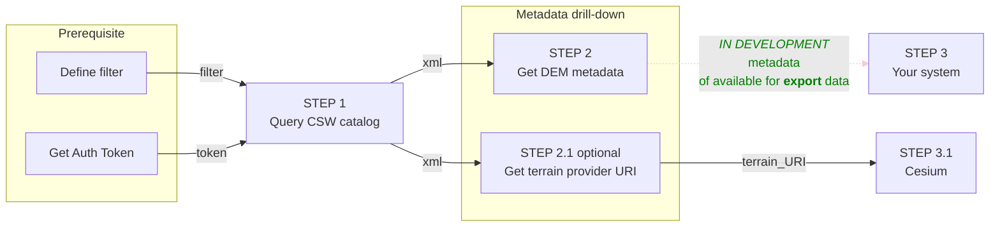

## Step by step guide
The following guide will help you understand, ***Step-by-step*** the best practices of how to work with the Map Colonies **DEM** Catalog and how to consume mapping products in a ***dynamic way*** (materials might be changed or added)

## Flow diagram


## Query CSW catalog (Step 1)

:::warning

Currently the terrain provider is only available through the `3D catalog`.

:::

:::info

**Authentication must be integrated in order to communicate with Catalog services.**<br/>
**See the principles [here](/docs/MapColonies/authentication)**

:::

Query **3D CSW catalog** service to find item(s) according to desired filter [examples are here](/docs/ogc/protocols/ogc-csw/ogc-csw-examples).

Filter should be based on [3D profile](/docs/MapColonies/3D/services/catalog/catalog-profile-v2).

```xml title="GetRecords Request For Terrain"
POST Request

url:
'<3D_CATALOG_SERVICE_URL>/csw'

body (XML):
<?xml version="1.0" encoding="UTF-8"?>
<csw:GetRecords outputFormat="application/xml"  outputSchema="http://schema.mapcolonies.com/3d" resultType="results" service="CSW" version="2.0.2" startPosition="1" maxRecords="200" xmlns:mc="http://schema.mapcolonies.com/3d" xmlns:csw="http://www.opengis.net/cat/csw/2.0.2" xmlns:ogc="http://www.opengis.net/ogc">
    <csw:Query typeNames="csw:Record">
        <csw:ElementSetName>full</csw:ElementSetName>
        <csw:Constraint version="1.1.0">
            <Filter xmlns="http://www.opengis.net/ogc">
              <PropertyIsEqualTo>

                <!-- ****** PROFILE FIELD NAME START ********************** -->
                <PropertyName>mc:productType</PropertyName>
                <!-- ****** PROFILE FIELD NAME END ********************** -->

                <!-- ****** PROFILE FIELD VALUE START ********************** -->
                <Literal>QuantizedMeshDTMBest</Literal>
                <!-- ****** PROFILE FIELD VALUE END ********************** -->

              </PropertyIsEqualTo>
            </Filter>
        </csw:Constraint>
    </csw:Query>
</csw:GetRecords>
```

You will get GetRecords XML Response with product **metadata**.

<details>
  <summary>Response example</summary>

```xml title="Search Results Example"
    <?xml version="1.0" encoding="UTF-8"?>
    <csw:GetRecordsResponse xmlns:csw="http://www.opengis.net/cat/csw/2.0.2" xmlns:dc="http://purl.org/dc/elements/1.1/" xmlns:dct="http://purl.org/dc/terms/" xmlns:gmd="http://www.isotc211.org/2005/gmd" xmlns:gml="http://www.opengis.net/gml" xmlns:mc="http://schema.mapcolonies.com/3d" xmlns:ows="http://www.opengis.net/ows" xmlns:xs="http://www.w3.org/2001/XMLSchema" xmlns:xsi="http://www.w3.org/2001/XMLSchema-instance" version="2.0.2" xsi:schemaLocation="http://www.opengis.net/cat/csw/2.0.2 http://schemas.opengis.net/csw/2.0.2/CSW-discovery.xsd">
    <csw:SearchStatus timestamp="2022-03-27T06:45:54Z" />
    <csw:SearchResults numberOfRecordsMatched="1" numberOfRecordsReturned="1" nextRecord="0" recordSchema="http://schema.mapcolonies.com/3d" elementSet="full">
        <mc:MC3DRecord>
            <mc:accuracyLE90>4.0</mc:accuracyLE90>
            <mc:classification>5</mc:classification>
            <mc:creationDateUTC>2022-10-24</mc:creationDateUTC>
            <mc:footprint>{"type":"Polygon","coordinates":[[[34.98,32.8],[35.1,32.8],[35.1,32.7],[34.98,32.7],[34.98,32.8]]]}</mc:footprint>
            <mc:geographicArea>North</mc:geographicArea>
            <mc:maxHorizontalAccuracyCE90>999.0</mc:maxHorizontalAccuracyCE90>
            <mc:id>33333333-3333-3333-3333-333333333333</mc:id>
            <mc:insertDate>2022-10-24</mc:insertDate>
            <mc:links scheme="TERRAIN_QMESH" name="" description="">https://tiles.mapcolonies.net/api/dem/v1/terrains/srtm100</mc:links>
            <mc:producerName>producer</mc:producerName>
            <mc:productBBox>35.2670012825,32.5856881598,35.3105702702,32.6300363309</mc:productBBox>
            <mc:productId>33333333-3333-3333-3333-333333333333</mc:productId>
            <mc:productName>srtm100</mc:productName>
            <mc:productSource></mc:productSource>
            <mc:productStatus>PUBLISHED</mc:productStatus>
            <mc:productType>QuantizedMeshDTMBest</mc:productType>
            <mc:productVersion>1</mc:productVersion>
            <mc:productionSystem></mc:productionSystem>
            <mc:productionSystemVersion>1</mc:productionSystemVersion>
            <mc:region>region</mc:region>
            <mc:sensors>UNDEFINED</mc:sensors>
            <mc:imagingTimeEndUTC>2022-10-24</mc:imagingTimeEndUTC>
            <mc:imagingTimeBeginUTC>2022-10-24</mc:imagingTimeBeginUTC>
            <mc:SRS>4326</mc:SRS>
            <mc:SRSName>WGS84GEO</mc:SRSName>
            <mc:type>RECORD_3D</mc:type>
            <mc:updateDateUTC>2022-10-25T16:48:17Z</mc:updateDateUTC>
            <ows:BoundingBox crs="urn:x-ogc:def:crs:EPSG:6.11:4326" dimensions="2">
                <ows:LowerCorner>32.7 34.98</ows:LowerCorner>
                <ows:UpperCorner>32.8 35.1</ows:UpperCorner>
            </ows:BoundingBox>
        </mc:MC3DRecord>
    </csw:SearchResults>
    </csw:GetRecordsResponse>
```
</details>

## Get DEM metadata (Step 2)
In the Response, look for desired data according to profile definition.

## Get terrain provider URI (Step 2.1) {#step-2.1}
In the Response, look for a `link` tag with `schem="TERRAIN_QMESH"`, this will be the link you need to get the data.

For our case:

```xml title="Extract link for terrain provider"
<mc:links scheme="TERRAIN_QMESH" name="srtm100-DTM">
  {TERRAIN_URL}/terrains/srtm100
</mc:links>
```

Save the value as `TERRAIN_URL` for the next steps.

## Construct Client (Step 3)
Now let's see how we can load the provider in our application.

:::warning
**Below examples are based on `Pseudo code`, you will have to adapt it in your own application to make it work.**
:::

### Cesium

:::info
**The minimum required version for cesium is v84.**
:::

```javascript
// **Optional** add to Cesium terrain provider in order to clamp 3d models to the ground or investigate terrain 
viewer.terrainProvider = new Cesium.TerrainProvider({
  url: new Cesium.Resource({
    url: "{TERRAIN_URL}",
    queryParameters: {
      "token": "{token}",
    },
  }),
});
...
```
Replace `{TERRAIN_URL}` with the URL link that you got from **[Step 2.1](#step-2.1)**.

Replace `{token}` with the token we provided you.
