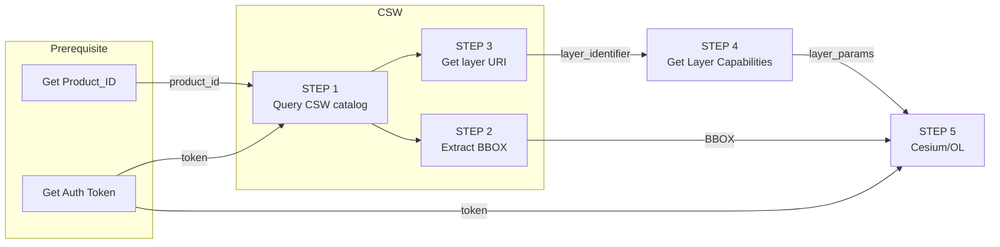

import Tabs from '@theme/Tabs';
import TabItem from '@theme/TabItem';
import PlaygroundFrame from '@site/src/components/PlaygroundFrame'

## Developer Guide step-by-step
The following guide will help you understand, ***Step-by-step*** the best practices of how to work with the Map Colonies Catalog and how to consume mapping products in ***dynamic way*** (materials might be changed or added)

**Note:** In order to get the layer details (Product_ID, region, etc.) you have the following options:
1. Open map-colonies catalog application and locate the required layer
2. Query all records via CSW GetRecords operation and search it in the result response - [Query Examples Documentation](/docs/ogc/protocols/ogc-csw/ogc-csw-examples#query-by-field-value)

## Flow diagram

The following flow will show you one of our main use-case's



## Query Catalog Service (Step 1) {#step-1}
Query **RASTER CSW catalog** service to find item(s) according to desired filter [example are here](/docs/ogc/protocols/ogc-csw/ogc-csw-examples).

:::warning
Pay attention to set the following parameter 'outputSchema="http://schema.mapcolonies.com/raster"' in order to get full catalog data
:::

There are a few ways to acquire the productId, for example:

<Tabs>
<TabItem value="SpecificLayer" label="Specific Layer">

To fetch a specific layer you need to aquire 2 properties values:
1. `productType`
2. `productId`
To get unique product when you already have the ***productType*** and ***productId*** you can use the following query (both can be coppied from our catalog app, for example for ***Best Orthophoto*** use the following)
```
POST Request

url:
'<RASTER-CATALOG-SERVICE_URL>/csw'

body (XML):
<?xml version="1.0" encoding="UTF-8"?>
<csw:GetRecords xmlns:csw="http://www.opengis.net/cat/csw/2.0.2" service="CSW" maxRecords="1"  startPosition="1" outputSchema="http://schema.mapcolonies.com/raster" version="2.0.2" xmlns:mc="http://schema.mapcolonies.com/raster" >
  <csw:Query typeNames="mc:MCRasterRecord">
   <csw:ElementSetName>full</csw:ElementSetName>
    <csw:Constraint version="1.1.0">
      <Filter xmlns="http://www.opengis.net/ogc">
        <And>
          <PropertyIsEqualTo>
            <PropertyName>mc:productType</PropertyName>
            <Literal>OrthophotoBest</Literal>
          </PropertyIsEqualTo>
          <PropertyIsEqualTo>
            <PropertyName>mc:productId</PropertyName>
            <Literal>ORTHOPHOTO_MOSAIC_BASE</Literal>
          </PropertyIsEqualTo>
        </And>
      </Filter>
    </csw:Constraint>
  </csw:Query>
</csw:GetRecords>
```

</TabItem>
<TabItem value="fetchAll" label="Fetch All Layers (Pagination)">

You can enquire all raster products, use maxRecords and startPosition for pagination:

``` xml
POST Request

url:
'<RASTER-CATALOG-SERVICE_URL>/csw'

body (XML):
<?xml version="1.0" encoding="UTF-8"?>
<csw:GetRecords xmlns:csw="http://www.opengis.net/cat/csw/2.0.2" service="CSW" maxRecords="1"  startPosition="1"  outputSchema="http://schema.mapcolonies.com/raster" version="2.0.2" xmlns:mc="http://schema.mapcolonies.com/raster" >
  <csw:Query typeNames="mc:MCRasterRecord">
   <csw:ElementSetName>full</csw:ElementSetName>
    <csw:Constraint version="1.1.0">
      <Filter xmlns="http://www.opengis.net/ogc">
        <PropertyIsEqualTo>
          <PropertyName>mc:type</PropertyName>
          <Literal>RECORD_RASTER</Literal>
        </PropertyIsEqualTo>
      </Filter>
    </csw:Constraint>
  </csw:Query>
</csw:GetRecords>
```

</TabItem>
</Tabs>

You will get GetRecords XML Response with product **metadata**.

<details>
  <summary>Response example</summary>

  ``` xml title="GetRecords Response"
    <?xml version="1.0" encoding="UTF-8" standalone="no"?>
    <!-- pycsw 2.7.dev0 -->
    <csw:GetRecordsResponse xmlns:csw="http://www.opengis.net/cat/csw/2.0.2" xmlns:dc="http://purl.org/dc/elements/1.1/" xmlns:dct="http://purl.org/dc/terms/" xmlns:gmd="http://www.isotc211.org/2005/gmd" xmlns:gml="http://www.opengis.net/gml" xmlns:ows="http://www.opengis.net/ows" xmlns:xs="http://www.w3.org/2001/XMLSchema" xmlns:xsi="http://www.w3.org/2001/XMLSchema-instance" xmlns:mc="http://schema.mapcolonies.com/raster" version="2.0.2" xsi:schemaLocation="http://www.opengis.net/cat/csw/2.0.2 http://schemas.opengis.net/csw/2.0.2/CSW-discovery.xsd">
        <csw:SearchStatus timestamp="2022-02-15T15:08:58Z"/>
        <csw:SearchResults numberOfRecordsMatched="2" numberOfRecordsReturned="1" nextRecord="2" recordSchema="http://schema.mapcolonies.com/raster" elementSet="full">
            <mc:MCRasterRecord>
                <mc:classification>4</mc:classification>
                <mc:creationDateUTC>2022-02-13T13:04:23Z</mc:creationDateUTC>
                <mc:description>World Wide 2020</mc:description>
                <mc:footprint>{"type":"Polygon","coordinates":[[[-180,-90],[-180,90],[180,90],[180,-90],[-180,-90]]]}</mc:footprint>
                <mc:minHorizontalAccuracyCE90>3</mc:minHorizontalAccuracyCE90>
                <mc:id>3b3164a7-280d-4392-a82f-d60a76e69092</mc:id>
                <mc:ingestionDate>2022-02-13T13:04:23Z</mc:ingestionDate>
                <mc:insertDate>2022-02-13T13:04:41Z</mc:insertDate>
                <mc:mimeType>image/jpeg</mc:mimeType>
                <mc:links scheme="WMS" name="ORTHOPHOTO_MOSAIC_BASE" description="">'<YOUR_MAPPROXY_URL>/service?REQUEST=GetCapabilities'</mc:links>
                <mc:links scheme="WMS_BASE" name="ORTHOPHOTO_MOSAIC_BASE" description="">'<YOUR_MAPPROXY_URL>/wms'</mc:links>
                <mc:links scheme="WMTS" name="ORTHOPHOTO_MOSAIC_BASE" description="">'<YOUR_MAPPROXY_URL>/wmts/1.0.0/WMTSCapabilities.xml'</mc:links>
                <mc:links scheme="WMTS_KVP" name="ORTHOPHOTO_MOSAIC_BASE" description="">'<YOUR_MAPPROXY_URL>/service?REQUEST=GetCapabilities&SERVICE=WMTS'</mc:links>
                <mc:links scheme="WMTS_BASE" name="ORTHOPHOTO_MOSAIC_BASE" description="">'<YOUR_MAPPROXY_URL>/wmts'</mc:links>
                <mc:maxResolutionMeter>0.1</mc:maxResolutionMeter>
                <mc:producerName>IDFMU</mc:producerName>
                <mc:productBBox>-180,-90,180,90</mc:productBBox>
                <mc:productId>ORTHOPHOTO_MOSAIC_BASE</mc:productId>
                <mc:productName>אורתופוטו מתעדכן</mc:productName>
                <mc:productType>OrthophotoBest</mc:productType>
                <mc:productVersion>1.0</mc:productVersion>
                <mc:region>World</mc:region>
                <mc:maxResolutionDeg>0.000171661376953125</mc:maxResolutionDeg>
                <mc:sensors>UNDEFINED</mc:sensors>
                <mc:imagingTimeEndUTC>2020-05-21</mc:imagingTimeEndUTC>
                <mc:imagingTimeBeginUTC>2020-05-21</mc:imagingTimeBeginUTC>
                <mc:SRS>4326</mc:SRS>
                <mc:SRSName>WGS84GEO</mc:SRSName>
                <mc:transparency>OPAQUE</mc:transparency>
                <mc:type>RECORD_RASTER</mc:type>
                <mc:updateDateUTC>2022-02-13T13:03:07Z</mc:updateDateUTC>
                <ows:BoundingBox crs="urn:x-ogc:def:crs:EPSG:6.11:4326" dimensions="2">
                    <ows:LowerCorner>-180.0 90.0</ows:LowerCorner>
                    <ows:UpperCorner>180.0 90.0</ows:UpperCorner>
                </ows:BoundingBox>
            </mc:MCRasterRecord>
        </csw:SearchResults>
    </csw:GetRecordsResponse>
  ```
</details>

## Extract product Bounding Box (Step 2) {#step-2}
Now you want to find LAYER product BBOX (aka ‘extent’) from the metadata response of the product.
In the Response, look for `<ows:BoundingBox></ows:BoundingBox>` element.


Another way to find the product extent:
In the Response, look for `<mc:footprint></mc:footprint>` element.
In the example above - response XML file looks like this:
`<mc:footprint>{"type":"Polygon","coordinates":[[[-180,-90],[-180,90],[180,90],[180,-90],[-180,-90]]]}</mc:footprint>`)

Use any tool (CesiumJS, turfJS, etc..) to convert the footprint(GeoJSON) into a bounding box.

For example using CesiumJS and turfJS
``` typescript title="Generate layer footprint"
import bbox from '@turf/bbox';
import { Rectangle } from 'cesium';
import { LayerRasterRecord } from '../models';

export const generateLayerRectangle = (layer: LayerRasterRecord): Rectangle => {
  return Rectangle.fromDegrees(...bbox(layer.footprint));
};

```
After you’ve got your product bounding box lets move to the next step…

## Get layer URI (Step 3) {#step-3}
In the Response, look for

:::note
WMTS (wmts capabilities) And WMTS_BASE (base wmts link exists also for those who prefer to use them)
:::

``` xml
<mc:links scheme="WMTS" name="[desired_layer_identifier]" description="">
  '<RASTER-RASTER-SERVING-SERVICE_URL>/wmts/1.0.0/WMTSCapabilities.xml'
</mc:links>
<mc:links scheme="WMTS_KVP" name="[desired_layer_identifier]" description="">
  '<RASTER-RASTER-SERVING-SERVICE_URL>/service?REQUEST=GetCapabilities&SERVICE=WMTS'
</mc:links>
<mc:links scheme="WMTS_BASE" name="[desired_layer_identifier]" description="">
  '<RASTER-RASTER-SERVING-SERVICE_URL>/wmts'
</mc:links>
```

You need to save `[desired_layer_identifier]` value for later use.
:::info
**You also may save `<mc:links>` <u>element</u> value, which is a layer consumption URL.**
:::

## Get Layer Capabilities (Step 4) {#step-4}
Now, you need to fetch Raster's MapServer specified Layer metadata by sending **GetCapabilities** request.
First - find the correct **GetCapabilities URL**. Best way to achieve it is by looking for `scheme="WMTS"` property in the response of **[Step 3](#step-3)** and extract the GetCapabilities URL off it.

``` xml
<mc:links scheme="WMTS" name="[desired_layer_identifier]" description="">
  '<RASTER-RASTER-SERVING-SERVICE_URL>/wmts/1.0.0/WMTSCapabilities.xml'
</mc:links>
```

**OR** you can use wmts KVP capabilities

``` xml title="Link for WMTS in KVP Format"
<mc:links scheme="WMTS_KVP" name="[desired_layer_identifier]" description="">
  '<RASTER-RASTER-SERVING-SERVICE_URL>/service?REQUEST=GetCapabilities&SERVICE=WMTS'
</mc:links>
```

Make a GET request to this link. The response contains the details of **all** available layers in following format.
<figure>
    
</figure>

In the Response, look for LAYER where `<ows:Identifier>` has saved [previously](#step-3) `[desired_layer_identifier]`

You can read more about ***GetCapabilities*** OGC format [here](http://docs.opengeospatial.org/is/13-082r2/13-082r2.html) 🌐

You need to **save** the following values in order to consume the layer later on [Step 5](#step-5).

:::info
**Alternative to &nbsp; [Step 3](#step-3) way to get layer consumption URL**
`<Layer/>` element include an exact WMTS URL template inside the child `<ResourceURL/>` element. So, you can use it as well
:::

## Construct Client side layer (Step 5) {#step-5}
Now, after you got all product metadata that you need by querying our Catalog and MapProxy capabilities, lets actually use it in order to display it in real map viewer / application (clients).
:::warning
**Below examples are based on `Pseudo code`, you will have to adapt it in your own application to make it work.**
:::

:::warning
**Important:** only **query parameter** `token` is currently supported
:::

<Tabs>
<TabItem value="Cesium" label="Cesium">

```javascript
...
...
...

const catalogLayer = new Cesium.WebMapTileServiceImageryProvider({
      url : '<LAYER_WMTS_URL>',                         // from Step_3 or Step_4
      /*********************************************************************************/
      /********     WHEN AUTH IS REQUIRED                                       ********/
      /*********************************************************************************/
      // url:new Cesium.Resource({
      //  url: '<LAYER_WMTS_URL>',                      // from Step_3 or Step_4
      //  headers: { 'X-API-KEY': RASTER_TOKEN },       // received RASTER auth token
      //  queryParameters: { 'token': RASTER_TOKEN },   // received RASTER auth token -
      //}),
      layer : '[desired_layer_identifier]',             // from Step_3
      style : '<LAYER_STYLE>',                          // from Step_4
      format : '<LAYER_FORMAT>',                        // from Step_4
      tileMatrixSetID : '<LAYER_TILE_MATRIX_SET_ID>',   // from Step_4
      /*********************************************************************************/
      /********     TILING SCHEME SHOULD BE 2 x 1                                ********/
      /*********************************************************************************/
      tilingScheme: new Cesium.GeographicTilingScheme(),
      /*********************************************************************************/
      /********     EXTENT SHOULD BE AS MUCH AS CLOSE TO LAYER ORIGIN FOOTPRINT ********/
      /*********************************************************************************/
      rectangle : <LAYER_EXTENT>,                       // from Step_2
    });

map.addLayer(catalogLayer);
...
...
...
```

</TabItem>
<TabItem value="OpenLayers (v6.x)" label="OpenLayers (v6.x)">


### OpenLayers (6.x)
```javascript
...
...
...
    const parser = new WMTSCapabilities();
    const capabilitiesResponse = await fetch('CapabilitiesURL');              // from Step_4
    const capabilitiesText = await capabilitiesResponse.text();
    const parserResult = parser.read(capabilitiesText);
    const layerOptions = optionsFromCapabilities(parserResult, {
      layer: '[desired_layer_identifier]'                                     // from Step_3
    });
    const layer = new TileLayer({ source: new WMTS(layerOptions), extent });  // from Step_2

    map.addLayer(layer);
...
...
...
```

</TabItem>
<TabItem value="Leaflet" label="Leaflet (v1.x)">

```javascript
  import L from "leaflet";
    ...
    ...
    ...
    //urlTemplate example: https://maps/api/raster/v1/wmts/test-orthophoto/{TileMatrixSet}/{TileMatrix}{TileCol}/{TileRow}.jpeg
    const parser = (urlTemplate) => {
      return wmtsUrl
    .replace("{TileMatrixSet}", '<LAYER_TILE_MATRIX_SET_ID>')         // from Step_4
    .replace("{TileMatrix}", "{z}")
    .replace("{TileRow}", "{y}")
    .replace("{TileCol}", "{x}");
    }

    const bounds = L.latLngBounds([
      [extent[1], extent[0]],                                         // from Step_2
      [extent[3], extent[2]],                                         // from Step_2
    ]);

    const urlTemplate = '<LAYER_WMTS_URL>'                            // from Step_3 or Step_4
    const parsedUrl = parser(urlTemplate)

    const map = L.map("map", { crs: L.CRS.EPSG4326 }).setView([0, 0], 0);
                                                                      //in case of queryParameter authentication:
    const layer = L.tileLayer(parsedUrl + '?token=${TOKEN}',{   // received RASTER auth token
      id : '<desired_layer_identifier>',                              // from Step_3
      bounds
    })

    map.addLayer(layer);
    ...
    ...
    ...
```

</TabItem>
</Tabs>

Replace all `<>` place holders with the real values that we got from all previous steps:
- url - should be replaced by the URL that you got from [Step 3](#step-3) or [Step 4](#step-4).
- layer - should be replaced with layer Product ID.
- style - should be replaced with the value that you got from [Step 4](#step-4).
- format - should be replaced with the value that you got from [Step 4](#step-4)
- tileMatrixSetID - how can you get it? from Response from [Step 4](#step-4).
- tilingScheme
- rectangle - value should be the BBOX (extent that you got from [Step 2](#step-2).
- Note - **extent** taken from step 2 - where bbox is calculated.

### Leaflet (1.x)

:::note
For **headers api key** see the following link: https://github.com/PaulLeCam/react-leaflet/issues/852#issuecomment-1495774676
:::

## Enrich Layer data (Step 6) {#step-6}
In order to present catalog items in your system you can use following fields:

- **mc:productName**
- **mc:description**
- **...**
- **rest** [Raster profile definition](/docs/MapColonies/Raster/services/catalog/raster-catalog-profile-v1)
