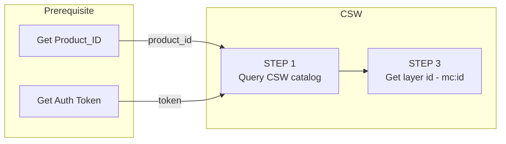

import Tabs from '@theme/Tabs';
import TabItem from '@theme/TabItem';
import PlaygroundFrame from '@site/src/components/PlaygroundFrame'

## Export Guide step-by-step
The following guide will help you understand, ***Step-by-step*** the best practices of how to work with the Map Colonies WFS Sevice and how to query layer parts data.

WFS querying capabilities Reference is [here](MapColonies/Raster/services/LayerParts/layer-parts)

**Note:** In order to get the layer id (mc:id) you have the following options:
1. Open map-colonies catalog application and locate the required layer
<figure>
    
</figure>
2. Query all records via CSW GetRecords operation and search it in the result response
- [Query Examples](/docs/ogc/protocols/ogc-csw/ogc-csw-examples)

## Flow diagram

The following flow will show you one of our main use-case's



## Query Catalog Service (Step 1)
Query **RASTER CSW catalog** service to find item(s) according to desired filter [example are here](/docs/ogc/protocols/ogc-csw/ogc-csw-examples).

:::warning
Pay attention to set the following parameter 'outputSchema="http://schema.mapcolonies.com/raster"' in order to get full catalog data
:::

There are a few ways to acquire the productId, for example:

<Tabs>
<TabItem value="SpecificLayer" label="Specific Layer">

To fetch a specific layer you need to aquire 2 properties values:
1. `productType`
2. `productId`
To get unique product when you already have the ***productType*** and ***productId*** you can use the following query (both can be coppied from our catalog app, for example for ***Best Orthophoto*** use the following)

POST Request

url:
```'<RASTER-CATALOG-SERVICE_URL>/csw'```

body (XML):
```xml 
<?xml version="1.0" encoding="UTF-8"?>
<csw:GetRecords xmlns:csw="http://www.opengis.net/cat/csw/2.0.2" service="CSW" maxRecords="1"  startPosition="1" outputSchema="http://schema.mapcolonies.com/raster" version="2.0.2" xmlns:mc="http://schema.mapcolonies.com/raster" >
  <csw:Query typeNames="mc:MCRasterRecord">
   <csw:ElementSetName>full</csw:ElementSetName>
    <csw:Constraint version="1.1.0">
      <Filter xmlns="http://www.opengis.net/ogc">
        <And>
          <PropertyIsEqualTo>
            <PropertyName>mc:productType</PropertyName>
            <Literal>OrthophotoBest</Literal>
          </PropertyIsEqualTo>
          <PropertyIsEqualTo>
            <PropertyName>mc:productId</PropertyName>
            <Literal>ORTHOPHOTO_MOSAIC_BASE</Literal>
          </PropertyIsEqualTo>
        </And>
      </Filter>
    </csw:Constraint>
  </csw:Query>
</csw:GetRecords>
```

</TabItem>
<TabItem value="fetchAll" label="Fetch All Layers (Pagination)">

You can enquire all raster products, use maxRecords and startPosition for pagination:

POST Request

url:
```'<RASTER-CATALOG-SERVICE_URL>/csw'```

body (XML):
```xml 
<?xml version="1.0" encoding="UTF-8"?>
<csw:GetRecords xmlns:csw="http://www.opengis.net/cat/csw/2.0.2" service="CSW" maxRecords="1" startPosition="1" outputSchema="http://schema.mapcolonies.com/raster" version="2.0.2" xmlns:mc="http://schema.mapcolonies.com/raster" >
  <csw:Query typeNames="mc:MCRasterRecord">
   <csw:ElementSetName>full</csw:ElementSetName>
    <csw:Constraint version="1.1.0">
      <Filter xmlns="http://www.opengis.net/ogc">
        <And>
          <PropertyIsEqualTo>
            <PropertyName>mc:productId</PropertyName>
            <Literal>productId</Literal>
          </PropertyIsEqualTo>
          <PropertyIsEqualTo>
            <PropertyName>mc:productType</PropertyName>
            <Literal>productType</Literal>
          </PropertyIsEqualTo>
        </And>
      </Filter>
    </csw:Constraint>
  </csw:Query>
</csw:GetRecords>
```

</TabItem>
</Tabs>

You will get GetRecords XML Response with product **metadata**.

<details>
  <summary>Response example</summary>

  ``` xml title="GetRecords Response"
    <?xml version="1.0" encoding="UTF-8" standalone="no"?>
    <!-- pycsw 2.7.dev0 -->
    <csw:GetRecordsResponse xmlns:csw="http://www.opengis.net/cat/csw/2.0.2" xmlns:dc="http://purl.org/dc/elements/1.1/" xmlns:dct="http://purl.org/dc/terms/" xmlns:gmd="http://www.isotc211.org/2005/gmd" xmlns:gml="http://www.opengis.net/gml" xmlns:ows="http://www.opengis.net/ows" xmlns:xs="http://www.w3.org/2001/XMLSchema" xmlns:xsi="http://www.w3.org/2001/XMLSchema-instance" xmlns:mc="http://schema.mapcolonies.com/raster" version="2.0.2" xsi:schemaLocation="http://www.opengis.net/cat/csw/2.0.2 http://schemas.opengis.net/csw/2.0.2/CSW-discovery.xsd">
        <csw:SearchStatus timestamp="2022-02-15T15:08:58Z"/>
        <csw:SearchResults numberOfRecordsMatched="2" numberOfRecordsReturned="1" nextRecord="2" recordSchema="http://schema.mapcolonies.com/raster" elementSet="full">
            <mc:MCRasterRecord>
                <mc:classification>4</mc:classification>
                <mc:creationDateUTC>2022-02-13T13:04:23Z</mc:creationDateUTC>
                <mc:description>World Wide 2020</mc:description>
                <mc:footprint>{"type":"Polygon","coordinates":[[[-180,-90],[-180,90],[180,90],[180,-90],[-180,-90]]]}</mc:footprint>
                <mc:minHorizontalAccuracyCE90>3</mc:minHorizontalAccuracyCE90>
                <mc:id>3b3164a7-280d-4392-a82f-d60a76e69092</mc:id>
                <mc:ingestionDate>2022-02-13T13:04:23Z</mc:ingestionDate>
                <mc:insertDate>2022-02-13T13:04:41Z</mc:insertDate>
                <mc:mimeType>image/jpeg</mc:mimeType>
                <mc:links scheme="WMS" name="ORTHOPHOTO_MOSAIC_BASE" description="">'<YOUR_MAPPROXY_URL>/service?REQUEST=GetCapabilities'</mc:links>
                <mc:links scheme="WMS_BASE" name="ORTHOPHOTO_MOSAIC_BASE" description="">'<YOUR_MAPPROXY_URL>/wms'</mc:links>
                <mc:links scheme="WMTS" name="ORTHOPHOTO_MOSAIC_BASE" description="">'<YOUR_MAPPROXY_URL>/wmts/1.0.0/WMTSCapabilities.xml'</mc:links>
                <mc:links scheme="WMTS_KVP" name="ORTHOPHOTO_MOSAIC_BASE" description="">'<YOUR_MAPPROXY_URL>/service?REQUEST=GetCapabilities&SERVICE=WMTS'</mc:links>
                <mc:links scheme="WMTS_BASE" name="ORTHOPHOTO_MOSAIC_BASE" description="">'<YOUR_MAPPROXY_URL>/wmts'</mc:links>
                NEW: -----> <mc:links scheme="WFS" name="ORTHOPHOTO_MOSAIC_BASE" description="">'<YOUR_WFS_URL>/wfs?request=GetCapabilities'</mc:links> <-----
                <mc:maxResolutionMeter>0.1</mc:maxResolutionMeter>
                <mc:producerName>IDFMU</mc:producerName>
                <mc:productBBox>-180,-90,180,90</mc:productBBox>
                <mc:productId>ORTHOPHOTO_MOSAIC_BASE</mc:productId>
                <mc:productName>אורתופוטו מתעדכן</mc:productName>
                <mc:productType>OrthophotoBest</mc:productType>
                <mc:productVersion>1.0</mc:productVersion>
                <mc:region>World</mc:region>
                <mc:maxResolutionDeg>0.000171661376953125</mc:maxResolutionDeg>
                <mc:sensors>UNDEFINED</mc:sensors>
                <mc:imagingTimeEndUTC>2020-05-21</mc:imagingTimeEndUTC>
                <mc:imagingTimeBeginUTC>2020-05-21</mc:imagingTimeBeginUTC>
                <mc:SRS>4326</mc:SRS>
                <mc:SRSName>WGS84GEO</mc:SRSName>
                <mc:transparency>OPAQUE</mc:transparency>
                <mc:type>RECORD_RASTER</mc:type>
                <mc:updateDateUTC>2022-02-13T13:03:07Z</mc:updateDateUTC>
                <ows:BoundingBox crs="urn:x-ogc:def:crs:EPSG:6.11:4326" dimensions="2">
                    <ows:LowerCorner>-180.0 90.0</ows:LowerCorner>
                    <ows:UpperCorner>180.0 90.0</ows:UpperCorner>
                </ows:BoundingBox>
            </mc:MCRasterRecord>
        </csw:SearchResults>
    </csw:GetRecordsResponse>
  ```
</details>

## Get layer URI (Step 2) {#step-2}

In the `catalog` response from the first step, look for the `links` tags.

:::warning
Each layer has it's own links, so make sure to filter for your wanted layer
:::

```xml title="Example links for a layer"
</mc:links>
<mc:links scheme="WFS" name="ORTHOPHOTO_MOSAIC_BASE" description="">
'<YOUR_WFS_URL>/wfs?request=GetCapabilities'
</mc:links>
```

You need to save the `[desired_layer_identifier]` value for later use.

## Query WFS layer GetCapabilities (Step 3)
Now you need to make an WFS `GetCapabilities` query request for the desired layer.

[Service Reference](/docs/MapColonies/Raster/services/LayerParts/layer-parts#getcapabilities)

Identify the WFS GetCapabilities from above step: 

```xml title="Link for WFS in RESTfull Format"
<mc:links scheme="WFS" name="[desired_layer_identifier]" description="">
  '<RASTER-SERVING-SERVICE_URL>/wfs'
</mc:links>
```
```

Make a GET request to this link. The response contains the details of all available layers in following format:

```xml title="Example links for a layer"
<ows:Operation name="DescribeFeatureType">
    <ows:DCP>
        <ows:HTTP>
            <ows:Get xlink:href="https://<YOUR_WFS_URL>/wfs"/>
            <ows:Post xlink:href="https://<YOUR_WFS_URL>/wfs"/>
        </ows:HTTP>
    </ows:DCP>
    <ows:Parameter name="outputFormat">
        <ows:AllowedValues>
            <ows:Value>application/gml+xml; version=3.2</ows:Value>
        </ows:AllowedValues>
    </ows:Parameter>
</ows:Operation>
<ows:Operation name="GetFeature">
    <ows:DCP>
        <ows:HTTP>
            <ows:Get xlink:href="https://<YOUR_WFS_URL>/wfs"/>
            <ows:Post xlink:href="https://<YOUR_WFS_URL>/wfs"/>
        </ows:HTTP>
    </ows:DCP>
</ows:Operation>
```

## Query WFS operations (Step 4)
As you can see, above xml response represents links to wfs operations query names (GetFeature/DescribeFeature)
Now all you have to do is query the desired WFS operation by those references that we mantioned.

<ows:Operation name="DescribeFeatureType"> Reference: [DescribeFeatureType](/docs/MapColonies/Raster/services/LayerParts/layer-parts#describefeaturetype)
<ows:Operation name="GetFeature"> -> Reference: [GetFeature](/docs/MapColonies/Raster/services/LayerParts/layer-parts#getfeature)