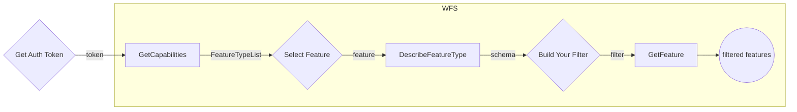

# Layer Parts Service 🧩

## General

### Understanding Layer Parts on Layer (records) management - Updates

This system utilizes polygons and layers to represent the precise area of a product and track all updates received over time. Polygons define the exact boundaries, while layers provide a structured way to integrate these updates. Let's delve deeper into how this system functions.

### Polygons

Represent the precise area of a product and all its subsequent updates.
Contain additional metadata like update date, accuracy, and photo sensor information.

### Layers

Composed of continuous geographic regions defined by several polygons.
Each polygon holds its own metadata.
Updates are merged with overlapping layers below.
Polygons within existing layers that overlap the new update (completely or partially) are re-calculated.

<figure>
    
</figure>

:::important Practical Example
B is a new layer containing 3 layer parts about to be merged into an existing layer.
As you can see in the “After” figure on the right, the new layer parts contains the merged layer parts of A and B.
Each part hold its own metadata and related attributes [LayerParts attributes](/docs/MapColonies/Raster/services/LayerParts/profile_v1_0.md)
:::

### WFS implementation

Raster layer parts service uses the [WFS](/docs/ogc/protocols/ogc-wfs) protocol which is a **READ-ONLY** Web Feature Service.
it provides facilities for searching and retrieving feature data with the `GetCapabilities`, `DescribeFeatureType` and `GetFeature` operations all other operations are invalid.

For the full capabilities provided by the service see [GetCapabilities](/docs/ogc/protocols/ogc-wfs#getcapabilities)

WFS partitions the queryable data into feature types each feature type has its own attributes describing the structure of the data itself.
For the description of a feature type see [DescribeFeatureType](/docs/ogc/protocols/ogc-wfs#describefeaturetype)

Finally, Features can be retrieved with the [GetFeature](/docs/ogc/protocols/ogc-wfs#getfeature) operation. the request returns a collection of geographic feature instances filtered according to a criteria set by the requesting client.
<br/>

:::important
**In layer parts, each feature represents a single polygon**
:::

:::warning Authentication
**Authentication must be integrated in order to communicate with Map and Catalog services.**<br/>
**See the principles [here](/docs/MapColonies/authentication)**
:::

## Overview

WFS protocol partitions the queryable features into different feature types.
Each feature types actually represent other catalog layer [Raster Catalog](/docs/MapColonies/Raster/services/catalog/raster-catalog-profile-v1).

Each feature type consists of same layer parts schema describing the feature. the feature type is queryable by its schema, each feature type has a default coordinate reference system and the bounding box which contains all features of this type, those are also possible parameters for querying.

Let's see an example using all three operations with different filters, the following chart describes our work flow



### The typeNames Convention

Each typeName represent a Layer from the catalog. The name string includes several parts as in the layer conventions:

```
<productId>-<productType>
```

1. `productId` represent a layer's product id, for example: `ORTHOPHOTO_MOSAIC_BASE`
1. `productType` represent layer's product type, for example: `OrthophotoBest`

So, for our example, the feature type name will be: `ORTHOPHOTO_MOSAIC_BASE-OrthophotoBest`.

## GetCapabilities

### List WFS capabilities and find available FeaturesTypes

To list all the available feature types use the `GetCapabilities` operation and look for the `FeatureTypeList` section.

```
<LAYER_PARTS_QUERY_SERVICE_URL>/wfs?
    service=wfs&
    version=2.0.0&
    request=GetCapabilities
```

<details>
  <summary>Response</summary>

```xml title="Response"
<FeatureTypeList>
        <FeatureType xmlns:layerParts="http://layerParts">
            <Name>layerParts:ORTHOPHOTO_BEST-OrthophotoBest</Name>
            <Title>orthophoto_best_orthophotobest</Title>
            <Abstract/>
            <ows:Keywords>
                <ows:Keyword>features</ows:Keyword>
                <ows:Keyword>orthophoto_best_orthophotobest</ows:Keyword>
            </ows:Keywords>
            <DefaultCRS>urn:ogc:def:crs:EPSG::4326</DefaultCRS>
            <ows:WGS84BoundingBox>
                <ows:LowerCorner>-180.0 -90.0</ows:LowerCorner>
                <ows:UpperCorner>180.0 90.0</ows:UpperCorner>
            </ows:WGS84BoundingBox>
        </FeatureType>
</FeatureTypeList>
```

</details>

<br/>

We got a `FeatureTypeList` consisting of the different `FeatureTypes` that each one hold and represent some catalog layer under the WFS service. one of them is the `layerParts:ORTHOPHOTO_BEST-OrthophotoBest`.`FeatureType` where layerParts is the namespace and the ORTHOPHOTO_BEST-OrthophotoBest is the unique `FeatureType` name under the layerParts namespace - it include layer's `productId` + `productType`. it is possible to query the FeatureType by its full name `layerPartss:ORTHOPHOTO_BEST-OrthophotoBest` or short unique name `ORTHOPHOTO_BEST-OrthophotoBest`.
The default coordinate reference system and the containing features bounding box are also presented.

## DescribeFeatureType

### Explore featureType 'ORTHOPHOTO_BEST-OrthophotoBest' layer

If you would like to view the schema of the `ORTHOPHOTO_BEST-OrthophotoBest` `FeatureType`, we could invoke the `DescribeFeatureType` request with `typeName` of `ORTHOPHOTO_BEST-OrthophotoBest`

The response is the XSD (in xml response) describing the `ORTHOPHOTO_BEST-OrthophotoBest` `FeatureType`.

For convenience we'll add `outputFormat` parameter as `application/json` to each of our requests for a json formatted response

```
<LAYER_PARTS_QUERY_SERVICE_URL>/wfs?
    service=wfs&
    version=2.0.0&
    request=DescribeFeatureType&
    typeName=ORTHOPHOTO_BEST-OrthophotoBest&
    outputFormat=application/json
```

<details>
  <summary>Response</summary>

```json
{
    "elementFormDefault": "qualified",
    "targetNamespace": "http://layerParts",
    "targetPrefix": "layerParts",
    "featureTypes": [
        {
            "typeName": "ORTHOPHOTO_BEST-OrthophotoBest",
            "properties": [
                {
                    "name": "id",
                    "maxOccurs": 1,
                    "minOccurs": 0,
                    "nillable": true,
                    "type": "xsd:string",
                    "localType": "string"
                },
                {
                    "name": "catalogId",
                    "maxOccurs": 1,
                    "minOccurs": 0,
                    "nillable": true,
                    "type": "xsd:string",
                    "localType": "string"
                },
                {
                    "name": "productId",
                    "maxOccurs": 1,
                    "minOccurs": 0,
                    "nillable": true,
                    "type": "xsd:string",
                    "localType": "string"
                },
                {
                    "name": "productType",
                    "maxOccurs": 1,
                    "minOccurs": 0,
                    "nillable": true,
                    "type": "xsd:string",
                    "localType": "string"
                },
                {
                    "name": "sourceId",
                    "maxOccurs": 1,
                    "minOccurs": 0,
                    "nillable": true,
                    "type": "xsd:string",
                    "localType": "string"
                },
                {
                    "name": "sourceName",
                    "maxOccurs": 1,
                    "minOccurs": 0,
                    "nillable": true,
                    "type": "xsd:string",
                    "localType": "string"
                },
                {
                    "name": "productVersion",
                    "maxOccurs": 1,
                    "minOccurs": 0,
                    "nillable": true,
                    "type": "xsd:string",
                    "localType": "string"
                },
                {
                    "name": "ingestionDateUtc",
                    "maxOccurs": 1,
                    "minOccurs": 0,
                    "nillable": true,
                    "type": "xsd:date-time",
                    "localType": "date-time"
                },
                {
                    "name": "imagingTimeBeginUtc",
                    "maxOccurs": 1,
                    "minOccurs": 0,
                    "nillable": true,
                    "type": "xsd:date-time",
                    "localType": "date-time"
                },
                {
                    "name": "imagingTimeEndUtc",
                    "maxOccurs": 1,
                    "minOccurs": 0,
                    "nillable": true,
                    "type": "xsd:date-time",
                    "localType": "date-time"
                },
                {
                    "name": "resolutionDegree",
                    "maxOccurs": 1,
                    "minOccurs": 0,
                    "nillable": true,
                    "type": "xsd:number",
                    "localType": "number"
                },
                {
                    "name": "resolutionMeter",
                    "maxOccurs": 1,
                    "minOccurs": 0,
                    "nillable": true,
                    "type": "xsd:number",
                    "localType": "number"
                },
                {
                    "name": "sourceResolutionMeter",
                    "maxOccurs": 1,
                    "minOccurs": 0,
                    "nillable": true,
                    "type": "xsd:number",
                    "localType": "number"
                },
                {
                    "name": "horizontalAccuracyCe90",
                    "maxOccurs": 1,
                    "minOccurs": 0,
                    "nillable": true,
                    "type": "xsd:number",
                    "localType": "number"
                },
                {
                    "name": "sensors",
                    "maxOccurs": 1,
                    "minOccurs": 0,
                    "nillable": true,
                    "type": "xsd:string",
                    "localType": "string"
                },
                {
                    "name": "countries",
                    "maxOccurs": 1,
                    "minOccurs": 0,
                    "nillable": true,
                    "type": "xsd:string",
                    "localType": "string"
                },
                {
                    "name": "cities",
                    "maxOccurs": 1,
                    "minOccurs": 0,
                    "nillable": true,
                    "type": "xsd:string",
                    "localType": "string"
                },
                {
                    "name": "description",
                    "maxOccurs": 1,
                    "minOccurs": 0,
                    "nillable": true,
                    "type": "xsd:string",
                    "localType": "string"
                },
                {
                    "name": "footprint",
                    "maxOccurs": 1,
                    "minOccurs": 0,
                    "nillable": true,
                    "type": "gml:Polygon",
                    "localType": "Polygon"
                }
            ]
        }
    ]
}
```

</details>

This is a description of a `ORTHOPHOTO_BEST-OrthophotoBest` feature that include all layer parts of the `ORTHOPHOTO_BEST-OrthophotoBest` catalog layer, it contains these properties. Each property has its own type, nillable flag value and min\max occurs.

## GetFeature

Now that we hold the structure of the `ORTHOPHOTO_BEST-OrthophotoBest` FeatureType we're able to query layer's layer parts features by a set of parameters using the `GetFeature` operation, let's see some examples:

### Limit response feature count

1. let's retrieve 2 of layer parts for provided featureType `ORTHOPHOTO_BEST-OrthophotoBest`, that include actually total of 4 features using GET request:

```
<LAYER_PARTS_QUERY_SERVICE_URL>/wfs?
    service=wfs&
    version=2.0.0&
    request=GetFeature&
    count=2&
    typeName=ORTHOPHOTO_BEST-OrthophotoBest&
    outputFormat=application/json
```

<details>
  <summary>Response</summary>

```json
{
    "type": "FeatureCollection",
    "features": [
        {
            "type": "Feature",
            "id": "ORTHOPHOTO_BEST-OrthophotoBest.30210f5d-ba98-480f-b13a-01705890eb8f",
            "geometry": {
                "type": "Polygon",
                "coordinates": [
                    [
                        [
                            -180,
                            90
                        ],
                        [
                            180,
                            90
                        ],
                        [
                            180,
                            -90
                        ],
                        [
                            -180,
                            -90
                        ],
                        [
                            -180,
                            90
                        ]
                    ],
                    [
                        [
                            34.2117,
                            31.4159
                        ],
                        [
                            34.2117,
                            31.2279
                        ],
                        [
                            34.4294,
                            31.2279
                        ],
                        [
                            34.4294,
                            31.4159
                        ],
                        [
                            34.2117,
                            31.4159
                        ]
                    ],
                    [
                        [
                            34.6064,
                            31.6234
                        ],
                        [
                            34.3887,
                            31.6234
                        ],
                        [
                            34.3887,
                            31.4354
                        ],
                        [
                            34.6064,
                            31.4354
                        ],
                        [
                            34.6064,
                            31.6234
                        ]
                    ],
                    [
                        [
                            35.0607,
                            32.1202
                        ],
                        [
                            35.0607,
                            31.9323
                        ],
                        [
                            35.2784,
                            31.9323
                        ],
                        [
                            35.2784,
                            32.1202
                        ],
                        [
                            35.0607,
                            32.1202
                        ]
                    ],
                    [
                        [
                            35.1511,
                            32.1381
                        ],
                        [
                            35.3664,
                            32.1381
                        ],
                        [
                            35.3664,
                            32.3249
                        ],
                        [
                            35.1511,
                            32.3249
                        ],
                        [
                            35.1511,
                            32.1381
                        ]
                    ],
                    [
                        [
                            35.6989,
                            33.7644
                        ],
                        [
                            35.6989,
                            33.5765
                        ],
                        [
                            35.9166,
                            33.5765
                        ],
                        [
                            35.9166,
                            33.7644
                        ],
                        [
                            35.6989,
                            33.7644
                        ]
                    ],
                    [
                        [
                            35.7645,
                            33.9586
                        ],
                        [
                            35.7645,
                            33.7706
                        ],
                        [
                            35.9822,
                            33.7706
                        ],
                        [
                            35.9822,
                            33.9586
                        ],
                        [
                            35.7645,
                            33.9586
                        ]
                    ]
                ]
            },
            "geometry_name": "footprint",
            "properties": {
                "id": "30210f5d-ba98-480f-b13a-01705890eb8f",
                "catalogId": "a1b6dd1c-c77c-42e6-a00a-306b67bcdebf",
                "productId": "ORTHOPHOTO_BEST",
                "productType": "OrthophotoBest",
                "sourceId": "BlueMarble",
                "sourceName": "O_BlueMarble_rgb_2km",
                "productVersion": "1.0",
                "ingestionDateUtc": "2024-09-15T12:27:40.974Z",
                "imagingTimeBeginUtc": "2001-01-01T05:00:00Z",
                "imagingTimeEndUtc": "2001-01-01T05:00:00Z",
                "resolutionDegree": 0.02197265625,
                "resolutionMeter": 2000,
                "sourceResolutionMeter": 2500,
                "horizontalAccuracyCe90": 2000,
                "sensors": "MAXAR",
                "countries": "ITALY",
                "cities": "",
                "description": ""
            },
            "bbox": [
                -180,
                -90,
                180,
                90
            ]
        },
        {
            "type": "Feature",
            "id": "ORTHOPHOTO_BEST-OrthophotoBest.d8017862-26a8-4747-a503-2096ffaf36ee",
            "geometry": {
                "type": "Polygon",
                "coordinates": [
                    [
                        [
                            34.3887,
                            31.4354
                        ],
                        [
                            34.6064,
                            31.4354
                        ],
                        [
                            34.6064,
                            31.6234
                        ],
                        [
                            34.3887,
                            31.6234
                        ],
                        [
                            34.3887,
                            31.4354
                        ]
                    ]
                ]
            },
            "geometry_name": "footprint",
            "properties": {
                "id": "d8017862-26a8-4747-a503-2096ffaf36ee",
                "catalogId": "a1b6dd1c-c77c-42e6-a00a-306b67bcdebf",
                "productId": "ORTHOPHOTO_BEST",
                "productType": "OrthophotoBest",
                "sourceId": "MAS_6_ORT_247568-26.0",
                "sourceName": "O_aza_w84geo_Tiff_10cm",
                "productVersion": "2.0",
                "ingestionDateUtc": "2024-09-15T12:27:40.974Z",
                "imagingTimeBeginUtc": "2022-08-20T23:08:10Z",
                "imagingTimeEndUtc": "2022-08-20T23:08:10Z",
                "resolutionDegree": 0.00000536441802978516,
                "resolutionMeter": 0.6,
                "sourceResolutionMeter": 0.1,
                "horizontalAccuracyCe90": 1.5,
                "sensors": "OTHER",
                "countries": "ICELAND",
                "cities": "",
                "description": "some description"
            },
            "bbox": [
                34.3887,
                31.4354,
                34.6064,
                31.6234
            ]
        }
    ],
    "totalFeatures": 7,
    "numberMatched": 7,
    "numberReturned": 2,
    "timeStamp": "2024-11-12T11:28:53.799Z",
    "crs": {
        "type": "name",
        "properties": {
            "name": "urn:ogc:def:crs:EPSG::4326"
        }
    },
    "bbox": [
        -180,
        -90,
        180,
        90
    ]
}
```

</details>

### Pagination

let's get only part of the feature, using `count` to mention the amount for paging, and `startIndex` as the offset

We'll invoke a POST GetFeature request
```
<LAYER_PARTS_QUERY_SERVICE_URL>/wfs
```
with the following body:

```xml
<wfs:GetFeature service="WFS" version="2.0.0" xmlns:wfs="http://www.opengis.net/wfs/2.0" xmlns:fes="http://www.opengis.net/fes/2.0" xmlns:xsi="http://www.w3.org/2001/XMLSchema-instance" xsi:schemaLocation="http://www.opengis.net/wfs/2.0 http://schemas.opengis.net/wfs/2.0/wfs.xsd" count="4" startIndex="3" outputFormat="application/json">
    <wfs:Query typeNames="layer_parts:ORTHOPHOTO_BEST-OrthophotoBest">
        <fes:Filter>
            <fes:PropertyIsEqualTo>
               <fes:ValueReference>productId</fes:ValueReference>
               <fes:Literal>ORTHOPHOTO_BEST</fes:Literal>
            </fes:PropertyIsEqualTo>

        </fes:Filter>
    </wfs:Query>
</wfs:GetFeature>
```

<details>
  <summary>Response</summary>

```json
{
    "type": "FeatureCollection",
    "features": [
        {
            "type": "Feature",
            "id": "ORTHOPHOTO_BEST-OrthophotoBest.ce2c1c30-6f0f-46cf-a2d1-b14b52088ad0",
            "geometry": {
                "type": "Polygon",
                "coordinates": [
                    [
                        [
                            35.3664,
                            32.1381
                        ],
                        [
                            35.1511,
                            32.1381
                        ],
                        [
                            35.1511,
                            32.3249
                        ],
                        [
                            35.3664,
                            32.3249
                        ],
                        [
                            35.3664,
                            32.1381
                        ]
                    ]
                ]
            },
            "geometry_name": "footprint",
            "properties": {
                "id": "ce2c1c30-6f0f-46cf-a2d1-b14b52088ad0",
                "catalogId": "a1b6dd1c-c77c-42e6-a00a-306b67bcdebf",
                "productId": "ORTHOPHOTO_BEST",
                "productType": "OrthophotoBest",
                "sourceId": "MAS_5_ORT_240115-11.1",
                "sourceName": "O_ayosh_w84geo_Apr17-Jun22_gpkg_0.07",
                "productVersion": "4.0",
                "ingestionDateUtc": "2024-09-15T12:27:40.974Z",
                "imagingTimeBeginUtc": "2021-06-11T02:00:00Z",
                "imagingTimeEndUtc": "2021-06-11T02:00:00Z",
                "resolutionDegree": 0.00000536441802978516,
                "resolutionMeter": 0.7,
                "sourceResolutionMeter": 0.07,
                "horizontalAccuracyCe90": 4,
                "sensors": "OTHER",
                "countries": "",
                "cities": "",
                "description": "some description"
            },
            "bbox": [
                35.1511,
                32.1381,
                35.3664,
                32.3249
            ]
        }
    ],
    "totalFeatures": 7,
    "numberMatched": 7,
    "numberReturned": 1,
    "timeStamp": "2024-11-12T11:39:18.579Z",
    "links": [
        {
            "title": "previous page",
            "type": "application/json",
            "rel": "previous",
            "href": "https://layer-parts.mapcolonies.net/api/raster/v1/wfs?FILTER=%28%3Cfes%3AFilter%20xmlns%3Axs%3D%22http%3A%2F%2Fwww.w3.org%2F2001%2FXMLSchema%22%20xmlns%3Afes%3D%22http%3A%2F%2Fwww.opengis.net%2Ffes%2F2.0%22%20xmlns%3Agml%3D%22http%3A%2F%2Fwww.opengis.net%2Fgml%2F3.2%22%3E%3Cfes%3APropertyIsEqualTo%20matchAction%3D%22Any%22%20matchCase%3D%22true%22%3E%3Cfes%3AValueReference%3EproductId%3C%2Ffes%3AValueReference%3E%3Cfes%3ALiteral%3EORTHOPHOTO_BEST%3C%2Ffes%3ALiteral%3E%3C%2Ffes%3APropertyIsEqualTo%3E%3C%2Ffes%3AFilter%3E%29&REQUEST=GetFeature&RESULTTYPE=RESULTS&OUTPUTFORMAT=application%2Fjson&VERSION=2.0.0&TYPENAMES=%28polygon_parts%3AORTHOPHOTO_BEST-OrthophotoBest%29&SERVICE=WFS&COUNT=3&STARTINDEX=0"
        }
    ],
    "crs": {
        "type": "name",
        "properties": {
            "name": "urn:ogc:def:crs:EPSG::4326"
        }
    },
    "bbox": [
        35.1511,
        32.1381,
        35.3664,
        32.3249
    ]
}
```

</details>

### Sorting

2. To get layer's layer parts features sorted by some property such as `productVersion` we can invoke the following GET request.

```
<LAYER_PARTS_QUERY_SERVICE_URL>/wfs?
    service=wfs&
    version=2.0.0&
    request=GetFeature&
    typeNames=ORTHOPHOTO_BEST-OrthophotoBest&
    sortBy=productVersion&
    outputFormat=application/json
```

<details>
  <summary>Response</summary>

```json
{
    "type": "FeatureCollection",
    "features": [
        {
            "type": "Feature",
            "id": "ORTHOPHOTO_BEST-OrthophotoBest.30210f5d-ba98-480f-b13a-01705890eb8f",
            "geometry": {
                "type": "Polygon",
                "coordinates": [
                    [
                        [
                            -180,
                            90
                        ],
                        [
                            180,
                            90
                        ],
                        [
                            180,
                            -90
                        ],
                        [
                            -180,
                            -90
                        ],
                        [
                            -180,
                            90
                        ]
                    ],
                    [
                        [
                            34.2117,
                            31.4159
                        ],
                        [
                            34.2117,
                            31.2279
                        ],
                        [
                            34.4294,
                            31.2279
                        ],
                        [
                            34.4294,
                            31.4159
                        ],
                        [
                            34.2117,
                            31.4159
                        ]
                    ],
                    [
                        [
                            34.6064,
                            31.6234
                        ],
                        [
                            34.3887,
                            31.6234
                        ],
                        [
                            34.3887,
                            31.4354
                        ],
                        [
                            34.6064,
                            31.4354
                        ],
                        [
                            34.6064,
                            31.6234
                        ]
                    ],
                    [
                        [
                            35.0607,
                            32.1202
                        ],
                        [
                            35.0607,
                            31.9323
                        ],
                        [
                            35.2784,
                            31.9323
                        ],
                        [
                            35.2784,
                            32.1202
                        ],
                        [
                            35.0607,
                            32.1202
                        ]
                    ],
                    [
                        [
                            35.1511,
                            32.1381
                        ],
                        [
                            35.3664,
                            32.1381
                        ],
                        [
                            35.3664,
                            32.3249
                        ],
                        [
                            35.1511,
                            32.3249
                        ],
                        [
                            35.1511,
                            32.1381
                        ]
                    ],
                    [
                        [
                            35.6989,
                            33.7644
                        ],
                        [
                            35.6989,
                            33.5765
                        ],
                        [
                            35.9166,
                            33.5765
                        ],
                        [
                            35.9166,
                            33.7644
                        ],
                        [
                            35.6989,
                            33.7644
                        ]
                    ],
                    [
                        [
                            35.7645,
                            33.9586
                        ],
                        [
                            35.7645,
                            33.7706
                        ],
                        [
                            35.9822,
                            33.7706
                        ],
                        [
                            35.9822,
                            33.9586
                        ],
                        [
                            35.7645,
                            33.9586
                        ]
                    ]
                ]
            },
            "geometry_name": "footprint",
            "properties": {
                "id": "30210f5d-ba98-480f-b13a-01705890eb8f",
                "catalogId": "a1b6dd1c-c77c-42e6-a00a-306b67bcdebf",
                "productId": "ORTHOPHOTO_BEST",
                "productType": "OrthophotoBest",
                "sourceId": "BlueMarble",
                "sourceName": "O_BlueMarble_rgb_2km",
                "productVersion": "1.0",
                "ingestionDateUtc": "2024-09-15T12:27:40.974Z",
                "imagingTimeBeginUtc": "2001-01-01T05:00:00Z",
                "imagingTimeEndUtc": "2001-01-01T05:00:00Z",
                "resolutionDegree": 0.02197265625,
                "resolutionMeter": 2000,
                "sourceResolutionMeter": 2500,
                "horizontalAccuracyCe90": 2000,
                "sensors": "MAXAR",
                "countries": "MEXICO",
                "cities": "",
                "description": ""
            },
            "bbox": [
                -180,
                -90,
                180,
                90
            ]
        },
        {
            "type": "Feature",
            "id": "ORTHOPHOTO_BEST-OrthophotoBest.d8017862-26a8-4747-a503-2096ffaf36ee",
            "geometry": {
                "type": "Polygon",
                "coordinates": [
                    [
                        [
                            34.3887,
                            31.4354
                        ],
                        [
                            34.6064,
                            31.4354
                        ],
                        [
                            34.6064,
                            31.6234
                        ],
                        [
                            34.3887,
                            31.6234
                        ],
                        [
                            34.3887,
                            31.4354
                        ]
                    ]
                ]
            },
            "geometry_name": "footprint",
            "properties": {
                "id": "d8017862-26a8-4747-a503-2096ffaf36ee",
                "catalogId": "a1b6dd1c-c77c-42e6-a00a-306b67bcdebf",
                "productId": "ORTHOPHOTO_BEST",
                "productType": "OrthophotoBest",
                "sourceId": "MAS_6_ORT_247568-26.0",
                "sourceName": "O_aza_w84geo_Tiff_10cm",
                "productVersion": "2.0",
                "ingestionDateUtc": "2024-09-15T12:27:40.974Z",
                "imagingTimeBeginUtc": "2022-08-20T23:08:10Z",
                "imagingTimeEndUtc": "2022-08-20T23:08:10Z",
                "resolutionDegree": 0.00000536441802978516,
                "resolutionMeter": 0.6,
                "sourceResolutionMeter": 0.1,
                "horizontalAccuracyCe90": 1.5,
                "sensors": "OTHER",
                "countries": "POLAND",
                "cities": "",
                "description": "some description"
            },
            "bbox": [
                34.3887,
                31.4354,
                34.6064,
                31.6234
            ]
        },
        {
            "type": "Feature",
            "id": "ORTHOPHOTO_BEST-OrthophotoBest.ba8a77d6-e022-4922-9c87-0098e84f9bc9",
            "geometry": {
                "type": "Polygon",
                "coordinates": [
                    [
                        [
                            34.2117,
                            31.2279
                        ],
                        [
                            34.4294,
                            31.2279
                        ],
                        [
                            34.4294,
                            31.4159
                        ],
                        [
                            34.2117,
                            31.4159
                        ],
                        [
                            34.2117,
                            31.2279
                        ]
                    ]
                ]
            },
            "geometry_name": "footprint",
            "properties": {
                "id": "ba8a77d6-e022-4922-9c87-0098e84f9bc9",
                "catalogId": "a1b6dd1c-c77c-42e6-a00a-306b67bcdebf",
                "productId": "ORTHOPHOTO_BEST",
                "productType": "OrthophotoBest",
                "sourceId": "MAS_6_ORT_247568-26.0",
                "sourceName": "O_aza_w84geo_Tiff_10cm",
                "productVersion": "3.0",
                "ingestionDateUtc": "2024-09-15T12:27:40.974Z",
                "imagingTimeBeginUtc": "2021-05-15T23:09:00Z",
                "imagingTimeEndUtc": "2021-05-15T23:09:00Z",
                "resolutionDegree": 0.00000536441802978516,
                "resolutionMeter": 0.6,
                "sourceResolutionMeter": 0.1,
                "horizontalAccuracyCe90": 0.6,
                "sensors": "OTHER",
                "countries": "FRANCE, SPAIN",
                "cities": "",
                "description": "some description"
            },
            "bbox": [
                34.2117,
                31.2279,
                34.4294,
                31.4159
            ]
        },
        {
            "type": "Feature",
            "id": "ORTHOPHOTO_BEST-OrthophotoBest.ce2c1c30-6f0f-46cf-a2d1-b14b52088ad0",
            "geometry": {
                "type": "Polygon",
                "coordinates": [
                    [
                        [
                            35.3664,
                            32.1381
                        ],
                        [
                            35.1511,
                            32.1381
                        ],
                        [
                            35.1511,
                            32.3249
                        ],
                        [
                            35.3664,
                            32.3249
                        ],
                        [
                            35.3664,
                            32.1381
                        ]
                    ]
                ]
            },
            "geometry_name": "footprint",
            "properties": {
                "id": "ce2c1c30-6f0f-46cf-a2d1-b14b52088ad0",
                "catalogId": "a1b6dd1c-c77c-42e6-a00a-306b67bcdebf",
                "productId": "ORTHOPHOTO_BEST",
                "productType": "OrthophotoBest",
                "sourceId": "MAS_5_ORT_240115-11.1",
                "sourceName": "O_ayosh_w84geo_Apr17-Jun22_gpkg_0.07",
                "productVersion": "4.0",
                "ingestionDateUtc": "2024-09-15T12:27:40.974Z",
                "imagingTimeBeginUtc": "2021-06-11T02:00:00Z",
                "imagingTimeEndUtc": "2021-06-11T02:00:00Z",
                "resolutionDegree": 0.00000536441802978516,
                "resolutionMeter": 0.7,
                "sourceResolutionMeter": 0.07,
                "horizontalAccuracyCe90": 4,
                "sensors": "OTHER",
                "countries": "",
                "cities": "",
                "description": "some description"
            },
            "bbox": [
                35.1511,
                32.1381,
                35.3664,
                32.3249
            ]
        },
        {
            "type": "Feature",
            "id": "ORTHOPHOTO_BEST-OrthophotoBest.791358a5-a19b-4164-80cb-4408403f1ab2",
            "geometry": {
                "type": "Polygon",
                "coordinates": [
                    [
                        [
                            35.2784,
                            31.9323
                        ],
                        [
                            35.0607,
                            31.9323
                        ],
                        [
                            35.0607,
                            32.1202
                        ],
                        [
                            35.2784,
                            32.1202
                        ],
                        [
                            35.2784,
                            31.9323
                        ]
                    ]
                ]
            },
            "geometry_name": "footprint",
            "properties": {
                "id": "791358a5-a19b-4164-80cb-4408403f1ab2",
                "catalogId": "a1b6dd1c-c77c-42e6-a00a-306b67bcdebf",
                "productId": "ORTHOPHOTO_BEST",
                "productType": "OrthophotoBest",
                "sourceId": "MAS_5_ORT_240115-11.2",
                "sourceName": "O_ayosh_w84geo_Apr17-Jun22_gpkg_0.08",
                "productVersion": "5.0",
                "ingestionDateUtc": "2024-09-15T12:27:40.974Z",
                "imagingTimeBeginUtc": "2021-05-12T04:00:00Z",
                "imagingTimeEndUtc": "2021-05-12T04:00:00Z",
                "resolutionDegree": 0.00000536441802978516,
                "resolutionMeter": 0.7,
                "sourceResolutionMeter": 0.07,
                "horizontalAccuracyCe90": 4,
                "sensors": "OTHER",
                "countries": "",
                "cities": "",
                "description": "some description"
            },
            "bbox": [
                35.0607,
                31.9323,
                35.2784,
                32.1202
            ]
        },
        {
            "type": "Feature",
            "id": "ORTHOPHOTO_BEST-OrthophotoBest.c87a6448-c9b8-42e5-8b94-5d988c1732be",
            "geometry": {
                "type": "Polygon",
                "coordinates": [
                    [
                        [
                            35.9822,
                            33.7706
                        ],
                        [
                            35.7645,
                            33.7706
                        ],
                        [
                            35.7645,
                            33.9586
                        ],
                        [
                            35.9822,
                            33.9586
                        ],
                        [
                            35.9822,
                            33.7706
                        ]
                    ]
                ]
            },
            "geometry_name": "footprint",
            "properties": {
                "id": "c87a6448-c9b8-42e5-8b94-5d988c1732be",
                "catalogId": "a1b6dd1c-c77c-42e6-a00a-306b67bcdebf",
                "productId": "ORTHOPHOTO_BEST",
                "productType": "OrthophotoBest",
                "sourceId": "MAS_6_ORT_247268-6.0",
                "sourceName": "O_lebnon_w84geo_rgb_Tiff_30cm",
                "productVersion": "6.0",
                "ingestionDateUtc": "2024-09-15T12:27:40.974Z",
                "imagingTimeBeginUtc": "2021-07-11T04:00:00Z",
                "imagingTimeEndUtc": "2021-07-11T04:00:00Z",
                "resolutionDegree": 0.00000536441802978516,
                "resolutionMeter": 0.6,
                "sourceResolutionMeter": 0.3,
                "horizontalAccuracyCe90": 6,
                "sensors": "WORLDVIEW2",
                "countries": "LITHUANIA",
                "cities": "",
                "description": ""
            },
            "bbox": [
                35.7645,
                33.7706,
                35.9822,
                33.9586
            ]
        },
        {
            "type": "Feature",
            "id": "ORTHOPHOTO_BEST-OrthophotoBest.d1b24130-1b9c-4daa-aa23-093bb58b0814",
            "geometry": {
                "type": "Polygon",
                "coordinates": [
                    [
                        [
                            35.9166,
                            33.5765
                        ],
                        [
                            35.6989,
                            33.5765
                        ],
                        [
                            35.6989,
                            33.7644
                        ],
                        [
                            35.9166,
                            33.7644
                        ],
                        [
                            35.9166,
                            33.5765
                        ]
                    ]
                ]
            },
            "geometry_name": "footprint",
            "properties": {
                "id": "d1b24130-1b9c-4daa-aa23-093bb58b0814",
                "catalogId": "a1b6dd1c-c77c-42e6-a00a-306b67bcdebf",
                "productId": "ORTHOPHOTO_BEST",
                "productType": "OrthophotoBest",
                "sourceId": "MAS_6_ORT_247268-6.0",
                "sourceName": "O_lebnon_w84geo_rgb_Tiff_30cm",
                "productVersion": "7.0",
                "ingestionDateUtc": "2024-09-15T12:27:40.974Z",
                "imagingTimeBeginUtc": "2021-09-01T04:00:00Z",
                "imagingTimeEndUtc": "2021-09-01T04:00:00Z",
                "resolutionDegree": 0.00000536441802978516,
                "resolutionMeter": 0.6,
                "sourceResolutionMeter": 0.03,
                "horizontalAccuracyCe90": 8.5,
                "sensors": "OTHER",
                "countries": "GREECE",
                "cities": "",
                "description": ""
            },
            "bbox": [
                35.6989,
                33.5765,
                35.9166,
                33.7644
            ]
        }
    ],
    "totalFeatures": 7,
    "numberMatched": 7,
    "numberReturned": 7,
    "timeStamp": "2024-11-12T11:43:00.892Z",
    "crs": {
        "type": "name",
        "properties": {
            "name": "urn:ogc:def:crs:EPSG::4326"
        }
    },
    "bbox": [
        -180,
        -90,
        180,
        90
    ]
}
```

</details>

### Query by geographical limits

For more complex criteria such as a set of multiple parameters or geographical intersections we should invoke a **POST** GetFetures request consisting the filter as a XML body.

3. let's look for all the layer parts features that intersect in a polygon, one of the properties of a polygon part feature is it's `footprint` describing the polygon part geography, we'll look by it by setting it as the request `ValueReference`. We can specify the `srsName` which is the coordinate reference system of the returned features in our case `EPSG:4326`.
   the polygon is a list of longitude-latitude pair coordinates.

We'll invoke a POST GetFeature request with the following body:

```xml
<?xml version="1.0" encoding="utf-8" ?>
<wfs:GetFeature xmlns:wfs="http://www.opengis.net/wfs/2.0" xmlns:fes="http://www.opengis.net/fes/2.0" xmlns:gml="http://www.opengis.net/gml/3.2" xmlns:sf="http://www.openplans.org/spearfish" xmlns:xsi="http://www.w3.org/2001/XMLSchema-instance" service="WFS" version="2.0.0" count="2" xsi:schemaLocation="http://www.opengis.net/wfs/2.0 http://schemas.opengis.net/wfs/2.0/wfs.xsd http://www.opengis.net/gml/3.2 http://schemas.opengis.net/gml/3.2.1/gml.xsd" outputFormat="application/json">
    <wfs:Query typeNames="layer_parts:ORTHOPHOTO_BEST-OrthophotoBest">
        <fes:Filter>
            <fes:Intersects>
                <fes:ValueReference>footprint</fes:ValueReference>
                <gml:Polygon gml:id="polygon.1" srsName="http://www.opengis.net/gml/srs/epsg.xml#4326">
                    <gml:exterior>
                        <gml:LinearRing>
                            <gml:posList>
                                35.34244 32.2543 34.92215 32.2543 34.9221 31.8823 35.34244 31.8823 35.34244 32.2543
                            </gml:posList>
                        </gml:LinearRing>
                    </gml:exterior>
                </gml:Polygon>
            </fes:Intersects>
        </fes:Filter>
    </wfs:Query>
</wfs:GetFeature>
```

<details>
  <summary>Response</summary>

```json
{
    "type": "FeatureCollection",
    "features": [
        {
            "type": "Feature",
            "id": "ORTHOPHOTO_BEST-OrthophotoBest.30210f5d-ba98-480f-b13a-01705890eb8f",
            "geometry": {
                "type": "Polygon",
                "coordinates": [
                    [
                        [
                            -180,
                            90
                        ],
                        [
                            180,
                            90
                        ],
                        [
                            180,
                            -90
                        ],
                        [
                            -180,
                            -90
                        ],
                        [
                            -180,
                            90
                        ]
                    ],
                    [
                        [
                            34.2117,
                            31.4159
                        ],
                        [
                            34.2117,
                            31.2279
                        ],
                        [
                            34.4294,
                            31.2279
                        ],
                        [
                            34.4294,
                            31.4159
                        ],
                        [
                            34.2117,
                            31.4159
                        ]
                    ],
                    [
                        [
                            34.6064,
                            31.6234
                        ],
                        [
                            34.3887,
                            31.6234
                        ],
                        [
                            34.3887,
                            31.4354
                        ],
                        [
                            34.6064,
                            31.4354
                        ],
                        [
                            34.6064,
                            31.6234
                        ]
                    ],
                    [
                        [
                            35.0607,
                            32.1202
                        ],
                        [
                            35.0607,
                            31.9323
                        ],
                        [
                            35.2784,
                            31.9323
                        ],
                        [
                            35.2784,
                            32.1202
                        ],
                        [
                            35.0607,
                            32.1202
                        ]
                    ],
                    [
                        [
                            35.1511,
                            32.1381
                        ],
                        [
                            35.3664,
                            32.1381
                        ],
                        [
                            35.3664,
                            32.3249
                        ],
                        [
                            35.1511,
                            32.3249
                        ],
                        [
                            35.1511,
                            32.1381
                        ]
                    ],
                    [
                        [
                            35.6989,
                            33.7644
                        ],
                        [
                            35.6989,
                            33.5765
                        ],
                        [
                            35.9166,
                            33.5765
                        ],
                        [
                            35.9166,
                            33.7644
                        ],
                        [
                            35.6989,
                            33.7644
                        ]
                    ],
                    [
                        [
                            35.7645,
                            33.9586
                        ],
                        [
                            35.7645,
                            33.7706
                        ],
                        [
                            35.9822,
                            33.7706
                        ],
                        [
                            35.9822,
                            33.9586
                        ],
                        [
                            35.7645,
                            33.9586
                        ]
                    ]
                ]
            },
            "geometry_name": "footprint",
            "properties": {
                "id": "30210f5d-ba98-480f-b13a-01705890eb8f",
                "catalogId": "a1b6dd1c-c77c-42e6-a00a-306b67bcdebf",
                "productId": "ORTHOPHOTO_BEST",
                "productType": "OrthophotoBest",
                "sourceId": "BlueMarble",
                "sourceName": "O_BlueMarble_rgb_2km",
                "productVersion": "1.0",
                "ingestionDateUtc": "2024-09-15T12:27:40.974Z",
                "imagingTimeBeginUtc": "2001-01-01T05:00:00Z",
                "imagingTimeEndUtc": "2001-01-01T05:00:00Z",
                "resolutionDegree": 0.02197265625,
                "resolutionMeter": 2000,
                "sourceResolutionMeter": 2500,
                "horizontalAccuracyCe90": 2000,
                "sensors": "MAXAR",
                "countries": "FRANCE",
                "cities": "",
                "description": ""
            },
            "bbox": [
                -180,
                -90,
                180,
                90
            ]
        },
        {
            "type": "Feature",
            "id": "ORTHOPHOTO_BEST-OrthophotoBest.ce2c1c30-6f0f-46cf-a2d1-b14b52088ad0",
            "geometry": {
                "type": "Polygon",
                "coordinates": [
                    [
                        [
                            35.3664,
                            32.1381
                        ],
                        [
                            35.1511,
                            32.1381
                        ],
                        [
                            35.1511,
                            32.3249
                        ],
                        [
                            35.3664,
                            32.3249
                        ],
                        [
                            35.3664,
                            32.1381
                        ]
                    ]
                ]
            },
            "geometry_name": "footprint",
            "properties": {
                "id": "ce2c1c30-6f0f-46cf-a2d1-b14b52088ad0",
                "catalogId": "a1b6dd1c-c77c-42e6-a00a-306b67bcdebf",
                "productId": "ORTHOPHOTO_BEST",
                "productType": "OrthophotoBest",
                "sourceId": "MAS_5_ORT_240115-11.1",
                "sourceName": "O_ayosh_w84geo_Apr17-Jun22_gpkg_0.07",
                "productVersion": "4.0",
                "ingestionDateUtc": "2024-09-15T12:27:40.974Z",
                "imagingTimeBeginUtc": "2021-06-11T02:00:00Z",
                "imagingTimeEndUtc": "2021-06-11T02:00:00Z",
                "resolutionDegree": 0.00000536441802978516,
                "resolutionMeter": 0.7,
                "sourceResolutionMeter": 0.07,
                "horizontalAccuracyCe90": 4,
                "sensors": "OTHER",
                "countries": "UNITED STATES",
                "cities": "",
                "description": "some description"
            },
            "bbox": [
                35.1511,
                32.1381,
                35.3664,
                32.3249
            ]
        }
    ],
    "totalFeatures": 3,
    "numberMatched": 3,
    "numberReturned": 2,
    "timeStamp": "2024-11-12T11:52:18.694Z",
    "crs": {
        "type": "name",
        "properties": {
            "name": "urn:ogc:def:crs:EPSG::4326"
        }
    },
    "bbox": [
        -180,
        -90,
        180,
        90
    ]
}
```

</details>

### Combining multiple filters

4. if we'd like to filter parts by a set of multiple parameters we'll achieve that by a `GetFeature` **POST** request.
   Say we would like to retrieve only the layer parts who's `resolutionDegree` is greater than **0.060** and their `sensors` type is **other**.

We'll invoke a request with the following body:

```xml title="Query with 2 filters"
<wfs:GetFeature service="WFS" version="2.0.0" xmlns:wfs="http://www.opengis.net/wfs/2.0" xmlns:fes="http://www.opengis.net/fes/2.0" xmlns:xsi="http://www.w3.org/2001/XMLSchema-instance" xsi:schemaLocation="http://www.opengis.net/wfs/2.0 http://schemas.opengis.net/wfs/2.0/wfs.xsd" count="4" outputFormat="application/json">
    <wfs:Query typeNames="layer_parts:ORTHOPHOTO_BEST-OrthophotoBest">
        <fes:Filter>
            <And>
            <fes:PropertyIsEqualTo>
               <fes:ValueReference>sensors</fes:ValueReference>
               <fes:Literal>OTHER</fes:Literal>
            </fes:PropertyIsEqualTo>
                        <fes:PropertyIsGreaterThan>
               <fes:ValueReference>resolutionMeter</fes:ValueReference>
               <fes:Literal>0.06</fes:Literal>
            </fes:PropertyIsGreaterThan>
            </And>
        </fes:Filter>
    </wfs:Query>
</wfs:GetFeature>
```

<details>
  <summary>Response</summary>

```json
{
    "type": "FeatureCollection",
    "features": [
        {
            "type": "Feature",
            "id": "ORTHOPHOTO_BEST-OrthophotoBest.ce2c1c30-6f0f-46cf-a2d1-b14b52088ad0",
            "geometry": {
                "type": "Polygon",
                "coordinates": [
                    [
                        [
                            35.3664,
                            32.1381
                        ],
                        [
                            35.1511,
                            32.1381
                        ],
                        [
                            35.1511,
                            32.3249
                        ],
                        [
                            35.3664,
                            32.3249
                        ],
                        [
                            35.3664,
                            32.1381
                        ]
                    ]
                ]
            },
            "geometry_name": "footprint",
            "properties": {
                "id": "ce2c1c30-6f0f-46cf-a2d1-b14b52088ad0",
                "catalogId": "a1b6dd1c-c77c-42e6-a00a-306b67bcdebf",
                "productId": "ORTHOPHOTO_BEST",
                "productType": "OrthophotoBest",
                "sourceId": "MAS_5_ORT_240115-11.1",
                "sourceName": "O_ayosh_w84geo_Apr17-Jun22_gpkg_0.07",
                "productVersion": "4.0",
                "ingestionDateUtc": "2024-09-15T12:27:40.974Z",
                "imagingTimeBeginUtc": "2021-06-11T02:00:00Z",
                "imagingTimeEndUtc": "2021-06-11T02:00:00Z",
                "resolutionDegree": 0.00000536441802978516,
                "resolutionMeter": 0.7,
                "sourceResolutionMeter": 0.07,
                "horizontalAccuracyCe90": 4,
                "sensors": "OTHER",
                "countries": "",
                "cities": "",
                "description": "some description"
            },
            "bbox": [
                35.1511,
                32.1381,
                35.3664,
                32.3249
            ]
        },
        {
            "type": "Feature",
            "id": "ORTHOPHOTO_BEST-OrthophotoBest.791358a5-a19b-4164-80cb-4408403f1ab2",
            "geometry": {
                "type": "Polygon",
                "coordinates": [
                    [
                        [
                            35.2784,
                            31.9323
                        ],
                        [
                            35.0607,
                            31.9323
                        ],
                        [
                            35.0607,
                            32.1202
                        ],
                        [
                            35.2784,
                            32.1202
                        ],
                        [
                            35.2784,
                            31.9323
                        ]
                    ]
                ]
            },
            "geometry_name": "footprint",
            "properties": {
                "id": "791358a5-a19b-4164-80cb-4408403f1ab2",
                "catalogId": "a1b6dd1c-c77c-42e6-a00a-306b67bcdebf",
                "productId": "ORTHOPHOTO_BEST",
                "productType": "OrthophotoBest",
                "sourceId": "MAS_5_ORT_240115-11.2",
                "sourceName": "O_ayosh_w84geo_Apr17-Jun22_gpkg_0.08",
                "productVersion": "5.0",
                "ingestionDateUtc": "2024-09-15T12:27:40.974Z",
                "imagingTimeBeginUtc": "2021-05-12T04:00:00Z",
                "imagingTimeEndUtc": "2021-05-12T04:00:00Z",
                "resolutionDegree": 0.00000536441802978516,
                "resolutionMeter": 0.7,
                "sourceResolutionMeter": 0.07,
                "horizontalAccuracyCe90": 4,
                "sensors": "OTHER",
                "countries": "",
                "cities": "",
                "description": ""
            },
            "bbox": [
                35.0607,
                31.9323,
                35.2784,
                32.1202
            ]
        }
    ],
    "totalFeatures": 2,
    "numberMatched": 2,
    "numberReturned": 2,
    "timeStamp": "2024-11-12T11:54:38.023Z",
    "crs": {
        "type": "name",
        "properties": {
            "name": "urn:ogc:def:crs:EPSG::4326"
        }
    },
    "bbox": [
        35.0607,
        31.9323,
        35.3664,
        32.3249
    ]
}
```

</details>

### Get feature count

By default, `resultType` is set to `results`. If a user wants to get the total number of parts in a feature, `resultType=hits` should be used.

- **`numberMatched`**: Indicates how many hits (total parts amount) there are.
- **`next`**: Provides the link to fetch the response itself.

:::warning Pagination
**The link does not include pagination parameters and will return all results for the layer. This should be avoided and either manually add the count parameter or make a separate request with pagination.**
:::

Here’s an example of GET request:

```plaintext
<POLYGON_PARTS_QUERY_SERVICE_URL>/wfs?
    service=wfs&
    version=2.0.0&
    request=GetFeature&
    typeNames=ORTHOPHOTO_BEST-OrthophotoBest&
    resultType=hits
```

<details>
  <summary>Response</summary>

```xml
<?xml version="1.0" encoding="UTF-8"?>
<wfs:FeatureCollection 
  xmlns:xs="http://www.w3.org/2001/XMLSchema" 
  xmlns:fes="http://www.opengis.net/fes/2.0" 
  xmlns:wfs="http://www.opengis.net/wfs/2.0" 
  xmlns:gml="http://www.opengis.net/gml/3.2" 
  xmlns:ows="http://www.opengis.net/ows/1.1" 
  xmlns:xlink="http://www.w3.org/1999/xlink" 
  xmlns:xsi="http://www.w3.org/2001/XMLSchema-instance" 
  next="https://polygon-parts-int/api/raster/v1/wfs?RESULTTYPE=results&REQUEST=GetFeature&OUTPUTFORMAT=application%2Fjson&VERSION=2.0.0&TYPENAMES=ORTHOPHOTO_BEST-OrthophotoBest&SERVICE=wfs&STARTINDEX=0" 
  numberMatched="21" 
  numberReturned="0" 
  timeStamp="2025-01-27T15:27:43.495Z" 
  xsi:schemaLocation="http://www.opengis.net/wfs/2.0 http://schemas.opengis.net/wfs/2.0/wfs.xsd"/>
  ```

</details>
