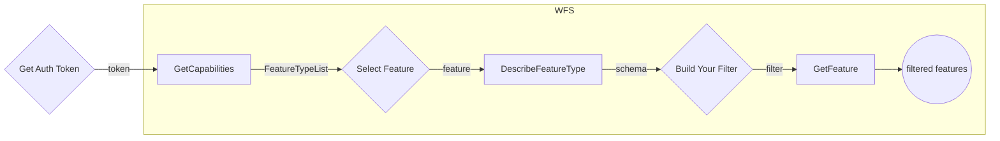

# Polygon Parts Service 🧩

## General

### Understanding Polygon Parts on Layer (records) management - Updates

This system utilizes polygons and layers to represent the precise area of a product and track all updates received over time. Polygons define the exact boundaries, while layers provide a structured way to integrate these updates. Let's delve deeper into how this system functions.

### Polygons

Represent the precise area of a product and all its subsequent updates.
Contain additional metadata like update date, accuracy, and photo sensor information.

### Layers

Composed of continuous geographic regions defined by several polygons.
Each polygon holds its own metadata.
Updates are merged with overlapping layers below.
Polygons within existing layers that overlap the new update (completely or partially) are re-calculated.

<figure>
    
</figure>

:::important Practical Example
B is a new layer containing 3 polygon parts about to be merged into an existing layer.
As you can see in the “After” figure on the right, the new layer parts contains the merged polygon parts of A and B.
Each part hold its own metadata and related attributes [PolygonParts attributes](/docs/MapColonies/Raster/services/PolygonParts/profile_v1_0.md)
:::

### WFS implementation

Raster polygon parts service uses the [WFS](/docs/ogc/protocols/ogc-wfs) protocol which is a READ-ONLY Web Feature Service.
it provides facilities for searching and retrieving feature data with the `GetCapabilities`, `DescribeFeatureType` and `GetFeature` operations all other operations are invalid.

For the full capabilities provided by the service see [GetCapabilities](/docs/ogc/protocols/ogc-wfs#getcapabilities)

WFS partitions the queryable data into feature types each feature type has its own attributes describing the structure of the data itself.
For the description of a feature type see [DescribeFeatureType](/docs/ogc/protocols/ogc-wfs#describefeaturetype)

Finally, Features can be retrieved with the [GetFeature](/docs/ogc/protocols/ogc-wfs#getfeature) operation. the request returns a collection of geographic feature instances filtered according to a criteria set by the requesting client.
<br/>

:::important
**In polygon parts, each feature represent single polygon**
:::

:::caution Authentication
**Authentication must be integrated in order to communicate with Map and Catalog services.**<br/>
**See the principles [here](/docs/MapColonies/authentication)**
:::

## Overview

WFS protocol partitions the queryable features into different feature types.
Each feature types actually represent other catalog layer [Raster Catalog](/docs/MapColonies/Raster/services/catalog/raster-catalog-profile-v1).

Each feature type consists of same polygon parts schema describing the feature. the feature type is queryable by its schema, each feature type has a default coordinate reference system and the bounding box which contains all features of this type, those are also possible parameters for querying.

Let's see an example using all three operations with different filters, the following chart describes our work flow



### The typeNames Convention

Each typeName represent a Layer from the catalog. The name string includes several parts as in the layer conventions:

```
<productId>-<productType>
```

1. `productId` represent a layer's product id, for example: `ORTHOPHOTO_MOSAIC_BASE`
1. `productType` represent layer's product type, for example: `OrthophotoBest`

So, for our example, the feature type name will be: `ORTHOPHOTO_MOSAIC_BASE-OrthophotoBest`.

## GetCapabilities

### List WFS capabilities and find available FeaturesTypes

To list all the available feature types use the `GetCapabilities` operation and look for the `FeatureTypeList` section.

```
<POLYGON_PARTS_QUERY_SERVICE_URL>/wfs?
    service=wfs&
    version={WFS_SERVICE_VERSION}&
    request=GetCapabilities
```

<details>
  <summary>Response</summary>

```xml title="Response"
<FeatureTypeList>
        <FeatureType xmlns:polygon_parts="http://polygon_parts">
            <Name>polygon_parts:BLUEMARBLE-Orthophoto</Name>
            <Title>BLUEMARBLE-Orthophoto</Title>
            <Abstract/>
            <ows:Keywords>
                <ows:Keyword>features</ows:Keyword>
                <ows:Keyword>polygon_parts</ows:Keyword>
            </ows:Keywords>
            <DefaultCRS>urn:ogc:def:crs:EPSG::4326</DefaultCRS>
            <ows:WGS84BoundingBox>
                <ows:LowerCorner>-180.0 -90.0</ows:LowerCorner>
                <ows:UpperCorner>180.0 90.0</ows:UpperCorner>
            </ows:WGS84BoundingBox>
        </FeatureType>
        <FeatureType xmlns:polygon_parts="http://polygon_parts">
            <Name>polygon_parts:ORTHOPHOTO_MOSAIC_BASE-OrthophotoBest</Name>
            <Title>mosaic_base_ORTHOPHOTO_MOSAIC_BASE</Title>
            <Abstract/>
            <ows:Keywords>
                <ows:Keyword>features</ows:Keyword>
                <ows:Keyword>polygon_parts</ows:Keyword>
            </ows:Keywords>
            <DefaultCRS>urn:ogc:def:crs:EPSG::4326</DefaultCRS>
            <ows:WGS84BoundingBox>
                <ows:LowerCorner>-180.0 -90.0</ows:LowerCorner>
                <ows:UpperCorner>180.0 90.0</ows:UpperCorner>
            </ows:WGS84BoundingBox>
        </FeatureType>
    </FeatureTypeList>
```

</details>

<br/>

We got a `FeatureTypeList` consisting of the different `FeatureTypes` that each one hold and represent some catalog layer under the WFS service. one of them is the `polygon_parts:ORTHOPHOTO_MOSAIC_BASE-OrthophotoBest`.`FeatureType` where polygon_parts is the namespace and the orthophoto_mosaic_base_ORTHOPHOTO_MOSAIC_BASE is the unique `FeatureType` name under the polygon_parts namespace - it include layer's `product_name` + `product_type`. it is possible to query the FeatureType by its full name `polygon_parts:ORTHOPHOTO_MOSAIC_BASE-OrthophotoBest` or short unique name `ORTHOPHOTO_MOSAIC_BASE-OrthophotoBest`.
The default coordinate reference system and the containing features bounding box are also presented.

## DescribeFeatureType

### Explore featureType 'Orthophoto Best' layer

If you would like to view the schema of the `ORTHOPHOTO_MOSAIC_BASE-OrthophotoBest` `FeatureType`, we could invoke the `DescribeFeatureType` request with `typeName` of `ORTHOPHOTO_MOSAIC_BASE-OrthophotoBest`

The response is the XSD (in xml response) describing the `ORTHOPHOTO_MOSAIC_BASE-OrthophotoBest` `FeatureType`.

For convenience we'll add outputFormat parameter as `application/json` to each of our requests for a json formatted response

```
<POLYGON_PARTS_QUERY_SERVICE_URL>/wfs?
    service=wfs&
    version={WFS_SERVICE_VERSION}&
    request=DescribeFeatureType&
    typeName=ORTHOPHOTO_MOSAIC_BASE-OrthophotoBest&
    outputFormat=application/json
```

<details>
  <summary>Response</summary>

```json title="Response in JSON"
{
  "elementFormDefault": "qualified",
  "targetNamespace": "http://polygon_parts",
  "targetPrefix": "polygon_parts",
  "featureTypes": [
    {
      "typeName": "ORTHOPHOTO_MOSAIC_BASE-OrthophotoBest",
      "properties": [
        {
          "name": "id",
          "maxOccurs": 1,
          "minOccurs": 0,
          "nillable": true,
          "type": "xsd:string",
          "localType": "string"
        },
        {
          "name": "catalogId",
          "maxOccurs": 1,
          "minOccurs": 0,
          "nillable": true,
          "type": "xsd:string",
          "localType": "string"
        },
        {
          "name": "productId",
          "maxOccurs": 1,
          "minOccurs": 0,
          "nillable": true,
          "type": "xsd:string",
          "localType": "string"
        },
        {
          "name": "productType",
          "maxOccurs": 1,
          "minOccurs": 0,
          "nillable": true,
          "type": "xsd:string",
          "localType": "string"
        },
        {
          "name": "sourceId",
          "maxOccurs": 1,
          "minOccurs": 0,
          "nillable": true,
          "type": "xsd:string",
          "localType": "string"
        },
        {
          "name": "sourceName",
          "maxOccurs": 1,
          "minOccurs": 0,
          "nillable": true,
          "type": "xsd:string",
          "localType": "string"
        },
        {
          "name": "productVersion",
          "maxOccurs": 1,
          "minOccurs": 0,
          "nillable": true,
          "type": "xsd:string",
          "localType": "string"
        },
        {
          "name": "ingestionDateUTC",
          "maxOccurs": 1,
          "minOccurs": 0,
          "nillable": true,
          "type": "xsd:date-time",
          "localType": "date-time"
        },
        {
          "name": "imagingTimeBeginUTC",
          "maxOccurs": 1,
          "minOccurs": 0,
          "nillable": true,
          "type": "xsd:date-time",
          "localType": "date-time"
        },
        {
          "name": "imagingTimeEndUTC",
          "maxOccurs": 1,
          "minOccurs": 0,
          "nillable": true,
          "type": "xsd:date-time",
          "localType": "date-time"
        },
        {
          "name": "resolutionDegree",
          "maxOccurs": 1,
          "minOccurs": 0,
          "nillable": true,
          "type": "xsd:number",
          "localType": "number"
        },
        {
          "name": "resolutionMeter",
          "maxOccurs": 1,
          "minOccurs": 0,
          "nillable": true,
          "type": "xsd:number",
          "localType": "number"
        },
        {
          "name": "sourceResolutionMeter",
          "maxOccurs": 1,
          "minOccurs": 0,
          "nillable": true,
          "type": "xsd:number",
          "localType": "number"
        },
        {
          "name": "horizontalAccuracyCE90",
          "maxOccurs": 1,
          "minOccurs": 0,
          "nillable": true,
          "type": "xsd:number",
          "localType": "number"
        },
        {
          "name": "sensors",
          "maxOccurs": 1,
          "minOccurs": 0,
          "nillable": true,
          "type": "xsd:string",
          "localType": "string"
        },
        {
          "name": "countries",
          "maxOccurs": 1,
          "minOccurs": 0,
          "nillable": true,
          "type": "xsd:string",
          "localType": "string"
        },
        {
          "name": "cities",
          "maxOccurs": 1,
          "minOccurs": 0,
          "nillable": true,
          "type": "xsd:string",
          "localType": "string"
        },
        {
          "name": "description",
          "maxOccurs": 1,
          "minOccurs": 0,
          "nillable": true,
          "type": "xsd:string",
          "localType": "string"
        },
        {
          "name": "geometry",
          "maxOccurs": 1,
          "minOccurs": 0,
          "nillable": true,
          "type": "gml:Polygon",
          "localType": "Polygon"
        }
      ]
    }
  ]
}
```

</details>

This is a description of a `orthophoto_mosaic_base_ORTHOPHOTO_MOSAIC_BASE` feature that include all polygon parts of the `ORTHOPHOTO_MOSAIC_BASE-OrthophotoBest` catalog layer, it contains these properties. Each property has its own type, nillable flag value and min\max occurs.

## GetFeature

Now that we hold the structure of the `orthophoto_mosaic_base_ORTHOPHOTO_MOSAIC_BASE` FeatureType we're able to query layer's polygon parts features by a set of parameters using the `GetFeature` operation, let's see some examples:

### Limit response feature count

1. let's retrieve 2 of polygon parts for provided featureType `orthophoto_mosaic_base_ORTHOPHOTO_MOSAIC_BASE`, that include actually total of 4 features using GET request:

```
<POLYGON_PARTS_QUERY_SERVICE_URL>/wfs?
    service=wfs&
    version={WFS_SERVICE_VERSION}&
    request=GetFeature&
    count=2&
    typeName=orthophoto_mosaic_base_ORTHOPHOTO_MOSAIC_BASE&
    outputFormat=application/json
```

<details>
  <summary>Response</summary>

```json
{
  "type": "FeatureCollection",
  "features": [
    {
      "type": "Feature",
      "id": "ORTHOPHOTO_MOSAIC_BASE-OrthophotoBest.12",
      "geometry": {
        "type": "Polygon",
        "coordinates": [
          [
            [180, 90],
            [180, -90],
            [-180, -90],
            [-180, 90],
            [180, 90]
          ],
          [
            [34.6064, 31.6234],
            [34.3887, 31.6234],
            [34.3887, 31.4354],
            [34.6064, 31.4354],
            [34.6064, 31.6234]
          ],
          [
            [34.4294, 31.2279],
            [34.4294, 31.4159],
            [34.2117, 31.4159],
            [34.2117, 31.2279],
            [34.4294, 31.2279]
          ],
          [
            [35.3664, 32.1381],
            [35.3664, 32.3249],
            [35.1511, 32.3249],
            [35.1511, 32.1381],
            [35.3664, 32.1381]
          ],
          [
            [35.0607, 31.9323],
            [35.2784, 31.9323],
            [35.2784, 32.1202],
            [35.0607, 32.1202],
            [35.0607, 31.9323]
          ],
          [
            [35.7645, 33.9586],
            [35.7645, 33.7706],
            [35.9822, 33.7706],
            [35.9822, 33.9586],
            [35.7645, 33.9586]
          ],
          [
            [35.9166, 33.7644],
            [35.6989, 33.7644],
            [35.6989, 33.5765],
            [35.9166, 33.5765],
            [35.9166, 33.7644]
          ]
        ]
      },
      "geometry_name": "geometry",
      "properties": {
        "id": "b3dd85c1-7a4b-4031-8da2-0d5229572547",
        "catalogId": "a1b6dd1c-c77c-42e6-a00a-306b67bcdebf",
        "productId": "ORTHOPHOTO_MOSAIC_BASE",
        "productType": "OrthophotoBest",
        "sourceId": "BlueMarble",
        "sourceName": "O_BlueMarble_rgb_2km",
        "productVersion": "1",
        "ingestionDateUTC": "2024-07-11T06:27:49.757Z",
        "imagingTimeBeginUTC": "2001-01-01T05:00:00Z",
        "imagingTimeEndUTC": "2001-01-01T05:00:00Z",
        "resolutionDegree": 0.02197265625,
        "resolutionMeter": 2000,
        "sourceResolutionMeter": 2500,
        "horizontalAccuracyCE90": 2000,
        "sensors": "MAXAR",
        "countries": "עולמי",
        "cities": "",
        "description": ""
      },
      "bbox": [-180, -90, 180, 90]
    },
    {
      "type": "Feature",
      "id": "ORTHOPHOTO_MOSAIC_BASE-OrthophotoBest.3",
      "geometry": {
        "type": "Polygon",
        "coordinates": [
          [
            [35.017272438849716, 29.9596406497117],
            [34.890572098923826, 29.9596406497117],
            [34.890572098923826, 29.819712060693362],
            [35.017272438849716, 29.819712060693362],
            [35.017272438849716, 29.9596406497117]
          ]
        ]
      },
      "geometry_name": "geometry",
      "properties": {
        "id": "f7885a03-b669-40cb-8ba7-9410fb644011",
        "catalogId": "a1b6dd1c-c77c-42e6-a00a-306b67bcdebf",
        "productId": "ORTHOPHOTO_MOSAIC_BASE",
        "productType": "OrthophotoBest",
        "sourceId": "MAS_6_ORT_247568-26.0",
        "sourceName": "O_south_w84geo_Tiff_10cm",
        "productVersion": "2.0",
        "ingestionDateUTC": "2024-07-11T06:27:49.757Z",
        "imagingTimeBeginUTC": "2022-08-20T23:08:10Z",
        "imagingTimeEndUTC": "2022-08-20T23:08:10Z",
        "resolutionDegree": 0.072,
        "resolutionMeter": 0.6,
        "sourceResolutionMeter": 0.1,
        "horizontalAccuracyCE90": 1.5,
        "sensors": "TEST_SENSOR_2",
        "countries": "ישראל, דרום הארץ, דרום",
        "cities": "",
        "description": "תשתית אורתופוטו באיזור דרום עדכנית לאוגוסט 2022"
      },
      "bbox": [
        34.890572098923826, 29.819712060693362, 35.017272438849716,
        29.9596406497117
      ]
    }
  ],
  "totalFeatures": 7,
  "numberMatched": 7,
  "numberReturned": 2,
  "timeStamp": "2024-07-11T08:23:42.502Z",
  "crs": {
    "type": "name",
    "properties": {
      "name": "urn:ogc:def:crs:EPSG::4326"
    }
  },
  "bbox": [-180, -90, 180, 90]
}
```

</details>

### Pagination

let's get only part of the feature, using `count` to mention the amount for paging, and `startIndex` as the offset

We'll invoke a POST GetFeature request with the following body:

```xml
<wfs:GetFeature service="WFS" version="2.0.0" xmlns:wfs="http://www.opengis.net/wfs/2.0" xmlns:fes="http://www.opengis.net/fes/2.0" xmlns:xsi="http://www.w3.org/2001/XMLSchema-instance" xsi:schemaLocation="http://www.opengis.net/wfs/2.0 http://schemas.opengis.net/wfs/2.0/wfs.xsd" count="4" startIndex="3" outputFormat="application/json">
    <wfs:Query typeNames="polygon_parts:ORTHOPHOTO_MOSAIC_BASE-OrthophotoBest">
        <fes:Filter>
            <fes:PropertyIsEqualTo>
               <fes:ValueReference>productId</fes:ValueReference>
               <fes:Literal>ORTHOPHOTO_MOSAIC_BASE</fes:Literal>
            </fes:PropertyIsEqualTo>

        </fes:Filter>
    </wfs:Query>
</wfs:GetFeature>
```

<details>
  <summary>Response</summary>

```json
{
  "type": "FeatureCollection",
  "features": [
    {
      "type": "Feature",
      "id": "ORTHOPHOTO_MOSAIC_BASE-OrthophotoBest.5",
      "geometry": {
        "type": "Polygon",
        "coordinates": [
          [
            [35.017272438849716, 29.9596406497117],
            [34.890572098923826, 29.9596406497117],
            [34.890572098923826, 29.819712060693362],
            [35.017272438849716, 29.819712060693362],
            [35.017272438849716, 29.9596406497117]
          ]
        ]
      },
      "geometry_name": "geometry",
      "properties": {
        "id": "5e6ba296-d65a-4024-8ad7-e3a7089c5961",
        "catalogId": "a1b6dd1c-c77c-42e6-a00a-306b67bcdebf",
        "productId": "ORTHOPHOTO_MOSAIC_BASE",
        "productType": "OrthophotoBest",
        "sourceId": "MAS_6_ORT_247568-26.0",
        "sourceName": "O_center_w84geo_Tiff_10cm",
        "productVersion": "3",
        "ingestionDateUTC": "2024-07-15T12:49:28.597Z",
        "imagingTimeBeginUTC": "2021-05-15T23:09:00Z",
        "imagingTimeEndUTC": "2021-05-15T23:09:00Z",
        "resolutionDegree": 0.052,
        "resolutionMeter": 0.6,
        "sourceResolutionMeter": 0.1,
        "horizontalAccuracyCE90": 3,
        "sensors": "TEST_SENSOR3",
        "countries": "ישראל, מרכז",
        "cities": "",
        "description": "תשתית אורתופוטו עדכני למאי 2021"
      },
      "bbox": [
        34.890572098923826, 29.819712060693362, 35.017272438849716,
        29.9596406497117
      ]
    },
    {
      "type": "Feature",
      "id": "ORTHOPHOTO_MOSAIC_BASE-OrthophotoBest.7",
      "geometry": {
        "type": "Polygon",
        "coordinates": [
          [
            [34.98549473145019, 29.782811797130847],
            [34.90115724749933, 29.782811797130847],
            [34.90115724749933, 29.672690878996704],
            [34.98549473145019, 29.672690878996704],
            [34.98549473145019, 29.782811797130847]
          ]
        ]
      },
      "geometry_name": "geometry",
      "properties": {
        "id": "9f227f63-da2d-4e40-a7ae-63ff1612b4bc",
        "catalogId": "a1b6dd1c-c77c-42e6-a00a-306b67bcdebf",
        "productId": "ORTHOPHOTO_MOSAIC_BASE",
        "productType": "OrthophotoBest",
        "sourceId": "MAS_5_ORT_240115",
        "sourceName": "O_center_w84geo_Apr17_gpkg_0.07",
        "productVersion": "4",
        "ingestionDateUTC": "2024-07-15T12:49:28.597Z",
        "imagingTimeBeginUTC": "2021-06-11T02:00:00Z",
        "imagingTimeEndUTC": "2021-06-11T02:00:00Z",
        "resolutionDegree": 0.62,
        "resolutionMeter": 0.6,
        "sourceResolutionMeter": 0.07,
        "horizontalAccuracyCE90": 4,
        "sensors": "OTHER",
        "countries": "ישראל, צפון",
        "cities": "",
        "description": "תשתית עדכני 2021"
      },
      "bbox": [
        34.890572098923826, 29.819712060693362, 35.017272438849716,
        29.9596406497117
      ]
    },
    {
      "type": "Feature",
      "id": "ORTHOPHOTO_MOSAIC_BASE-OrthophotoBest.9",
      "geometry": {
        "type": "Polygon",
        "coordinates": [
          [
            [34.98549473145019, 29.782811797130847],
            [34.90115724749933, 29.782811797130847],
            [34.90115724749933, 29.672690878996704],
            [34.98549473145019, 29.672690878996704],
            [34.98549473145019, 29.782811797130847]
          ]
        ]
      },
      "geometry_name": "geometry",
      "properties": {
        "id": "9f227f63-da2d-4e40-a7ae-63ff1612b4bc",
        "catalogId": "a1b6dd1c-c77c-42e6-a00a-306b67bcdebf",
        "productId": "ORTHOPHOTO_MOSAIC_BASE",
        "productType": "OrthophotoBest",
        "sourceId": "MAS_5_ORT_240115-11.2",
        "SourceName": "O_w84geo_Apr17-Jun22_gpkg_0.08",
        "productVersion": "5",
        "ingestionDateUTC": "2024-07-15T12:49:28.597Z",
        "imagingTimeBeginUTC": "2021-05-12T04:00:00Z",
        "imagingTimeEndUTC": "2021-05-12T04:00:00Z",
        "resolutionDegree": 0.072,
        "resolutionMeter": 0.6,
        "sourceResolutionMeter": 0.07,
        "horizontalAccuracyCE90": 4,
        "sensors": "OTHER",
        "countries": "ישראל",
        "cities": "",
        "description": "תשתית אורתופוטו עדכני למאי 2021"
      },
      "bbox": [
        34.90115724749933, 29.672690878996704, 34.98549473145019,
        29.782811797130847
      ]
    }
  ],
  "totalFeatures": 7,
  "numberMatched": 7,
  "numberReturned": 3,
  "timeStamp": "2024-07-21T12:38:40.254Z",
  "links": [
    {
      "title": "previous page",
      "type": "application/json",
      "rel": "previous",
      "href": "https://polygon-parts.mapcolonies.net/api/raster/v1/wfs?FILTER=%28%3Cfes%3AFilter%20xmlns%3Axs%3D%22http%3A%2F%2Fwww.w3.org%2F2001%2FXMLSchema%22%20xmlns%3Afes%3D%22http%3A%2F%2Fwww.opengis.net%2Ffes%2F2.0%22%20xmlns%3Agml%3D%22http%3A%2F%2Fwww.opengis.net%2Fgml%2F3.2%22%3E%3Cfes%3APropertyIsEqualTo%20matchAction%3D%22Any%22%20matchCase%3D%22true%22%3E%3Cfes%3AValueReference%3EproductId%3C%2Ffes%3AValueReference%3E%3Cfes%3ALiteral%3EORTHOPHOTO_MOSAIC_BASE%3C%2Ffes%3ALiteral%3E%3C%2Ffes%3APropertyIsEqualTo%3E%3C%2Ffes%3AFilter%3E%29&REQUEST=GetFeature&RESULTTYPE=RESULTS&OUTPUTFORMAT=application%2Fjson&VERSION=2.0.0&TYPENAMES=%28polygon_parts%3AORTHOPHOTO_MOSAIC_BASE-OrthophotoBest%29&SERVICE=WFS&COUNT=1&STARTINDEX=0"
    }
  ],
  "crs": {
    "type": "name",
    "properties": {
      "name": "urn:ogc:def:crs:EPSG::4326"
    }
  },
  "bbox": [
    34.90115724749933, 29.672690878996704, 34.98549473145019, 29.782811797130847
  ]
}
```

</details>

### Sorting

2. To get layer's polygon parts features sorted by some property such as `productVersion` we can invoke the following request.

```
<POLYGON_PARTS_QUERY_SERVICE_URL>/wfs?
    service=wfs&
    version={WFS_SERVICE_VERSION}&
    request=GetFeature&
    typeNames=ORTHOPHOTO_MOSAIC_BASE-OrthophotoBest&
    sortBy=productVersion&
    outputFormat=application/json
```

<details>
  <summary>Response</summary>

```json
{
  "type": "FeatureCollection",
  "features": [
    {
      "type": "Feature",
      "id": "ORTHOPHOTO_MOSAIC_BASE-OrthophotoBest.12",
      "geometry": {
        "type": "Polygon",
        "coordinates": [
          [
            [180, 90],
            [180, -90],
            [-180, -90],
            [-180, 90],
            [180, 90]
          ],
          [
            [34.98549473145019, 29.782811797130847],
            [34.90115724749933, 29.782811797130847],
            [34.90115724749933, 29.672690878996704],
            [34.98549473145019, 29.672690878996704],
            [34.98549473145019, 29.782811797130847]
          ],
          [
            [34.98549473145019, 29.782811797130847],
            [34.90115724749933, 29.782811797130847],
            [34.90115724749933, 29.672690878996704],
            [34.98549473145019, 29.672690878996704],
            [34.98549473145019, 29.782811797130847]
          ]
        ]
      },
      "geometry_name": "geometry",
      "properties": {
        "id": "9f227f63-da2d-4e40-a7ae-63ff1612b4bc",
        "catalogId": "a1b6dd1c-c77c-42e6-a00a-306b67bcdebf",
        "productId": "ORTHOPHOTO_MOSAIC_BASE",
        "productType": "OrthophotoBest",
        "sourceId": "BlueMarble",
        "sourceName": "O_BlueMarble_rgb_2km",
        "productVersion": "1",
        "ingestionDateUTC": "2024-07-11T06:27:49.757Z",
        "imagingTimeBeginUTC": "2001-01-01T05:00:00Z",
        "imagingTimeEndUTC": "2001-01-01T05:00:00Z",
        "resolutionDegree": 0.02197265625,
        "resolutionMeter": 2000,
        "sourceResolutionMeter": 2500,
        "horizontalAccuracyCE90": 2000,
        "sensors": "MAXAR",
        "countries": "עולמי",
        "cities": "",
        "description": ""
      },
      "bbox": [-180, -90, 180, 90]
    },
    {
      "type": "Feature",
      "id": "ORTHOPHOTO_MOSAIC_BASE-OrthophotoBest.3",
      "geometry": {
        "type": "Polygon",
        "coordinates": [
          [
            [34.98549473145019, 29.782811797130847],
            [34.90115724749933, 29.782811797130847],
            [34.90115724749933, 29.672690878996704],
            [34.98549473145019, 29.672690878996704],
            [34.98549473145019, 29.782811797130847]
          ]
        ]
      },
      "geometry_name": "geometry",
      "properties": {
        "id": "9f227f63-da2d-4e40-a7ae-63ff1612b4bc",
        "catalogId": "a1b6dd1c-c77c-42e6-a00a-306b67bcdebf",
        "productId": "ORTHOPHOTO_MOSAIC_BASE",
        "productType": "OrthophotoBest",
        "sourceId": "MAS_6_ORT_247568-26.0",
        "sourceName": "O_south_w84geo_Tiff_10cm",
        "productVersion": "2",
        "ingestionDateUTC": "2024-07-11T06:27:49.757Z",
        "imagingTimeBeginUTC": "2022-08-20T23:08:10Z",
        "imagingTimeEndUTC": "2022-08-20T23:08:10Z",
        "resolutionDegree": 0.072,
        "resolutionMeter": 0.6,
        "sourceResolutionMeter": 0.1,
        "horizontalAccuracyCE90": 1.5,
        "sensors": "TEST_SENSOR_2",
        "countries": "ישראל, דרום הארץ, דרום",
        "cities": "",
        "description": "תשתית אורתופוטו באיזור דרום עדכנית לאוגוסט 2022"
      },
      "bbox": [
        34.90115724749933, 29.672690878996704, 34.98549473145019,
        29.782811797130847
      ]
    },
    {
      "type": "Feature",
      "id": "ORTHOPHOTO_MOSAIC_BASE-OrthophotoBest.5",
      "geometry": {
        "type": "Polygon",
        "coordinates": [
          [
            [34.98549473145019, 29.782811797130847],
            [34.90115724749933, 29.782811797130847],
            [34.90115724749933, 29.672690878996704],
            [34.98549473145019, 29.672690878996704],
            [34.98549473145019, 29.782811797130847]
          ]
        ]
      },
      "geometry_name": "geometry",
      "properties": {
        "id": "9f227f63-da2d-4e40-a7ae-63ff1612b4bc",
        "catalogId": "a1b6dd1c-c77c-42e6-a00a-306b67bcdebf",
        "productId": "ORTHOPHOTO_MOSAIC_BASE",
        "productType": "OrthophotoBest",
        "sourceId": "MAS_6_ORT_247568-26.0",
        "sourceName": "O_south_w84geo_Tiff_10cm",
        "productVersion": "3",
        "ingestionDateUTC": "2024-07-11T06:27:49.757Z",
        "imagingTimeBeginUTC": "2021-05-15T23:09:00Z",
        "imagingTimeEndUTC": "2021-05-15T23:09:00Z",
        "resolutionDegree": 0.072,
        "resolutionMeter": 0.6,
        "sourceResolutionMeter": 0.1,
        "horizontalAccuracyCE90": 3,
        "sensors": "TEST_SENSOR_1",
        "countries": "ישראל, דרום",
        "cities": "",
        "description": "תשתית אורתופוטו בדרום הארץ עדכני למאי 2021"
      },
      "bbox": [
        34.90115724749933, 29.672690878996704, 34.98549473145019,
        29.782811797130847
      ]
    },
    {
      "type": "Feature",
      "id": "ORTHOPHOTO_MOSAIC_BASE-OrthophotoBest.7",
      "geometry": {
        "type": "Polygon",
        "coordinates": [
          [
            [34.784517383368296, 32.09026061257954],
            [34.784517383368296, 32.02584851078221],
            [34.87342700067666, 32.02584851078221],
            [34.87342700067666, 32.09026061257954],
            [34.784517383368296, 32.09026061257954]
          ]
        ]
      },
      "geometry_name": "geometry",
      "properties": {
        "id": "9f227f63-da2d-4e40-a7ae-63ff1612b4bc",
        "catalogId": "a1b6dd1c-c77c-42e6-a00a-306b67bcdebf",
        "productId": "ORTHOPHOTO_MOSAIC_BASE",
        "productType": "OrthophotoBest",
        "sourceId": "MAS_5_ORT_240115-11.1",
        "sourceName": "O_center_w84geo_Apr17-Jun22_gpkg_0.07",
        "productVersion": "4",
        "ingestionDateUTC": "2024-07-11T06:27:49.757Z",
        "imagingTimeBeginUTC": "2021-06-11T02:00:00Z",
        "imagingTimeEndUTC": "2021-06-11T02:00:00Z",
        "resolutionDegree": 0.062,
        "resolutionMeter": 0.6,
        "sourceResolutionMeter": 0.07,
        "horizontalAccuracyCE90": 4,
        "sensors": "OTHER",
        "countries": "ישראל",
        "cities": "",
        "description": "תשתית אורתופוטו  במרכז  הארץ עדכני ליוני 2021"
      },
      "bbox": [
        34.784517383368296, 32.02584851078221, 34.87342700067666,
        32.09026061257954
      ]
    },
    {
      "type": "Feature",
      "id": "ORTHOPHOTO_MOSAIC_BASE-OrthophotoBest.9",
      "geometry": {
        "type": "Polygon",
        "coordinates": [
          [
            [34.784517383368296, 32.09026061257954],
            [34.784517383368296, 32.02584851078221],
            [34.87342700067666, 32.02584851078221],
            [34.87342700067666, 32.09026061257954],
            [34.784517383368296, 32.09026061257954]
          ]
        ]
      },
      "geometry_name": "geometry",
      "properties": {
        "id": "9f227f63-da2d-4e40-a7ae-63ff1612b4bc",
        "catalogId": "a1b6dd1c-c77c-42e6-a00a-306b67bcdebf",
        "productId": "ORTHOPHOTO_MOSAIC_BASE",
        "productType": "OrthophotoBest",
        "sourceId": "MAS_5_ORT_240115-11.2",
        "sourceName": "O_center_w84geo_Apr17-Jun22_gpkg_0.08",
        "productVersion": "5",
        "ingestionDateUTC": "2024-07-11T06:27:49.757Z",
        "imagingTimeBeginUTC": "2021-05-12T04:00:00Z",
        "imagingTimeEndUTC": "2021-05-12T04:00:00Z",
        "resolutionDegree": 0.062,
        "resolutionMeter": 0.6,
        "sourceResolutionMeter": 0.07,
        "horizontalAccuracyCE90": 4,
        "sensors": "OTHER",
        "countries": "ישראל",
        "cities": "",
        "description": "תשתית אורתופוטו במרכז המדינה עדכני למאי 2021"
      },
      "bbox": [
        34.784517383368296, 32.02584851078221, 34.87342700067666,
        32.09026061257954
      ]
    },
    {
      "type": "Feature",
      "id": "ORTHOPHOTO_MOSAIC_BASE-OrthophotoBest.11",
      "geometry": {
        "type": "Polygon",
        "coordinates": [
          [
            [35.064814353455404, 32.85094300562277],
            [35.064814353455404, 32.808880172316066],
            [35.09637711939874, 32.808880172316066],
            [35.09637711939874, 32.85094300562277],
            [35.064814353455404, 32.85094300562277]
          ]
        ]
      },
      "geometry_name": "geometry",
      "properties": {
        "id": "9f227f63-da2d-4e40-a7ae-63ff1612b4bc",
        "catalogId": "a1b6dd1c-c77c-42e6-a00a-306b67bcdebf",
        "productId": "ORTHOPHOTO_MOSAIC_BASE",
        "productType": "OrthophotoBest",
        "sourceId": "MAS_6_ORT_247268-6.0",
        "sourceName": "O_north_w84geo_rgb_Tiff_30cm",
        "productVersion": "6",
        "ingestionDateUTC": "2024-07-11T06:27:49.757Z",
        "imagingTimeBeginUTC": "2021-07-11T04:00:00Z",
        "imagingTimeEndUTC": "2021-07-11T04:00:00Z",
        "resolutionDegree": 0.052,
        "resolutionMeter": 0.6,
        "sourceResolutionMeter": 0.3,
        "horizontalAccuracyCE90": 6,
        "sensors": "WORLDVIEW2",
        "countries": "",
        "cities": "",
        "description": "10300100C2411D00"
      },
      "bbox": [
        35.064814353455404, 32.808880172316066, 35.09637711939874,
        32.85094300562277
      ]
    },
    {
      "type": "Feature",
      "id": "ORTHOPHOTO_MOSAIC_BASE-OrthophotoBest.13",
      "geometry": {
        "type": "Polygon",
        "coordinates": [
          [
            [34.988118558230155, 32.817028819163966],
            [34.988118558230155, 32.79262878072221],
            [35.054288443470284, 32.79262878072221],
            [35.054288443470284, 32.817028819163966],
            [34.988118558230155, 32.817028819163966]
          ]
        ]
      },
      "geometry_name": "geometry",
      "properties": {
        "id": "9f227f63-da2d-4e40-a7ae-63ff1612b4bc",
        "catalogId": "a1b6dd1c-c77c-42e6-a00a-306b67bcdebf",
        "productId": "ORTHOPHOTO_MOSAIC_BASE",
        "productType": "OrthophotoBest",
        "sourceId": "MAS_6_ORT_247268-6.0",
        "sourceName": "O_north_w84geo_rgb_Tiff_30cm",
        "productVersion": "7",
        "ingestionDateUTC": "2024-07-11T06:27:49.757Z",
        "imagingTimeBeginUTC": "2021-09-01T04:00:00Z",
        "imagingTimeEndUTC": "2021-09-01T04:00:00Z",
        "resolutionDegree": 0.072,
        "resolutionMeter": 0.6,
        "sourceResolutionMeter": 0.3,
        "horizontalAccuracyCE90": 8.5,
        "sensors": "TEST_SENSOR_2",
        "countries": "",
        "cities": "",
        "description": "38225114-2021090108361457WV03038225"
      },
      "bbox": [
        34.988118558230155, 32.79262878072221, 35.054288443470284,
        32.817028819163966
      ]
    }
  ],
  "totalFeatures": 7,
  "numberMatched": 7,
  "numberReturned": 7,
  "timeStamp": "2024-07-11T08:22:41.924Z",
  "crs": {
    "type": "name",
    "properties": {
      "name": "urn:ogc:def:crs:EPSG::4326"
    }
  },
  "bbox": [-180, -90, 180, 90]
}
```

</details>

### Query by geographical limits

For more complex criteria such as a set of multiple parameters or geographical intersections we should invoke a POST GetFetures request consisting the filter as a XML body.

3. let's look for all the polygon parts features that intersect in a polygon, one of the properties of a polygon part feature is it's geometry describing the polygon part geography, we'll look by it by setting it as the request `ValueReference`. We can specify the `srsName` which is the coordinate reference system of the returned features in our case `EPSG:4326`.
   the polygon is a list of latitude-longitude pair coordinates.

We'll invoke a POST GetFeature request with the following body:

```xml
<?xml version="1.0" encoding="utf-8" ?>
<wfs:GetFeature xmlns:wfs="http://www.opengis.net/wfs/2.0" xmlns:fes="http://www.opengis.net/fes/2.0" xmlns:gml="http://www.opengis.net/gml/3.2" xmlns:sf="http://www.openplans.org/spearfish" xmlns:xsi="http://www.w3.org/2001/XMLSchema-instance" service="WFS" version="2.0.0" count="2" xsi:schemaLocation="http://www.opengis.net/wfs/2.0 http://schemas.opengis.net/wfs/2.0/wfs.xsd http://www.opengis.net/gml/3.2 http://schemas.opengis.net/gml/3.2.1/gml.xsd" outputFormat="application/json">
    <wfs:Query typeNames="polygon_parts:ORTHOPHOTO_MOSAIC_BASE-OrthophotoBest">
        <fes:Filter>
            <fes:Intersects>
                <fes:ValueReference>geometry</fes:ValueReference>
                <gml:Polygon gml:id="polygon.1" srsName="http://www.opengis.net/gml/srs/epsg.xml#4326">
                    <gml:exterior>
                        <gml:LinearRing>
                            <gml:posList>
                                35.34244 32.2543 34.92215 32.2543 34.9221 31.8823 35.34244 31.8823 35.34244 32.2543
                            </gml:posList>
                        </gml:LinearRing>
                    </gml:exterior>
                </gml:Polygon>
            </fes:Intersects>
        </fes:Filter>
    </wfs:Query>
</wfs:GetFeature>
```

<details>
  <summary>Response</summary>

```json
{
  "type": "FeatureCollection",
  "features": [
    {
      "type": "Feature",
      "id": "ORTHOPHOTO_MOSAIC_BASE-OrthophotoBest.7",
      "geometry": {
        "type": "Polygon",
        "coordinates": [
          [
            [34.86972277637517, 32.019564407769835],
            [34.762249171646715, 32.019564407769835],
            [34.762249171646715, 31.955123269803096],
            [34.86972277637517, 31.955123269803096],
            [34.86972277637517, 32.019564407769835]
          ]
        ]
      },
      "geometry_name": "geometry",
      "properties": {
        "id": "9f227f63-da2d-4e40-a7ae-63ff1612b4bc",
        "catalogId": "a1b6dd1c-c77c-42e6-a00a-306b67bcdebf",
        "productId": "ORTHOPHOTO_MOSAIC_BASE",
        "productType": "OrthophotoBest",
        "sourceId": "MAS_5_ORT_240115-11.1",
        "SourceName": "O_center_w84geo_Apr17-Jun22_gpkg_0.07",
        "productVersion": "4",
        "ingestionDateUTC": "2024-07-11T06:27:49.757Z",
        "imagingTimeBeginUTC": "2021-06-11T02:00:00Z",
        "imagingTimeEndUTC": "2021-06-11T02:00:00Z",
        "resolutionDegree": 0.072,
        "resolutionMeter": 0.6,
        "sourceResolutionMeter": 0.07,
        "horizontalAccuracyCE90": 4,
        "sensors": "OTHER",
        "countries": "ישראל",
        "cities": "",
        "description": "תשתית אורתופוטו במרכז הארץ עדכני ליוני 2021"
      },
      "bbox": [
        34.762249171646715, 31.955123269803096, 34.86972277637517,
        32.019564407769835
      ]
    },
    {
      "type": "Feature",
      "id": "ORTHOPHOTO_MOSAIC_BASE-OrthophotoBest.9",
      "geometry": {
        "type": "Polygon",
        "coordinates": [
          [
            [34.86972277637517, 32.019564407769835],
            [34.762249171646715, 32.019564407769835],
            [34.762249171646715, 31.955123269803096],
            [34.86972277637517, 31.955123269803096],
            [34.86972277637517, 32.019564407769835]
          ]
        ]
      },
      "geometry_name": "geometry",
      "properties": {
        "id": "9f227f63-da2d-4e40-a7ae-63ff1612b4bc",
        "catalogId": "a1b6dd1c-c77c-42e6-a00a-306b67bcdebf",
        "productId": "ORTHOPHOTO_MOSAIC_BASE",
        "productType": "OrthophotoBest",
        "sourceId": "MAS_5_ORT_240115-11.2",
        "sourceName": "O_center_w84geo_Apr17-Jun22_gpkg_0.08",
        "productVersion": "5",
        "ingestionDateUTC": "2024-07-11T06:27:49.757Z",
        "imagingTimeBeginUTC": "2021-05-12T04:00:00Z",
        "imagingTimeEndUTC": "2021-05-12T04:00:00Z",
        "resolutionDegree": 0.072,
        "resolutionMeter": 0.6,
        "sourceResolutionMeter": 0.07,
        "horizontalAccuracyCE90": 4,
        "sensors": "OTHER",
        "countries": "ישראל",
        "cities": "",
        "description": "תשתית אורתופוטו במרכז המדינה עדכני למאי 2021"
      },
      "bbox": [
        34.762249171646715, 31.955123269803096, 34.86972277637517,
        32.019564407769835
      ]
    }
  ],
  "totalFeatures": 3,
  "numberMatched": 3,
  "numberReturned": 2,
  "timeStamp": "2024-07-11T08:19:13.094Z",
  "crs": {
    "type": "name",
    "properties": {
      "name": "urn:ogc:def:crs:EPSG::4326"
    }
  },
  "bbox": [35.0607, 31.9323, 35.3664, 32.3249]
}
```

</details>

### Combining multiple filters

4. if we'd like to filter parts by a set of multiple parameters we'll achieve that by a `GetFeature` **POST** request.
   Say we would like to retrieve only the polygon parts who's `resolutionDegree` is greater than **0.060** and their `sensors` type is **other**.

We'll invoke a request with the following body:

```xml title="Query with 2 filters"
<wfs:GetFeature service="WFS" version="2.0.0" xmlns:wfs="http://www.opengis.net/wfs/2.0" xmlns:fes="http://www.opengis.net/fes/2.0" xmlns:xsi="http://www.w3.org/2001/XMLSchema-instance" xsi:schemaLocation="http://www.opengis.net/wfs/2.0 http://schemas.opengis.net/wfs/2.0/wfs.xsd" count="4" outputFormat="application/json">
    <wfs:Query typeNames="polygon_parts:ORTHOPHOTO_MOSAIC_BASE-OrthophotoBest">
        <fes:Filter>
            <And>
            <fes:PropertyIsEqualTo>
               <fes:ValueReference>sensors</fes:ValueReference>
               <fes:Literal>OTHER</fes:Literal>
            </fes:PropertyIsEqualTo>
                        <fes:PropertyIsGreaterThan>
               <fes:ValueReference>resolutionMeter</fes:ValueReference>
               <fes:Literal>0.06</fes:Literal>
            </fes:PropertyIsGreaterThan>
            </And>
        </fes:Filter>
    </wfs:Query>
</wfs:GetFeature>
```

<details>
  <summary>Response</summary>

```json title="Reponse in GeoJSON"
{
  "type": "FeatureCollection",
  "features": [
    {
      "type": "Feature",
      "id": "ORTHOPHOTO_MOSAIC_BASE-OrthophotoBest.7",
      "geometry": {
        "type": "Polygon",
        "coordinates": [
          [
            [34.86972277637517, 32.019564407769835],
            [34.762249171646715, 32.019564407769835],
            [34.762249171646715, 31.955123269803096],
            [34.86972277637517, 31.955123269803096],
            [34.86972277637517, 32.019564407769835]
          ]
        ]
      },
      "geometry_name": "geometry",
      "properties": {
        "id": "9f227f63-da2d-4e40-a7ae-63ff1612b4bc",
        "catalogId": "a1b6dd1c-c77c-42e6-a00a-306b67bcdebf",
        "productId": "ORTHOPHOTO_MOSAIC_BASE",
        "productType": "OrthophotoBest",
        "sourceId": "MAS_5_ORT_240115-11.1",
        "sourceName": "O_center_w84geo_Apr17-Jun22_gpkg_0.07",
        "productVersion": "4",
        "ingestionDateUTC": "2024-07-11T06:27:49.757Z",
        "imagingTimeBeginUTC": "2021-06-11T02:00:00Z",
        "imagingTimeEndUTC": "2021-06-11T02:00:00Z",
        "resolutionDegree": 0.072,
        "resolutionMeter": 0.6,
        "sourceResolutionMeter": 0.07,
        "horizontalAccuracyCE90": 4,
        "sensors": "OTHER",
        "countries": "ישראל",
        "cities": "",
        "description": "תשתית אורתופוטו  במרכז  הארץ עדכני ליוני 2021"
      },
      "bbox": [
        34.762249171646715, 31.955123269803096, 34.86972277637517,
        32.019564407769835
      ]
    },
    {
      "type": "Feature",
      "id": "ORTHOPHOTO_MOSAIC_BASE-OrthophotoBest.9",
      "geometry": {
        "type": "Polygon",
        "coordinates": [
          [
            [34.86972277637517, 32.019564407769835],
            [34.762249171646715, 32.019564407769835],
            [34.762249171646715, 31.955123269803096],
            [34.86972277637517, 31.955123269803096],
            [34.86972277637517, 32.019564407769835]
          ]
        ]
      },
      "geometry_name": "geometry",
      "properties": {
        "id": "9f227f63-da2d-4e40-a7ae-63ff1612b4bc",
        "catalogId": "a1b6dd1c-c77c-42e6-a00a-306b67bcdebf",
        "productId": "ORTHOPHOTO_MOSAIC_BASE",
        "productType": "OrthophotoBest",
        "sourceId": "MAS_5_ORT_240115-11.2",
        "sourceName": "O_center_w84geo_Apr17-Jun22_gpkg_0.08",
        "productVersion": "5",
        "ingestionDateUTC": "2024-07-11T06:27:49.757Z",
        "imagingTimeBeginUTC": "2021-05-12T04:00:00Z",
        "imagingTimeEndUTC": "2021-05-12T04:00:00Z",
        "resolutionDegree": 0.072,
        "resolutionMeter": 0.6,
        "sourceResolutionMeter": 0.07,
        "horizontalAccuracyCE90": 4,
        "sensors": "OTHER",
        "countries": "ישראל",
        "cities": "",
        "description": "תשתית אורתופוטו במרכז המדינה עדכני למאי 2021"
      },
      "bbox": [
        34.762249171646715, 31.955123269803096, 34.86972277637517,
        32.019564407769835
      ]
    }
  ],
  "totalFeatures": 2,
  "numberMatched": 2,
  "numberReturned": 2,
  "timeStamp": "2024-07-11T08:17:33.255Z",
  "crs": {
    "type": "name",
    "properties": {
      "name": "urn:ogc:def:crs:EPSG::4326"
    }
  },
  "bbox": [
    34.762249171646715, 31.955123269803096, 34.86972277637517,
    32.019564407769835
  ]
}
```

</details>
