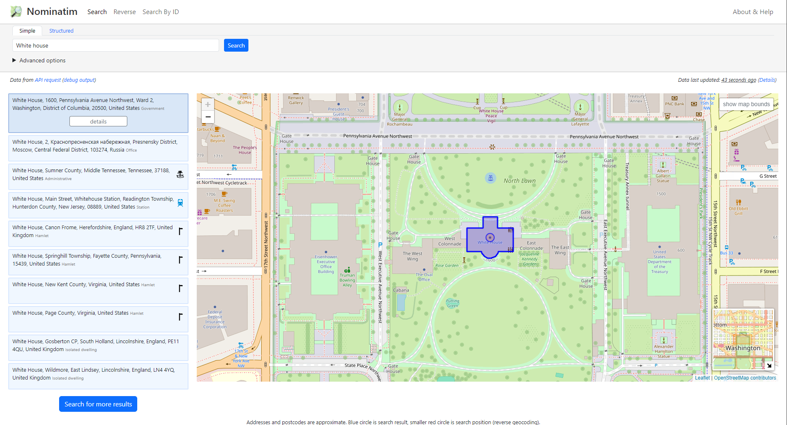

# Nominatim 🌍

Nominatim (from the Latin, 'by name') is a tool to search OpenStreetMap data by name and address (geocoding) and to generate synthetic addresses of OSM points (reverse geocoding).

## How to use
Nominatim indexes named (or numbered) features within the OpenStreetMap (OSM) dataset and a subset of other unnamed features (pubs, hotels, churches, etc).

Its API has the following endpoints for querying the data:
 * __[/search](/docs/MapColonies/openstreetmap/nominatim/Osm-Search-API)__ - search OSM objects by name or type
 * __[/reverse](/docs/MapColonies/openstreetmap/nominatim/Osm-Reverse-Search-API)__ - search OSM object by their location
 * __[/lookup](/docs/MapColonies/openstreetmap/nominatim/Osm-AddressLookup-API)__ - look up address details for OSM objects by their ID

## Nominatim UI
Nominatim is a search API, it does not provide a website interface on its own. nominatim-ui offers a small website for trying Nominatim and inspecting the database content.

## I'm getting bad results
Please check the [FAQ page](/docs/MapColonies/openstreetmap/nominatim/osm-nominatim-faq) and check if there is a solution to your problem there. If the problem persists don't hesitate to contact us.

## "I can't find my home address, do something about it 😡"
First, we are sorry, but its not our fault 🤷

We import the data as is from the internet, without any change or modification to maintain authenticity. Because OpenStreetMap is free and Open Source, you can go on their website at `openstreetmap.org`, and make the changes yourself. Be sure to read the guidelines before making any change to avoid it being removed.

 Copyright © https://nominatim.org/