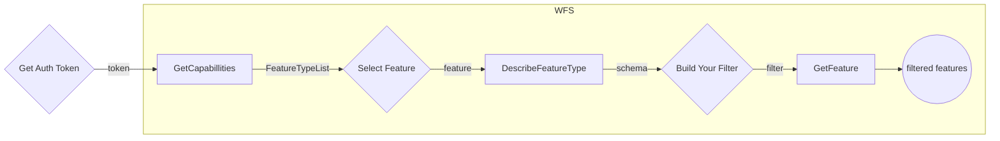

# Query Service 🔎

The vector query service uses the [WFS](/docs/ogc/protocols/ogc-wfs) protocol which is a READ-ONLY Web Feature Service.
it provides facilities for searching and retrieving feature data with the `GetCapabilities`, `DescribeFeatureType` and `GetFeature` operations all other operations are invalid.
For the full capabilities provided by the service see [GetCapabilities](/docs/ogc/protocols/ogc-wfs#getcapabilities)

WFS partitions the queryable data into feature types each feature type has its own attributes describing the structure of the data itself.
For the description of a feature type see [DescribeFeatureType](/docs/ogc/protocols/ogc-wfs#describefeaturetype)

Finally, Features can be retrieved with the [GetFeature](/docs/ogc/protocols/ogc-wfs#getfeature) operation. the request returns a collection of geographic feature instances filtered according to a criteria set by the requesting client.

## Example

WFS protocol partitions the queryable features into different feature types, each feature type consists of a schema describing the feature. the feature type is queryable by its schema, each feature type has a default coordinate reference system and the bounding box which containis all features of this type, those are also possible parameters for querying.

Let's see an example using all three operations with different filters, the following chart describes our work flow



:::tip
**to get an auth token [see this](/docs/MapColonies/authentication)**<br/>
:::

To list all the available feature types use the `GetCapabilities` operation and look for the `FeatureTypeList` section.

<details>
  <summary>Response</summary>

```xml title="Response"
<FeatureTypeList>
    <FeatureType xmlns:vector="vector">
        <Name>vector:buildings</Name>
        <Title>buildings</Title>
        <Abstract/>
        <ows:Keywords>
            <ows:Keyword>features</ows:Keyword>
            <ows:Keyword>buildings</ows:Keyword>
        </ows:Keywords>
        <DefaultCRS>urn:ogc:def:crs:EPSG::4326</DefaultCRS>
        <ows:WGS84BoundingBox>
            <ows:LowerCorner>34.21269226074219 29.4852237701416</ows:LowerCorner>
            <ows:UpperCorner>35.87874221801758 33.35012435913086</ows:UpperCorner>
        </ows:WGS84BoundingBox>
    </FeatureType>
    ...
<FeatureTypeList>
```
</details>

We got a `FeatureTypeList` consisting of the different `FeatureTypes` under the WFS service. one of them is the `vector:buildings` `FeatureType` where vector is the namespace and the buildings is the unique `FeatureType` name under the vector namespace. it is possible to query the FeatureType by its full name `vector:buildings` or short unique name `buildings`.
The default coordinate reference system and the containing features bounding box are also presented.

If you would like to view the schema of the `buildings` `FeatureType`, we could invoke the `DescribeFeatureType` request with `typeName` of `buildings`

For convenience we'll add outputFormat parameter as `application/json` to each of our requests for a json formatted response

```
<VECTOR_QUERY_SERVICE_URL>/wfs?
    service=wfs&
    version={WFS_SERVICE_VERSION}&
    request=DescribeFeatureType&
    typeName=buildings&
    outputFormat=application/json
```

<details>
  <summary>Response</summary>

```json title="Response in JSON"
{
    "elementFormDefault": "qualified",
    "targetNamespace": "vector",
    "targetPrefix": "vector",
    "featureTypes": [
        {
            "typeName": "buildings",
            "properties": [
                {
                    "name": "osm_id",
                    "maxOccurs": 1,
                    "minOccurs": 1,
                    "nillable": false,
                    "type": "xsd:int",
                    "localType": "int"
                },
                {
                    "name": "id",
                    "maxOccurs": 1,
                    "minOccurs": 1,
                    "nillable": false,
                    "type": "xsd:int",
                    "localType": "int"
                },
                {
                    "name": "geom",
                    "maxOccurs": 1,
                    "minOccurs": 0,
                    "nillable": true,
                    "type": "gml:Polygon",
                    "localType": "Polygon"
                },
                {
                    "name": "relative_feature_height",
                    "maxOccurs": 1,
                    "minOccurs": 0,
                    "nillable": true,
                    "type": "xsd:number",
                    "localType": "number"
                },
                {
                    "name": "all_entity_names",
                    "maxOccurs": 1,
                    "minOccurs": 0,
                    "nillable": true,
                    "type": "xsd:string",
                    "localType": "string"
                },
                {
                    "name": "building_type",
                    "maxOccurs": 1,
                    "minOccurs": 0,
                    "nillable": true,
                    "type": "xsd:string",
                    "localType": "string"
                },
                {
                    "name": "entity",
                    "maxOccurs": 1,
                    "minOccurs": 0,
                    "nillable": true,
                    "type": "xsd:string",
                    "localType": "string"
                },
                {
                    "name": "sensitivity",
                    "maxOccurs": 1,
                    "minOccurs": 0,
                    "nillable": true,
                    "type": "xsd:string",
                    "localType": "string"
                },
                {
                    "name": "entity_id",
                    "maxOccurs": 1,
                    "minOccurs": 0,
                    "nillable": true,
                    "type": "xsd:string",
                    "localType": "string"
                },
                {
                    "name": "is_sensitive",
                    "maxOccurs": 1,
                    "minOccurs": 0,
                    "nillable": true,
                    "type": "xsd:boolean",
                    "localType": "boolean"
                },
                {
                    "name": "date",
                    "maxOccurs": 1,
                    "minOccurs": 0,
                    "nillable": true,
                    "type": "xsd:date-time",
                    "localType": "date-time"
                }
            ]
        }
    ]
}
```
</details>

The response is the XSD (in xml response) describing the `buildings` `FeatureType`.

This is a description of a building feature, it contains these properties, each property has its own type, nillable flag value and min\max occurs - these describing the requireness of the property and possible repeatness.

Now that we hold the structure of the `buildings` FeatureType we're able to query building features by a set of parameters using the `GetFeature` operation, let's see some examples:


1. let's retrieve a specific building by its `featureId`, `featureId` is unique thus the response will be at most of one single existing building feature. the buildings `FeatureType` FeatureId is the `entityId` property, notice that this property is non nillable and has a `minOccurs` of 1.

due to `enitityId` containing '{' and '}' at the beginning and the end of the string we need to encode those to '%7B' and '%7D' respectively

```
<VECTOR_QUERY_SERVICE_URL>/wfs?
    service=wfs&
    version={WFS_SERVICE_VERSION}&
    request=GetFeature&
    typeNames=buildings&
    featureId={entityId}&
    outputFormat=application/json
```
<details>
  <summary>Response</summary>

```json title="Response in GeoJSON"
{
    "type": "FeatureCollection",
    "features": [
        {
            "type": "Feature",
            "id": "buildings.{aafe0435-426a-4a4a-926e-f799be96cace}",
            "geometry": {
                "type": "Polygon",
                "coordinates": [
                    [
                        [
                            34.9127511,
                            29.4993255
                        ],
                        [
                            34.9127592,
                            29.4992901
                        ],
                        [
                            34.9128039,
                            29.4992777
                        ],
                        [
                            34.9128446,
                            29.4993051
                        ],
                        [
                            34.9128273,
                            29.4993493
                        ],
                        [
                            34.9127785,
                            29.4993538
                        ],
                        [
                            34.9127511,
                            29.4993255
                        ]
                    ]
                ]
            },
            "geometry_name": "geom",
            "properties": {
                "osm_id": 807070935,
                "id": 1,
                "relative_feature_height": null,
                "all_entity_names": null,
                "building_type": "yes",
                "entity": null,
                "sensitivity": "רגיש",
                "entity_id": "{aafe0435-426a-4a4a-926e-f799be96cace}",
                "is_sensitive": true,
                "date": "2022-07-26T11:16:02Z"
            },
            "bbox": [
                34.9127511,
                29.4992777,
                34.9128446,
                29.4993538
            ]
        }
    ],
    "totalFeatures": 1,
    "numberMatched": 1,
    "numberReturned": 1,
    "timeStamp": "2022-07-27T07:44:58.341Z",
    "crs": {
        "type": "name",
        "properties": {
            "name": "urn:ogc:def:crs:EPSG::4326"
        }
    },
    "bbox": [
        34.9127511,
        29.4992777,
        34.9128446,
        29.4993538
    ]
}
```
</details>

Other than the feature itself we also retrieve additional metadata such as the containing bounding box of each feature and the whole response, total number of features of the selected `FeatureType`, number matched the given parameters criteria and number returned by the invoked request.

2. To get at most the top 3 building features sorted by some property such as `relative_feature_height` we can invoke the following request,
the default sort is in **ascending** order, to specify order append +A or +D to the `sortBy` parameter

```
<VECTOR_QUERY_SERVICE_URL>/wfs?
    service=wfs&
    version={WFS_SERVICE_VERSION}&
    request=GetFeature&
    typeNames=buildings&
    count=2&
    sortBy=relative_feature_height+D&
    outputFormat=application/json
```

<details>
  <summary>Response</summary>

```json
{
  "type": "FeatureCollection",
  "features": [
    {
      "type": "Feature",
      "id": "buildings.{ff4ba732-247c-45c5-b5fe-4a957118c950}",
      "geometry": {
        "type": "Polygon",
        "coordinates": [
          [
            [
              34.9110353,
              29.4985325
            ],
            [
              34.9110624,
              29.4984171
            ],
            [
              34.9111355,
              29.4985567
            ],
            [
              34.9110353,
              29.4985325
            ]
          ]
        ]
      },
      "geometry_name": "geom",
      "properties": {
        "osm_id": 115082118,
        "id": 2,
        "relative_feature_height": 20.1,
        "all_entity_names": null,
        "building_type": "yes",
        "entity": null,
        "sensitivity": "רגיש",
        "entity_id": "{ff4ba732-247c-45c5-b5fe-4a957118c950}",
        "is_sensitive": true,
        "date": "2022-07-26T11:14:18Z"
      },
      "bbox": [
        34.9110353,
        29.4984171,
        34.9112991,
        29.4985942
      ]
    },
    {
      "type": "Feature",
      "id": "buildings.{aafe0435-426a-4a4a-926e-f799be96cace}",
      "geometry": {
        "type": "Polygon",
        "coordinates": [
          [
            [
              34.9127511,
              29.4993255
            ],
            [
              34.9127592,
              29.4992901
            ],
            [
              34.9127785,
              29.4993538
            ],
            [
              34.9127511,
              29.4993255
            ]
          ]
        ]
      },
      "geometry_name": "geom",
      "properties": {
        "osm_id": 807070935,
        "id": 1,
        "relative_feature_height": 3,
        "all_entity_names": null,
        "building_type": "yes",
        "entity": null,
        "sensitivity": "רגיש",
        "entity_id": "{aafe0435-426a-4a4a-926e-f799be96cace}",
        "is_sensitive": true,
        "date": "2022-07-26T11:16:02Z"
      },
      "bbox": [
        34.9127511,
        29.4992777,
        34.9128446,
        29.4993538
      ]
    }
  ],
  "totalFeatures": 773014,
  "numberMatched": 773014,
  "numberReturned": 2,
  "timeStamp": "2022-07-27T07:58:17.787Z",
  "crs": {
    "type": "name",
    "properties": {
      "name": "urn:ogc:def:crs:EPSG::4326"
    }
  },
  "bbox": [
    34.9110353,
    29.4984171,
    34.9128446,
    29.4993538
  ]
}
```
</details>

3. The following GET request will look for all the building features contained or partially contained by the specified bounding box in the specified coordinate reference system (`EPSG:4326`) the coordinate system is optional part of the bbox parameter, if not specified the default CRS value of the FeatureType will be used (described in the GetCapabilities operation)
The retrieved features will be encoded in the specified `srsName` coordinate system, in our case also `EPSG:4326`.

For simplicity we'll limit the result to only __2__ features with the `count` parameter:

```
<VECTOR_QUERY_SERVICE_URL>/wfs?
    service=wfs&
    version={WFS_SERVICE_VERSION}&
    request=GetFeature&
    typeNames=buildings&
    bbox=31.995,34.718,32.046,34.787,urn:ogc:def:crs:EPSG::4326&
    srsName=urn:ogc:def:crs:EPSG::4326&
    count=2&
    outputFormat=application/json
```

<details>
  <summary>Response</summary>

```json
{
    "type": "FeatureCollection",
    "features": [
        {
            "type": "Feature",
            "id": "buildings.{798ed395-8e62-480f-b4fe-dbf7026633f8}",
            "geometry": {
                "type": "Polygon",
                "coordinates": [
                    [
                        [
                            34.7735756,
                            31.9986023
                        ],
                        [
                            34.7737984,
                            31.9983632
                        ],
                        [
                            34.7740616,
                            31.9985396
                        ],
                        [
                            34.7738387,
                            31.9987787
                        ],
                        [
                            34.7735756,
                            31.9986023
                        ]
                    ]
                ]
            },
            "geometry_name": "geom",
            "properties": {
                "osm_id": 331438436,
                "id": 98591,
                "relative_feature_height": 11,
                "all_entity_names": null,
                "building_type": "yes",
                "entity": null,
                "sensitivity": "רגיש",
                "entity_id": "{798ed395-8e62-480f-b4fe-dbf7026633f8}",
                "is_sensitive": true,
                "date": "2022-07-26T11:14:26Z"
            },
            "bbox": [
                34.7735756,
                31.9983632,
                34.7740616,
                31.9987787
            ]
        },
        {
            "type": "Feature",
            "id": "buildings.{3e0eff0c-45e5-4001-aaf9-a38a55faa543}",
            "geometry": {
                "type": "Polygon",
                "coordinates": [
                    [
                        [
                            34.7738667,
                            31.9983535
                        ],
                        [
                            34.7741028,
                            31.9981003
                        ],
                        [
                            34.7743303,
                            31.9982528
                        ],
                        [
                            34.7740943,
                            31.998506
                        ],
                        [
                            34.7738667,
                            31.9983535
                        ]
                    ]
                ]
            },
            "geometry_name": "geom",
            "properties": {
                "osm_id": 331438504,
                "id": 98592,
                "relative_feature_height": null,
                "all_entity_names": null,
                "building_type": "yes",
                "entity": null,
                "sensitivity": "ללא התייחסות",
                "entity_id": "{3e0eff0c-45e5-4001-aaf9-a38a55faa543}",
                "is_sensitive": false,
                "date": "2022-07-26T11:14:26Z"
            },
            "bbox": [
                34.7738667,
                31.9981003,
                34.7743303,
                31.998506
            ]
        }
    ],
    "totalFeatures": 11198,
    "numberMatched": 11198,
    "numberReturned": 2,
    "timeStamp": "2022-07-27T08:27:45.596Z",
    "crs": {
        "type": "name",
        "properties": {
            "name": "urn:ogc:def:crs:EPSG::4326"
        }
    },
    "bbox": [
        34.7735756,
        31.9981003,
        34.7743303,
        31.9987787
    ]
}
```
</details>

For more complex criterias such as a set of multiple parameters or geographical intersections we should invoke a POST GetFetures request consisting the filter as a XML body.

4. let's look for all the building features that intersect in a polygon, one of the properties of a building feature is it's geom describing the building geography, we'll look by it by setting it as the request `ValueReference`. We can specify the `srsName` which is the coordinate reference system of the returned features in our case `EPSG:4326`.
the polygon is a list of latitude-longitude pair coordinates.

We'll invoke a POST GetFeature request with the following body:

```xml
<?xml version="1.0" encoding="utf-8" ?>
<wfs:GetFeature xmlns:wfs="http://www.opengis.net/wfs/2.0" xmlns:fes="http://www.opengis.net/fes/2.0" xmlns:gml="http://www.opengis.net/gml/3.2" xmlns:sf="http://www.openplans.org/spearfish" xmlns:xsi="http://www.w3.org/2001/XMLSchema-instance" service="WFS" version="2.0.0" count="2" xsi:schemaLocation="http://www.opengis.net/wfs/2.0 http://schemas.opengis.net/wfs/2.0/wfs.xsd http://www.opengis.net/gml/3.2 http://schemas.opengis.net/gml/3.2.1/gml.xsd" outputFormat="application/json">
    <wfs:Query typeNames="vector:buildings2">
        <fes:Filter>
            <fes:Intersects>
                <fes:ValueReference>geom</fes:ValueReference>
                <gml:Polygon gml:id="polygon.1" srsName="http://www.opengis.net/gml/srs/epsg.xml#4326">
                    <gml:exterior>
                        <gml:LinearRing>
                            <gml:posList>
                                34.746 32.0546 34.758 32.087 34.7985 32.086 32.053 34.792 34.746 32.0546
                            </gml:posList>
                        </gml:LinearRing>
                    </gml:exterior>
                </gml:Polygon>
            </fes:Intersects>
        </fes:Filter>
    </wfs:Query>
</wfs:GetFeature>
```


<details>
  <summary>Response</summary>

```json
{
    "type": "FeatureCollection",
    "features": [
        {
            "type": "Feature",
            "id": "buildings.{de560e14-0055-4ca0-8b35-5cfa75cd85c7}",
            "geometry": {
                "type": "Polygon",
                "coordinates": [
                    [
                        [
                            34.7924709,
                            32.087685
                        ],
                        [
                            34.7925809,
                            32.0876495
                        ],
                        [
                            34.7926377,
                            32.0877757
                        ],
                        [
                            34.7925276,
                            32.0878112
                        ],
                        [
                            34.7924709,
                            32.087685
                        ]
                    ]
                ]
            },
            "geometry_name": "geom",
            "properties": {
                "osm_id": 149367040,
                "id": 515817,
                "relative_feature_height": 45,
                "all_entity_names": null,
                "building_type": "yes",
                "entity": null,
                "sensitivity": "ללא התייחסות",
                "entity_id": "{de560e14-0055-4ca0-8b35-5cfa75cd85c7}",
                "is_sensitive": false,
                "date": "2022-07-26T11:14:18Z"
            },
            "bbox": [
                34.7924709,
                32.0876495,
                34.7926377,
                32.0878112
            ]
        },
        {
            "type": "Feature",
            "id": "buildings.{538d6ffb-35cd-4034-97b6-7b8ebefab8f1}",
            "geometry": {
                "type": "Polygon",
                "coordinates": [
                    [
                        [
                            34.7927799,
                            32.0876342
                        ],
                        [
                            34.7928929,
                            32.0876309
                        ],
                        [
                            34.7929,
                            32.0878021
                        ],
                        [
                            34.792787,
                            32.0878055
                        ],
                        [
                            34.7927799,
                            32.0876342
                        ]
                    ]
                ]
            },
            "geometry_name": "geom",
            "properties": {
                "osm_id": 149367207,
                "id": 515818,
                "relative_feature_height": 3,
                "all_entity_names": null,
                "building_type": "yes",
                "entity": null,
                "sensitivity": "רגיש",
                "entity_id": "{538d6ffb-35cd-4034-97b6-7b8ebefab8f1}",
                "is_sensitive": true,
                "date": "2022-07-26T11:14:18Z"
            },
            "bbox": [
                34.7927799,
                32.0876309,
                34.7929,
                32.0878055
            ]
        }
    ],
    "totalFeatures": 2070,
    "numberMatched": 2070,
    "numberReturned": 2,
    "timeStamp": "2022-07-27T08:39:00.630Z",
    "crs": {
        "type": "name",
        "properties": {
            "name": "urn:ogc:def:crs:EPSG::4326"
        }
    },
    "bbox": [
        34.7924709,
        32.0876309,
        34.7929,
        32.0878112
    ]
}
```
</details>

5. if we'd like to filter buildings by a set of multiple parameters we'll achieve that by a `GetFeature` **POST** request.
Say we would like to retrieve only the buildings who's `relative_feature_height` is greater than __10__ and their `is_sensitive` flag is **falsy**.

We'll invoke a request with the following body:

```xml title="Query with 2 filters"
<wfs:GetFeature service="WFS" version="2.0.0" xmlns:wfs="http://www.opengis.net/wfs/2.0" xmlns:fes="http://www.opengis.net/fes/2.0" xmlns:xsi="http://www.w3.org/2001/XMLSchema-instance" xsi:schemaLocation="http://www.opengis.net/wfs/2.0 http://schemas.opengis.net/wfs/2.0/wfs.xsd" count="2" outputFormat="application/json">
    <wfs:Query typeNames="vector:buildings">
        <fes:Filter>
            <fes:PropertyIsGreaterThan>
               <fes:ValueReference>relative_feature_height</fes:ValueReference>
               <fes:Literal>10</fes:Literal>
            </fes:PropertyIsGreaterThan>
            <fes:PropertyIsEqualTo>
               <fes:ValueReference>is_sensitive</fes:ValueReference>
               <fes:Literal>false</fes:Literal>
            </fes:PropertyIsEqualTo>
        </fes:Filter>
    </wfs:Query>
</wfs:GetFeature>
```

<details>
  <summary>Response</summary>

```json title="Reponse in GeoJSON"
{
    "type": "FeatureCollection",
    "features": [
        {
            "type": "Feature",
            "id": "buildings.{6544d0de-37f2-4cb7-8122-07153d659624}",
            "geometry": {
                "type": "Polygon",
                "coordinates": [
                    [
                        [
                            34.3178082,
                            31.2941689
                        ],
                        [
                            34.3178674,
                            31.294039
                        ],
                        [
                            34.3180002,
                            31.2940832
                        ],
                        [
                            34.317941,
                            31.2942131
                        ],
                        [
                            34.3178082,
                            31.2941689
                        ]
                    ]
                ]
            },
            "geometry_name": "geom",
            "properties": {
                "osm_id": 306816301,
                "id": 345546,
                "relative_feature_height": 11.5,
                "all_entity_names": null,
                "building_type": "yes",
                "entity": null,
                "sensitivity": "ללא התייחסות",
                "entity_id": "{6544d0de-37f2-4cb7-8122-07153d659624}",
                "is_sensitive": false,
                "date": "2022-07-26T11:14:25Z"
            },
            "bbox": [
                34.3178082,
                31.294039,
                34.3180002,
                31.2942131
            ]
        },
        {
            "type": "Feature",
            "id": "buildings.{2d2a3a5f-eae9-4806-b68d-7e346c3cdfa8}",
            "geometry": {
                "type": "Polygon",
                "coordinates": [
                    [
                        [
                            34.3178424,
                            31.2935296
                        ],
                        [
                            34.317868,
                            31.2934804
                        ],
                        [
                            34.3179474,
                            31.2935106
                        ],
                        [
                            34.3179218,
                            31.2935598
                        ],
                        [
                            34.3178424,
                            31.2935296
                        ]
                    ]
                ]
            },
            "geometry_name": "geom",
            "properties": {
                "osm_id": 306815931,
                "id": 345547,
                "relative_feature_height": 33.612,
                "all_entity_names": null,
                "building_type": "yes",
                "entity": null,
                "sensitivity": "ללא התייחסות",
                "entity_id": "{2d2a3a5f-eae9-4806-b68d-7e346c3cdfa8}",
                "is_sensitive": false,
                "date": "2022-07-26T11:14:25Z"
            },
            "bbox": [
                34.3178424,
                31.2934804,
                34.3179474,
                31.2935598
            ]
        }
    ],
    "totalFeatures": 385759,
    "numberMatched": 385759,
    "numberReturned": 2,
    "timeStamp": "2022-07-27T09:42:24.943Z",
    "crs": {
        "type": "name",
        "properties": {
            "name": "urn:ogc:def:crs:EPSG::4326"
        }
    },
    "bbox": [
        34.3178082,
        31.2934804,
        34.3180002,
        31.2942131
    ]
}
```
</details>
