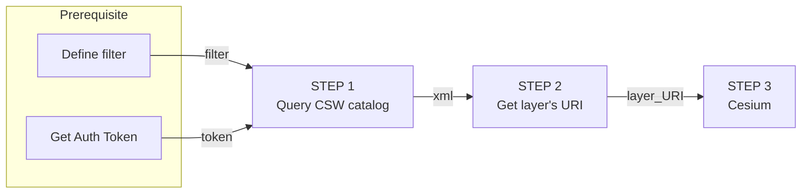

## Developer Guide step-by-step <!-- {docsify-ignore} -->
The following guide will help you understand, ***Step-by-step*** the best practices of how to work with the Map Colonies **3D** Catalog and how to consume mapping products in a ***dynamic way*** (materials might be changed or added)

> :satisfied: **You can see fully functional example &nbsp; [3D Example](.//assets/examples/3d/index.html)**


## Flow diagram


## Query CSW catalog (Step 1)
Query **3D CSW catalog** service to find item(s) according to desired filter [example are here](/catalog-information/query-examples.md)

Filter should be based on [3D profile](/catalog-information/v1_0/3d_profile.md)

Example query based on `mc:classification` profile field
```
POST Request

url:
'<PYCSW-3D-SERVICE_URL>/csw'

body (XML):
<?xml version="1.0" encoding="UTF-8"?>
<csw:GetRecords outputFormat="application/xml"  outputSchema="http://schema.mapcolonies.com/3d" resultType="results" service="CSW" version="2.0.2" startPosition="1" maxRecords="200" xmlns:mc="http://schema.mapcolonies.com/3d" xmlns:csw="http://www.opengis.net/cat/csw/2.0.2" xmlns:ogc="http://www.opengis.net/ogc">
    <csw:Query typeNames="csw:Record">
        <csw:ElementSetName>full</csw:ElementSetName>
        <csw:Constraint version="1.1.0">
            <ogc:Filter>
                <ogc:PropertyIsEqualTo>
                    <ogc:PropertyName>mc:classification</ogc:PropertyName>
                    <ogc:Literal>5</ogc:Literal>
                </ogc:PropertyIsEqualTo>
            </ogc:Filter>
        </csw:Constraint>
    </csw:Query>
</csw:GetRecords>
```

You will get GetRecords XML Response with product **metadata**.

<details>
  <summary>Response example</summary>

```xml
    <?xml version="1.0" encoding="UTF-8"?>
    <!-- pycsw 2.7.dev0 -->
    <csw:GetRecordsResponse xmlns:csw="http://www.opengis.net/cat/csw/2.0.2" xmlns:dc="http://purl.org/dc/elements/1.1/" xmlns:dct="http://purl.org/dc/terms/" xmlns:gmd="http://www.isotc211.org/2005/gmd" xmlns:gml="http://www.opengis.net/gml" xmlns:mc="http://schema.mapcolonies.com/3d" xmlns:ows="http://www.opengis.net/ows" xmlns:xs="http://www.w3.org/2001/XMLSchema" xmlns:xsi="http://www.w3.org/2001/XMLSchema-instance" version="2.0.2" xsi:schemaLocation="http://www.opengis.net/cat/csw/2.0.2 http://schemas.opengis.net/csw/2.0.2/CSW-discovery.xsd">
    <csw:SearchStatus timestamp="2022-03-27T06:45:54Z" />
    <csw:SearchResults numberOfRecordsMatched="1" numberOfRecordsReturned="1" nextRecord="0" recordSchema="http://schema.mapcolonies.com/3d" elementSet="full">
        <mc:MC3DRecord>
            <mc:accuracyLEP90>999.0</mc:accuracyLEP90>
            <mc:classification>5</mc:classification>
            <mc:footprint>{"type":"Polygon","coordinates":[[[31.2603,33.4345],[31.2603,34.4888],[32.3353,34.4888],[32.3353,33.4345],[31.2603,33.4345]]]}</mc:footprint>
            <mc:geographicArea>ישראל</mc:geographicArea>
            <mc:maxHorizontalAccuracyCE90>999.0</mc:maxHorizontalAccuracyCE90>
            <mc:id>c2bbeeee-6081-4e69-918c-287f48ea244d</mc:id>
            <mc:links scheme="3D_LAYER" name="" description="">http://model-server-3d/15211-65da-4523-9d6f-08016ad51b0d/tileset.json</mc:links>
            <mc:producerName>TZAHAL</mc:producerName>
            <mc:productBBox>31.2603,33.4345,32.3353,34.4888</mc:productBBox>
            <mc:productId>c2bbeeee-6081-4e69-918c-287f48ea244d</mc:productId>
            <mc:productName>מודל פריז</mc:productName>
            <mc:productType>3DPhotoRealistic</mc:productType>
            <mc:productVersion>1</mc:productVersion>
            <mc:productionMethod>photogrammetric</mc:productionMethod>
            <mc:productionSystem>P-30</mc:productionSystem>
            <mc:productionSystemVersion>1</mc:productionSystemVersion>
            <mc:region>צפון</mc:region>
            <mc:sensors>sensor1</mc:sensors>
            <mc:imagingTimeEndUTC>2022-06-15T10:39:00Z</mc:imagingTimeEndUTC>
            <mc:imagingTimeBeginUTC>2022-06-15T10:39:00Z</mc:imagingTimeBeginUTC>
            <mc:SRS>4567</mc:SRS>
            <mc:SRSName>WGS24GEO</mc:SRSName>
            <mc:type>RECORD_3D</mc:type>
            <ows:BoundingBox crs="urn:x-ogc:def:crs:EPSG:6.11:4326" dimensions="2">
                <ows:LowerCorner>33.4345 31.2603</ows:LowerCorner>
                <ows:UpperCorner>34.4888 32.3353</ows:UpperCorner>
            </ows:BoundingBox>
        </mc:MC3DRecord>
    </csw:SearchResults>
    </csw:GetRecordsResponse>
```
</details>

> :no_entry: **Authentication must be integrated in order to communicate with CSW server.**<br/>
> **See the principles [here](/ogc-protocols/ogc-csw-auth.md)**

## Get layer URI (Step 2)
In the Response, look for 

`<mc:links scheme="`<strong>3DTiles</strong>`" name="">`
  `http://3dtiles-server.com/3dtiles/332dd927-6ad9-4054-a0de-931f1f2e67f3/tileset.json`
`</mc:links>`element.

> :information_source: **You need to save `<mc:links>` <u>element</u> value, which is a layer consumption URL.**

## Construct Client side LAYER (Step 3)
Now, after you got all product metadata that you need by querying our Catalog and MapProxy capabilities, lets actually use it in order to display it in real map viewer / application (clients).
> :warning: **Below examples are based on `Pseudo code`, you will have to adapt it in your own application to make it work.**

### Cesium
```javascript
...
const tileset = viewer.scene.primitives.add(
    new Cesium.Cesium3DTileset({
      url: new Cesium.Resource({
        url: "<URL>",
        headers: {
            "x-api-key": "<token>",
        }
        /*************************************************************************/
        /* or queryParamters when authentication defined via query string params */
        /*************************************************************************/
        // queryParameters: {
        //   "token": "<token>",
        // },
    }),    
    })  
);
...
```
Replace `<URL>` with the URL link that you got from **Step 2**.

> :satisfied: **You can see fully functional example &nbsp; [3D Example](.//assets/examples/3d/index.html)**

<br/>
<br/>
<table style=" width: 100%; display: table !important;">
    <tbody>
        <tr>
            <td align="left">
                <a href="#/catalog-information/v1_0/3d_profile">Previous (Catalog profile)</a>
            </td>
            <td align="right"></td>
        </tr>
    </tbody>
</table>