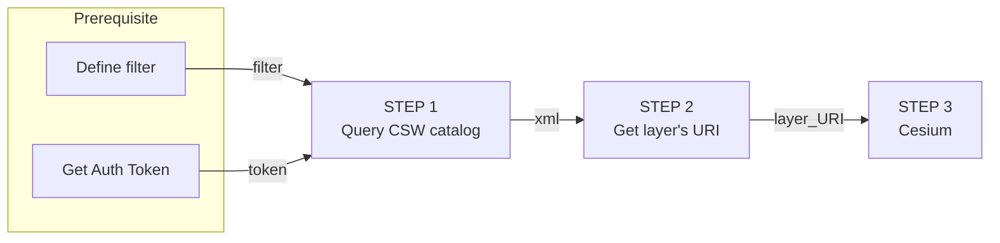

# 3D: Get Started
## Developer Guide step-by-step <!-- {docsify-ignore} -->
The following guide will help you understand, ***Step-by-step*** the best practices of how to work with the Map Colonies **3D** Catalog and how to consume mapping products in a ***dynamic way*** (materials might be changed or added)

> :satisfied: **You can see fully functional example &nbsp; [3D Example](.//assets/examples/3d/index.html)**


## Lets get started…


## Step 1 (Query CSW catalog):
Query **3D CSW catalog** service to find item(s) according to desired filter [example are here](/catalog-information/query-examples.md)

Filter should be based on [3D profile](/catalog-information/v1_0/3d_profile.md)

Example query based on `mc:classification` profile field
```
POST Request

url:
'<PYCSW-3D-SERVICE_URL>/csw'

body (XML):
<?xml version="1.0" encoding="UTF-8"?>
<csw:GetRecords outputFormat="application/xml"  outputSchema="http://schema.mapcolonies.com/3d" resultType="results" service="CSW" version="2.0.2" startPosition="1" maxRecords="200" xmlns:mc="http://schema.mapcolonies.com/3d" xmlns:csw="http://www.opengis.net/cat/csw/2.0.2" xmlns:ogc="http://www.opengis.net/ogc">
    <csw:Query typeNames="csw:Record">
        <csw:ElementSetName>full</csw:ElementSetName>
        <csw:Constraint version="1.1.0">
            <ogc:Filter>
                <ogc:PropertyIsEqualTo>
                    <ogc:PropertyName>mc:classification</ogc:PropertyName>
                    <ogc:Literal>5</ogc:Literal>
                </ogc:PropertyIsEqualTo>
            </ogc:Filter>
        </csw:Constraint>
    </csw:Query>
</csw:GetRecords>
```

You will get GetRecords XML Response with product **metadata**.

<details>
  <summary>Response example</summary>

```xml
    <?xml version="1.0" encoding="UTF-8"?>
    <!-- pycsw 2.7.dev0 -->
    <csw:GetRecordsResponse xmlns:csw="http://www.opengis.net/cat/csw/2.0.2" xmlns:dc="http://purl.org/dc/elements/1.1/" xmlns:dct="http://purl.org/dc/terms/" xmlns:gmd="http://www.isotc211.org/2005/gmd" xmlns:gml="http://www.opengis.net/gml" xmlns:mc="http://schema.mapcolonies.com/3d" xmlns:ows="http://www.opengis.net/ows" xmlns:xs="http://www.w3.org/2001/XMLSchema" xmlns:xsi="http://www.w3.org/2001/XMLSchema-instance" version="2.0.2" xsi:schemaLocation="http://www.opengis.net/cat/csw/2.0.2 http://schemas.opengis.net/csw/2.0.2/CSW-discovery.xsd">
    <csw:SearchStatus timestamp="2022-03-27T06:45:54Z" />
    <csw:SearchResults numberOfRecordsMatched="1" numberOfRecordsReturned="1" nextRecord="0" recordSchema="http://schema.mapcolonies.com/3d" elementSet="full">
        <mc:MC3DRecord>
            <mc:accuracyLEP90>999</mc:accuracyLEP90>
            <mc:accuracySE90>250</mc:accuracySE90>
            <mc:classification>5</mc:classification>
            <mc:compartmentalization>string</mc:compartmentalization>
            <mc:creationDateUTC>2022-03-22T08:54:28Z</mc:creationDateUTC>
            <mc:description>string</mc:description>
            <mc:footprint>0103000020E61000000100000005000000ED2918192DA241406AFF61D4F74A4040ED2918192DA24140F040CE07A550404038CF40C4C0A74140F040CE07A550404038CF40C4C0A741406AFF61D4F74A4040ED2918192DA241406AFF61D4F74A4040</mc:footprint>
            <mc:geographicArea>string</mc:geographicArea>
            <mc:heightRangeFrom>0</mc:heightRangeFrom>
            <mc:heightRangeTo>0</mc:heightRangeTo>
            <mc:maxHorizontalAccuracyCE90>0</mc:maxHorizontalAccuracyCE90>
            <mc:id>e3e95ea1-dbb1-4f0a-abb3-3f430e82b81e</mc:id>
            <mc:links scheme="3DTiles" name="" description="">http://3dtiles-server.com/3dtiles/332dd927-6ad9-4054-a0de-931f1f2e67f3/tileset.json</mc:links>
            <mc:maxFlightAlt>0</mc:maxFlightAlt>
            <mc:maxResolutionMeter>1.5</mc:maxResolutionMeter>
            <mc:minFlightAlt>0</mc:minFlightAlt>
            <mc:minResolutionMeter>1.1</mc:minResolutionMeter>
            <mc:nominalResolution>5</mc:nominalResolution>
            <mc:producerName>string</mc:producerName>
            <mc:productBBox>35.2670012825,32.5856881598,35.3105702702,32.6300363309</mc:productBBox>
            <mc:productId>e3e95ea1-dbb1-4f0a-abb3-3f430e82b81e</mc:productId>
            <mc:productName>Afula</mc:productName>
            <mc:productType>3DPhotoRealistic</mc:productType>
            <mc:productVersion>1</mc:productVersion>
            <mc:productionMethod>string</mc:productionMethod>
            <mc:productionSystem>string</mc:productionSystem>
            <mc:productionSystemVersion>string</mc:productionSystemVersion>
            <mc:region>string</mc:region>
            <mc:relativeAccuracyLE90>100</mc:relativeAccuracyLE90>
            <mc:sensors>OTHER</mc:sensors>
            <mc:imagingTimeEndUTC>2022-03-22T08:54:28Z</mc:imagingTimeEndUTC>
            <mc:imagingTimeBeginUTC>2022-03-22T08:54:28Z</mc:imagingTimeBeginUTC>
            <mc:SRS>4326</mc:SRS>
            <mc:SRSName>string</mc:SRSName>
            <mc:SRSOrigin>(30;40;50)</mc:SRSOrigin>
            <mc:type>RECORD_3D</mc:type>
            <mc:visualAccuracy>100</mc:visualAccuracy>
            <ows:BoundingBox crs="urn:x-ogc:def:crs:EPSG:6.11:4326" dimensions="2">
                <ows:LowerCorner>32.5856881598 35.2670012825</ows:LowerCorner>
                <ows:UpperCorner>32.6300363309 35.3105702702</ows:UpperCorner>
            </ows:BoundingBox>
        </mc:MC3DRecord>
    </csw:SearchResults>
    </csw:GetRecordsResponse>
```
</details>

> :no_entry: **Authentication must be integrated in order to communicate with CSW server.**<br/>
> **See the principles [here](/ogc-protocols/ogc-csw-auth.md)**

## Step 2 (Get layer URI):
In the Response, look for 

`<mc:links scheme="`<strong>3DTiles</strong>`" name="">`
  `http://3dtiles-server.com/3dtiles/332dd927-6ad9-4054-a0de-931f1f2e67f3/tileset.json`
`</mc:links>`element.

> :information_source: **You need to save `<mc:links>` <u>element</u> value, which is a layer consumption URL.**

## Step 3 (Construct Client side LAYER):
Now, after you got all product metadata that you need by querying our Catalog and MapProxy capabilities, lets actually use it in order to display it in real map viewer / application (clients).
> :warning: **Below examples are based on `Pseudo code`, you will have to adapt it in your own application to make it work.**

### Cesium
```javascript
...
const tileset = viewer.scene.primitives.add(
    new Cesium.Cesium3DTileset({
      url: URL,    
    })  
);
...
```
Replace `URL` with the URL link that you got from **Step 2**.

> :satisfied: **You can see fully functional example &nbsp; [3D Example](.//assets/examples/3d/index.html)**
